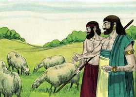
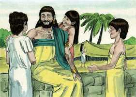
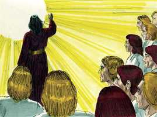
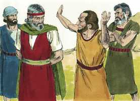
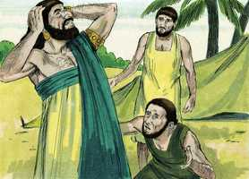

# Jó Capítulo 1

**1** 	HAVIA um homem na terra de Uz, cujo nome era Jó; e era este homem íntegro, reto e temente a Deus e desviava-se do mal.

 

**2** 	E nasceram-lhe sete filhos e três filhas.

 

**3** 	E o seu gado era de sete mil ovelhas, três mil camelos, quinhentas juntas de bois e quinhentas jumentas; eram também muitíssimos os servos a seu serviço, de maneira que este homem era maior do que todos os do oriente.

 

**4** 	E iam seus filhos à casa uns dos outros e faziam banquetes cada um por sua vez; e mandavam convidar as suas três irmãs a comerem e beberem com eles.

**5** 	Sucedia, pois, que, decorrido o turno de dias de seus banquetes, enviava Jó, e os santificava, e se levantava de madrugada, e oferecia holocaustos segundo o número de todos eles; porque dizia Jó: Porventura pecaram meus filhos, e amaldiçoaram a Deus no seu coração. Assim fazia Jó continuamente.

**6** 	E num dia em que os filhos de Deus vieram apresentar-se perante o Senhor, veio também Satanás entre eles.

 

**7** 	Então o Senhor disse a Satanás: Donde vens? E Satanás respondeu ao Senhor, e disse: De rodear a terra, e passear por ela.

**8** 	E disse o Senhor a Satanás: Observaste tu a meu servo Jó? Porque ninguém há na terra semelhante a ele, homem íntegro e reto, temente a Deus, e que se desvia do mal.

 

**9** 	Então respondeu Satanás ao Senhor, e disse: Porventura teme Jó a Deus debalde?

**10** 	Porventura tu não cercaste de sebe, a ele, e a sua casa, e a tudo quanto tem? A obra de suas mãos abençoaste e o seu gado se tem aumentado na terra.

**11** 	Mas estende a tua mão, e toca-lhe em tudo quanto tem, e verás se não blasfema contra ti na tua face.

**12** 	E disse o Senhor a Satanás: Eis que tudo quanto ele tem está na tua mão; somente contra ele não estendas a tua mão. E Satanás saiu da presença do Senhor.

 

**13** 	E sucedeu um dia, em que seus filhos e suas filhas comiam, e bebiam vinho, na casa de seu irmão primogênito,

**14** 	Que veio um mensageiro a Jó, e lhe disse: Os bois lavravam, e as jumentas pastavam junto a eles;

 

**15** 	E deram sobre eles os sabeus, e os tomaram, e aos servos feriram ao fio da espada; e só eu escapei para trazer-te a nova.

**16** 	Estando este ainda falando, veio outro e disse: Fogo de Deus caiu do céu, e queimou as ovelhas e os servos, e os consumiu, e só eu escapei para trazer-te a nova.

 

**17** 	Estando ainda este falando, veio outro, e disse: Ordenando os caldeus três tropas, deram sobre os camelos, e os tomaram, e aos servos feriram ao fio da espada; e só eu escapei para trazer-te a nova.

**18** 	Estando ainda este falando, veio outro, e disse: Estando teus filhos e tuas filhas comendo e bebendo vinho, em casa de seu irmão primogênito,

 

**19** 	Eis que um grande vento sobreveio dalém do deserto, e deu nos quatro cantos da casa, que caiu sobre os jovens, e morreram; e só eu escapei para trazer-te a nova.

**20** 	Então Jó se levantou, e rasgou o seu manto, e rapou a sua cabeça, e se lançou em terra, e adorou.

 

**21** 	E disse: Nu saí do ventre de minha mãe e nu tornarei para lá; o Senhor o deu, e o Senhor o tomou: bendito seja o nome do Senhor.

**22** 	Em tudo isto Jó não pecou, nem atribuiu a Deus falta alguma.

