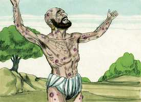

# Jó Capítulo 16

**1** 	ENTÃO respondeu Jó, dizendo:

**2** 	Tenho ouvido muitas coisas como estas; todos vós sois consoladores molestos.

 

**3** 	Porventura não terão fim essas palavras de vento? Ou o que te irrita, para assim responderes?

**4** 	Falaria eu também como vós falais, se a vossa alma estivesse em lugar da minha alma, ou amontoaria palavras contra vós, e menearia contra vós a minha cabeça?

**5** 	Antes vos fortaleceria com a minha boca, e a consolação dos meus lábios abrandaria a vossa dor.

**6** 	Se eu falar, a minha dor não cessa, e, calando-me eu, qual é o meu alívio?

**7** 	Na verdade, agora tu me tens fatigado; tu assolaste toda a minha companhia,

**8** 	Testemunha disto é que já me fizeste enrugado, e a minha magreza já se levanta contra mim, e no meu rosto testifica contra mim.

**9** 	Na sua ira me despedaçou, e ele me perseguiu; rangeu os seus dentes contra mim; aguça o meu adversário os seus olhos contra mim.

**10** 	Abrem a sua boca contra mim; com desprezo me feriram nos queixos, e contra mim se ajuntam todos.

**11** 	Entrega-me Deus ao perverso, e nas mãos dos ímpios me faz cair.

**12** 	Descansado estava eu, porém ele me quebrantou; e pegou-me pela cerviz, e me despedaçou; também me pôs por seu alvo.

**13** 	Cercam-me os seus flecheiros; atravessa-me os rins, e não me poupa, e o meu fel derrama sobre a terra,

**14** 	Fere-me com ferimento sobre ferimento; arremete contra mim como um valente.

**15** 	Cosi sobre a minha pele o cilício, e revolvi a minha cabeça no pó.

**16** 	O meu rosto está todo avermelhado de chorar, e sobre as minhas pálpebras está a sombra da morte:

**17** 	Apesar de não haver violência nas minhas mãos, e de ser pura a minha oração.

**18** 	Ah! terra, não cubras o meu sangue e não haja lugar para ocultar o meu clamor!

**19** 	Eis que também agora a minha testemunha está no céu, e nas alturas o meu testemunho está.

**20** 	Os meus amigos são os que zombam de mim; os meus olhos se desfazem em lágrimas diante de Deus.

**21** 	Ah! se alguém pudesse contender com Deus pelo homem, como o homem pelo seu próximo!

**22** 	Porque decorridos poucos anos, eu seguirei o caminho por onde não tornarei.

