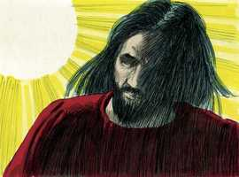
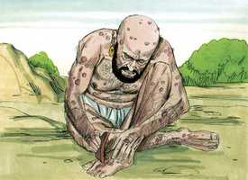
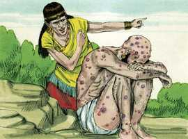
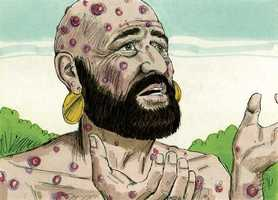

# Jó Capítulo 2

**1** 	E, VINDO outro dia, em que os filhos de Deus vieram apresentar-se perante o Senhor, veio também Satanás entre eles, apresentar-se perante o Senhor.

**2** 	Então o Senhor disse a Satanás: Donde vens? E respondeu Satanás ao Senhor, e disse: De rodear a terra, e passear por ela.

**3** 	E disse o Senhor a Satanás: Observaste o meu servo Jó? Porque ninguém há na terra semelhante a ele, homem íntegro e reto, temente a Deus e que se desvia do mal, e que ainda retém a sua sinceridade, havendo-me tu incitado contra ele, para o consumir sem causa.

**4** 	Então Satanás respondeu ao Senhor, e disse: Pele por pele, e tudo quanto o homem tem dará pela sua vida.

 

**5** 	Porém estende a tua mão, e toca-lhe nos ossos, e na carne, e verás se não blasfema contra ti na tua face!

**6** 	E disse o Senhor a Satanás: Eis que ele está na tua mão; porém guarda a sua vida.

**7** 	Então saiu Satanás da presença do Senhor, e feriu a Jó de úlceras malignas, desde a planta do pé até ao alto da cabeça.

 

**8** 	E Jó tomou um caco para se raspar com ele; e estava assentado no meio da cinza.

**9** 	Então sua mulher lhe disse: Ainda reténs a tua sinceridade? Amaldiçoa a Deus, e morre.

 

**10** 	Porém ele lhe disse: Como fala qualquer doida, falas tu; receberemos o bem de Deus, e não receberíamos o mal? Em tudo isto não pecou Jó com os seus lábios.

**11** 	Ouvindo, pois, três amigos de Jó todo este mal que tinha vindo sobre ele, vieram cada um do seu lugar: Elifaz o temanita, e Bildade o suíta, e Zofar o naamatita; e combinaram condoer-se dele, para o consolarem.

 

**12** 	E, levantando de longe os seus olhos, não o conheceram; e levantaram a sua voz e choraram, e rasgaram cada um o seu manto, e sobre as suas cabeças lançaram pó ao ar.

 

**13** 	E assentaram-se com ele na terra, sete dias e sete noites; e nenhum lhe dizia palavra alguma, porque viam que a dor era muito grande.

 

