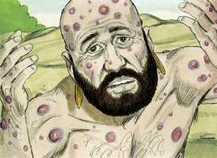

# Jó Capítulo 3

**1** 	DEPOIS disto abriu Jó a sua boca, e amaldiçoou o seu dia.

**2** 	E Jó, falando, disse:

 

**3** 	Pereça o dia em que nasci, e a noite em que se disse: Foi concebido um homem!

**4** 	Converta-se aquele dia em trevas; e Deus, lá de cima, não tenha cuidado dele, nem resplandeça sobre ele a luz.

**5** 	Contaminem-no as trevas e a sombra da morte; habitem sobre ele nuvens; a escuridão do dia o espante!

**6** 	Quanto àquela noite, dela se apodere a escuridão; e não se regozije ela entre os dias do ano; e não entre no número dos meses!

**7** 	Ah! que solitária seja aquela noite, e nela não entre voz de júbilo!

**8** 	Amaldiçoem-na aqueles que amaldiçoam o dia, que estão prontos para suscitar o seu pranto.

**9** 	Escureçam-se as estrelas do seu crepúsculo; que espere a luz, e não venha; e não veja as pálpebras da alva;

**10** 	Porque não fechou as portas do ventre; nem escondeu dos meus olhos a canseira.

**11** 	Por que não morri eu desde a madre? E em saindo do ventre, não expirei?

**12** 	Por que me receberam os joelhos? E por que os peitos, para que mamasse?

**13** 	Porque já agora jazeria e repousaria; dormiria, e então haveria repouso para mim.

**14** 	Com os reis e conselheiros da terra, que para si edificam casas nos lugares assolados,

**15** 	Ou com os príncipes que possuem ouro, que enchem as suas casas de prata,

**16** 	Ou como aborto oculto, não existiria; como as crianças que não viram a luz.

**17** 	Ali os maus cessam de perturbar; e ali repousam os cansados.

**18** 	Ali os presos juntamente repousam, e não ouvem a voz do exator.

**19** 	Ali está o pequeno e o grande, e o servo livre de seu senhor.

**20** 	Por que se dá luz ao miserável, e vida aos amargurados de ânimo?

**21** 	Que esperam a morte, e ela não vem; e cavam em procura dela mais do que de tesouros ocultos;

**22** 	Que de alegria saltam, e exultam, achando a sepultura?

**23** 	Por que se dá luz ao homem, cujo caminho é oculto, e a quem Deus o encobriu?

**24** 	Porque antes do meu pão vem o meu suspiro; e os meus gemidos se derramam como água.

**25** 	Porque aquilo que temia me sobreveio; e o que receava me aconteceu.

**26** 	Nunca estive tranqüilo, nem sosseguei, nem repousei, mas veio sobre mim a perturbação.

