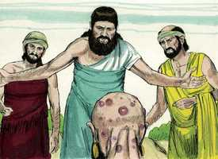

# Jó Capítulo 4

**1** 	ENTÃO respondeu Elifaz o temanita, e disse:

**2** 	Se intentarmos falar-te, enfadar-te-ás? Mas quem poderia conter as palavras?

 

**3** 	Eis que ensinaste a muitos, e tens fortalecido as mãos fracas.

**4** 	As tuas palavras firmaram os que tropeçavam e os joelhos desfalecentes tens fortalecido.

**5** 	Mas agora, que se trata de ti, te enfadas; e tocando-te a ti, te perturbas.

**6** 	Porventura não é o teu temor de Deus a tua confiança, e a tua esperança a integridade dos teus caminhos?

**7** 	Lembra-te agora qual é o inocente que jamais pereceu? E onde foram os sinceros destruídos?

**8** 	Segundo eu tenho visto, os que lavram iniqüidade, e semeiam mal, segam o mesmo.

**9** 	Com o hálito de Deus perecem; e com o sopro da sua ira se consomem.

**10** 	O rugido do leão, e a voz do leão feroz, e os dentes dos leõezinhos se quebram.

**11** 	Perece o leão velho, porque não tem presa; e os filhos da leoa andam dispersos.

**12** 	Uma coisa me foi trazida em segredo; e os meus ouvidos perceberam um sussurro dela.

**13** 	Entre pensamentos vindos de visões da noite, quando cai sobre os homens o sono profundo,

**14** 	Sobrevieram-me o espanto e o tremor, e todos os meus ossos estremeceram.

**15** 	Então um espírito passou por diante de mim; fez-me arrepiar os cabelos da minha carne.

**16** 	Parou ele, porém não conheci a sua feição; um vulto estava diante dos meus olhos; houve silêncio, e ouvi uma voz que dizia:

**17** 	Seria porventura o homem mais justo do que Deus? Seria porventura o homem mais puro do que o seu Criador?

**18** 	Eis que ele não confia nos seus servos e aos seus anjos atribui loucura;

**19** 	Quanto menos àqueles que habitam em casas de lodo, cujo fundamento está no pó, e são esmagados como a traça!

**20** 	Desde a manhã até à tarde são despedaçados; e eternamente perecem sem que disso se faça caso.

**21** 	Porventura não passa com eles a sua excelência? Morrem, mas sem sabedoria.

