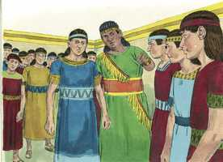
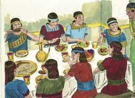
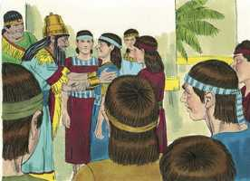

# Daniel Capítulo 1

**1** 	NO ano terceiro do reinado de Jeoiaquim, rei de Judá, veio Nabucodonosor, rei de Babilônia, a Jerusalém, e a sitiou.

**2** 	E o Senhor entregou nas suas mãos a Jeoiaquim, rei de Judá, e uma parte dos utensílios da casa de Deus, e ele os levou para a terra de Sinar, para a casa do seu deus, e pôs os utensílios na casa do tesouro do seu deus.

**3** 	E disse o rei a Aspenaz, chefe dos seus eunucos, que trouxesse alguns dos filhos de Israel, e da linhagem real e dos príncipes,

**4** 	Jovens em quem não houvesse defeito algum, de boa aparência, e instruídos em toda a sabedoria, e doutos em ciência, e entendidos no conhecimento, e que tivessem habilidade para assistirem no palácio do rei, e que lhes ensinassem as letras e a língua dos caldeus.

**5** 	E o rei lhes determinou a porção diária, das iguarias do rei, e do vinho que ele bebia, e que assim fossem mantidos por três anos, para que no fim destes pudessem estar diante do rei.

**6** 	E entre eles se achavam, dos filhos de Judá, Daniel, Hananias, Misael e Azarias;

 

**7** 	E o chefe dos eunucos lhes pôs outros nomes, a saber: a Daniel pôs o de Beltessazar, e a Hananias o de Sadraque, e a Misael o de Mesaque, e a Azarias o de Abednego.

**8** 	E Daniel propôs no seu coração não se contaminar com a porção das iguarias do rei, nem com o vinho que ele bebia; portanto pediu ao chefe dos eunucos que lhe permitisse não se contaminar.

**9** 	Ora, Deus fez com que Daniel achasse graça e misericórdia diante do chefe dos eunucos.

**10** 	E disse o chefe dos eunucos a Daniel: Tenho medo do meu senhor, o rei, que determinou a vossa comida e a vossa bebida; pois por que veria ele os vossos rostos mais tristes do que os dos outros jovens da vossa idade? Assim porias em perigo a minha cabeça para com o rei.

**11** 	Então disse Daniel ao despenseiro a quem o chefe dos eunucos havia constituído sobre Daniel, Hananias, Misael e Azarias:

**12** 	Experimenta, peço-te, os teus servos dez dias, e que se nos dêem legumes a comer, e água a beber.

**13** 	Então se examine diante de ti a nossa aparência, e a aparência dos jovens que comem a porção das iguarias do rei; e, conforme vires, procederás para com os teus servos.

**14** 	E ele consentiu isto, e os experimentou dez dias.

 

**15** 	E, ao fim dos dez dias, apareceram os seus semblantes melhores, e eles estavam mais gordos de carne do que todos os jovens que comiam das iguarias do rei.

**16** 	Assim o despenseiro tirou-lhes a porção das iguarias, e o vinho de que deviam beber, e lhes dava legumes.

**17** 	Quanto a estes quatro jovens, Deus lhes deu o conhecimento e a inteligência em todas as letras, e sabedoria; mas a Daniel deu entendimento em toda a visão e sonhos.

**18** 	E ao fim dos dias, em que o rei tinha falado que os trouxessem, o chefe dos eunucos os trouxe diante de Nabucodonosor.

 

**19** 	E o rei falou com eles; e entre todos eles não foram achados outros tais como Daniel, Hananias, Misael e Azarias; portanto ficaram assistindo diante do rei.

**20** 	E em toda a matéria de sabedoria e de discernimento, sobre o que o rei lhes perguntou, os achou dez vezes mais doutos do que todos os magos astrólogos que havia em todo o seu reino.

**21** 	E Daniel permaneceu até ao primeiro ano do rei Ciro.

