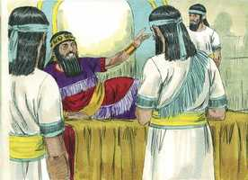
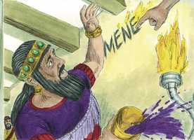
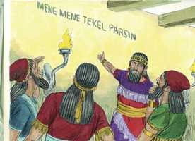
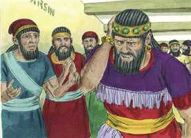
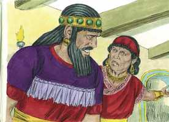
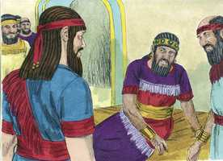
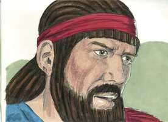
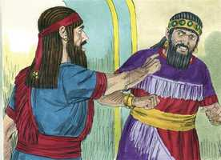
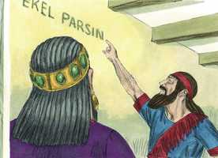
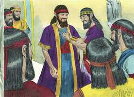

# Daniel Capítulo 5

**1** 	O REI Belsazar deu um grande banquete a mil dos seus senhores, e bebeu vinho na presença dos mil.

**2** 	Havendo Belsazar provado o vinho, mandou trazer os vasos de ouro e de prata, que Nabucodonosor, seu pai, tinha tirado do templo que estava em Jerusalém, para que bebessem neles o rei, os seus príncipes, as suas mulheres e concubinas.

 

**3** 	Então trouxeram os vasos de ouro, que foram tirados do templo da casa de Deus, que estava em Jerusalém, e beberam neles o rei, os seus príncipes, as suas mulheres e concubinas.

 

**4** 	Beberam o vinho, e deram louvores aos deuses de ouro, de prata, de bronze, de ferro, de madeira, e de pedra.

**5** 	Na mesma hora apareceram uns dedos de mão de homem, e escreviam, defronte do castiçal, na caiadura da parede do palácio real; e o rei via a parte da mão que estava escrevendo.

 

**6** 	Mudou-se então o semblante do rei, e os seus pensamentos o turbaram; as juntas dos seus lombos se relaxaram, e os seus joelhos batiam um no outro.

**7** 	E gritou o rei com força, que se introduzissem os astrólogos, os caldeus e os adivinhadores; e falou o rei, dizendo aos sábios de Babilônia: Qualquer que ler este escrito, e me declarar a sua interpretação, será vestido de púrpura, e trará uma cadeia de ouro ao pescoço e, no reino, será o terceiro governante.

 

**8** 	Então entraram todos os sábios do rei; mas não puderam ler o escrito, nem fazer saber ao rei a sua interpretação.

**9** 	Então o rei Belsazar perturbou-se muito, e mudou-se-lhe o semblante; e os seus senhores estavam sobressaltados.

 

**10** 	A rainha, por causa das palavras do rei e dos seus senhores, entrou na casa do banquete, e respondeu, dizendo: Ó rei, vive para sempre! Não te perturbem os teus pensamentos, nem se mude o teu semblante.

 

**11** 	Há no teu reino um homem, no qual há o espírito dos deuses santos; e nos dias de teu pai se achou nele luz, e inteligência, e sabedoria, como a sabedoria dos deuses; e teu pai, o rei Nabucodonosor, sim, teu pai, o rei, o constituiu mestre dos magos, dos astrólogos, dos caldeus e dos adivinhadores;

**12** 	Porquanto se achou neste Daniel um espírito excelente, e conhecimento, e entendimento, interpretando sonhos e explicando enigmas, e resolvendo dúvidas, ao qual o rei pôs o nome de Beltessazar. Chame-se, pois, agora Daniel, e ele dará a interpretação.

**13** 	Então Daniel foi introduzido à presença do rei. Falou o rei, dizendo a Daniel: És tu aquele Daniel, um dos filhos dos cativos de Judá, que o rei, meu pai, trouxe de Judá?

 

**14** 	Tenho ouvido dizer a teu respeito que o espírito dos deuses está em ti, e que em ti se acham a luz, e o entendimento e a excelente sabedoria.

**15** 	Agora mesmo foram introduzidos à minha presença os sábios e os astrólogos, para lerem este escrito, e me fazerem saber a sua interpretação; mas não puderam dar a interpretação destas palavras.

**16** 	Eu, porém, tenho ouvido dizer de ti que podes dar interpretação e resolver dúvidas. Agora, se puderes ler este escrito, e fazer-me saber a sua interpretação, serás vestido de púrpura, e terás cadeia de ouro ao pescoço e no reino serás o terceiro governante.

**17** 	Então respondeu Daniel, e disse na presença do rei: As tuas dádivas fiquem contigo, e dá os teus prêmios a outro; contudo lerei ao rei o escrito, e far-lhe-ei saber a interpretação.

 

**18** 	Ó rei! Deus, o Altíssimo, deu a Nabucodonosor, teu pai, o reino, e a grandeza, e a glória, e a majestade.

 

**19** 	E por causa da grandeza, que lhe deu, todos os povos, nações e línguas tremiam e temiam diante dele; a quem queria matava, e a quem queria conservava em vida; e a quem queria engrandecia, e a quem queria abatia.

**20** 	Mas quando o seu coração se exaltou, e o seu espírito se endureceu em soberba, foi derrubado do seu trono real, e passou dele a sua glória.

**21** 	E foi tirado dentre os filhos dos homens, e o seu coração foi feito semelhante ao dos animais, e a sua morada foi com os jumentos monteses; fizeram-no comer a erva como os bois, e do orvalho do céu foi molhado o seu corpo, até que conheceu que Deus, o Altíssimo, tem domínio sobre o reino dos homens, e a quem quer constitui sobre ele.

**22** 	E tu, Belsazar, que és seu filho, não humilhaste o teu coração, ainda que soubeste tudo isto.

**23** 	E te levantaste contra o Senhor do céu, pois foram trazidos à tua presença os vasos da casa dele, e tu, os teus senhores, as tuas mulheres e as tuas concubinas, bebestes vinho neles; além disso, deste louvores aos deuses de prata, de ouro, de bronze, de ferro, de madeira e de pedra, que não vêem, não ouvem, nem sabem; mas a Deus, em cuja mão está a tua vida, e de quem são todos os teus caminhos, a ele não glorificaste.

**24** 	Então dele foi enviada aquela parte da mão, que escreveu este escrito.

**25** 	Este, pois, é o escrito que se escreveu: MENE, MENE, TEQUEL, UFARSIM.

 

**26** 	Esta é a interpretação daquilo: MENE: Contou Deus o teu reino, e o acabou.

**27** 	TEQUEL: Pesado foste na balança, e foste achado em falta.

**28** 	PERES: Dividido foi o teu reino, e dado aos medos e aos persas.

**29** 	Então mandou Belsazar que vestissem a Daniel de púrpura, e que lhe pusessem uma cadeia de ouro ao pescoço, e proclamassem a respeito dele que havia de ser o terceiro no governo do seu reino.

 

**30** 	Naquela noite foi morto Belsazar, rei dos caldeus.

**31** 	E Dario, o medo, ocupou o reino, sendo da idade de sessenta e dois anos.

