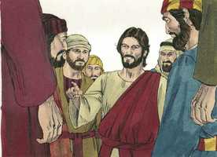
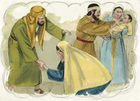
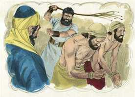
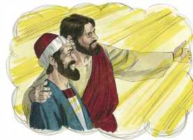
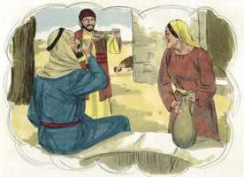

# Mateus Capítulo 10

**1** 	E, CHAMANDO os seus doze discípulos, deu-lhes poder sobre os espíritos imundos, para os expulsarem, e para curarem toda a enfermidade e todo o mal.

 

**2** 	Ora, os nomes dos doze apóstolos são estes: O primeiro, Simão, chamado Pedro, e André, seu irmão; Tiago, filho de Zebedeu, e João, seu irmão;

  

**3** 	Filipe e Bartolomeu; Tomé e Mateus, o publicano; Tiago, filho de Alfeu, e Lebeu, apelidado Tadeu;

 

**4** 	Simão, o Cananita, e Judas Iscariotes, aquele que o traiu.

**5** 	Jesus enviou estes doze, e lhes ordenou, dizendo: Não ireis pelo caminho dos gentios, nem entrareis em cidade de samaritanos;

 

**6** 	Mas ide antes às ovelhas perdidas da casa de Israel;

 

**7** 	E, indo, pregai, dizendo: É chegado o reino dos céus.

**8** 	Curai os enfermos, limpai os leprosos, ressuscitai os mortos, expulsai os demônios; de graça recebestes, de graça dai.

 

**9** 	Não possuais ouro, nem prata, nem cobre, em vossos cintos,

**10** 	Nem alforjes para o caminho, nem duas túnicas, nem alparcas, nem bordões; porque digno é o operário do seu alimento.

**11** 	E, em qualquer cidade ou aldeia em que entrardes, procurai saber quem nela seja digno, e hospedai-vos aí, até que vos retireis.

**12** 	E, quando entrardes nalguma casa, saudai-a;

**13** 	E, se a casa for digna, desça sobre ela a vossa paz; mas, se não for digna, torne para vós a vossa paz.

 

**14** 	E, se ninguém vos receber, nem escutar as vossas palavras, saindo daquela casa ou cidade, sacudi o pó dos vossos pés.

 

**15** 	Em verdade vos digo que, no dia do juízo, haverá menos rigor para o país de Sodoma e Gomorra do que para aquela cidade.

**16** 	Eis que vos envio como ovelhas ao meio de lobos; portanto, sede prudentes como as serpentes e inofensivos como as pombas.

**17** 	Acautelai-vos, porém, dos homens; porque eles vos entregarão aos sinédrios, e vos açoitarão nas suas sinagogas;

 

**18** 	E sereis até conduzidos à presença dos governadores, e dos reis, por causa de mim, para lhes servir de testemunho a eles, e aos gentios.

**19** 	Mas, quando vos entregarem, não vos dê cuidado como, ou o que haveis de falar, porque naquela mesma hora vos será ministrado o que haveis de dizer.

**20** 	Porque não sois vós quem falará, mas o Espírito de vosso Pai é que fala em vós.

**21** 	E o irmão entregará à morte o irmão, e o pai o filho; e os filhos se levantarão contra os pais, e os matarão.

 

**22** 	E odiados de todos sereis por causa do meu nome; mas aquele que perseverar até ao fim, esse será salvo.

**23** 	Quando pois vos perseguirem nesta cidade, fugi para outra; porque em verdade vos digo que não acabareis de percorrer as cidades de Israel sem que venha o Filho do homem.

**24** 	Não é o discípulo mais do que o mestre, nem o servo mais do que o seu senhor.

**25** 	Basta ao discípulo ser como seu mestre, e ao servo como seu senhor. Se chamaram Belzebu ao pai de família, quanto mais aos seus domésticos?

**26** 	Portanto, não os temais; porque nada há encoberto que não haja de revelar-se, nem oculto que não haja de saber-se.

**27** 	O que vos digo em trevas dizei-o em luz; e o que escutais ao ouvido pregai-o sobre os telhados.

**28** 	E não temais os que matam o corpo e não podem matar a alma; temei antes aquele que pode fazer perecer no inferno a alma e o corpo.

**29** 	Não se vendem dois passarinhos por um ceitil? e nenhum deles cairá em terra sem a vontade de vosso Pai.

**30** 	E até mesmo os cabelos da vossa cabeça estão todos contados.

**31** 	Não temais, pois; mais valeis vós do que muitos passarinhos.

**32** 	Portanto, qualquer que me confessar diante dos homens, eu o confessarei diante de meu Pai, que está nos céus.

**33** 	Mas qualquer que me negar diante dos homens, eu o negarei também diante de meu Pai, que está nos céus.

**34** 	Não cuideis que vim trazer a paz à terra; não vim trazer paz, mas espada;

**35** 	Porque eu vim pôr em dissensão o homem contra seu pai, e a filha contra sua mãe, e a nora contra sua sogra;

**36** 	E assim os inimigos do homem serão os seus familiares.

**37** 	Quem ama o pai ou a mãe mais do que a mim não é digno de mim; e quem ama o filho ou a filha mais do que a mim não é digno de mim.

**38** 	E quem não toma a sua cruz, e não segue após mim, não é digno de mim.

**39** 	Quem achar a sua vida perdê-la-á; e quem perder a sua vida, por amor de mim, achá-la-á.

**40** 	Quem vos recebe, a mim me recebe; e quem me recebe a mim, recebe aquele que me enviou.

 

**41** 	Quem recebe um profeta em qualidade de profeta, receberá galardão de profeta; e quem recebe um justo na qualidade de justo, receberá galardão de justo.

**42** 	E qualquer que tiver dado só que seja um copo de água fria a um destes pequenos, em nome de discípulo, em verdade vos digo que de modo algum perderá o seu galardão.

 

