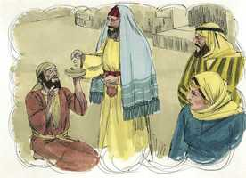
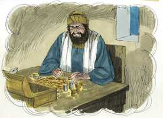
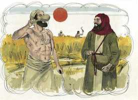

# Mateus Capítulo 6

**1** 	GUARDAI-VOS de fazer a vossa esmola diante dos homens, para serdes vistos por eles; aliás, não tereis galardão junto de vosso Pai, que está nos céus.

 

**2** 	Quando, pois, deres esmola, não faças tocar trombeta diante de ti, como fazem os hipócritas nas sinagogas e nas ruas, para serem glorificados pelos homens. Em verdade vos digo que já receberam o seu galardão.

**3** 	Mas, quando tu deres esmola, não saiba a tua mão esquerda o que faz a tua direita;

**4** 	Para que a tua esmola seja dada em secreto; e teu Pai, que vê em secreto, ele mesmo te recompensará publicamente.

**5** 	E, quando orares, não sejas como os hipócritas; pois se comprazem em orar em pé nas sinagogas, e às esquinas das ruas, para serem vistos pelos homens. Em verdade vos digo que já receberam o seu galardão.

**6** 	Mas tu, quando orares, entra no teu aposento e, fechando a tua porta, ora a teu Pai que está em secreto; e teu Pai, que vê em secreto, te recompensará publicamente.

**7** 	E, orando, não useis de vãs repetições, como os gentios, que pensam que por muito falarem serão ouvidos.

**8** 	Não vos assemelheis, pois, a eles; porque vosso Pai sabe o que vos é necessário, antes de vós lho pedirdes.

**9** 	Portanto, vós orareis assim: Pai nosso, que estás nos céus, santificado seja o teu nome;

**10** 	Venha o teu reino, seja feita a tua vontade, assim na terra como no céu;

**11** 	O pão nosso de cada dia nos dá hoje;

**12** 	E perdoa-nos as nossas dívidas, assim como nós perdoamos aos nossos devedores;

**13** 	E não nos conduzas à tentação; mas livra-nos do mal; porque teu é o reino, e o poder, e a glória, para sempre. Amém.

**14** 	Porque, se perdoardes aos homens as suas ofensas, também vosso Pai celestial vos perdoará a vós;

**15** 	Se, porém, não perdoardes aos homens as suas ofensas, também vosso Pai vos não perdoará as vossas ofensas.

**16** 	E, quando jejuardes, não vos mostreis contristados como os hipócritas; porque desfiguram os seus rostos, para que aos homens pareça que jejuam. Em verdade vos digo que já receberam o seu galardão.

**17** 	Tu, porém, quando jejuares, unge a tua cabeça, e lava o teu rosto,

**18** 	Para não pareceres aos homens que jejuas, mas a teu Pai, que está em secreto; e teu Pai, que vê em secreto, te recompensará publicamente.

**19** 	Não ajunteis tesouros na terra, onde a traça e a ferrugem tudo consomem, e onde os ladrões minam e roubam;

 

**20** 	Mas ajuntai tesouros no céu, onde nem a traça nem a ferrugem consomem, e onde os ladrões não minam nem roubam.

**21** 	Porque onde estiver o vosso tesouro, aí estará também o vosso coração.

**22** 	A candeia do corpo são os olhos; de sorte que, se os teus olhos forem bons, todo o teu corpo terá luz;

**23** 	Se, porém, os teus olhos forem maus, o teu corpo será tenebroso. Se, portanto, a luz que em ti há são trevas, quão grandes serão tais trevas!

**24** 	Ninguém pode servir a dois senhores; porque ou há de odiar um e amar o outro, ou se dedicará a um e desprezará o outro. Não podeis servir a Deus e a Mamom.

**25** 	Por isso vos digo: Não andeis cuidadosos quanto à vossa vida, pelo que haveis de comer ou pelo que haveis de beber; nem quanto ao vosso corpo, pelo que haveis de vestir. Não é a vida mais do que o mantimento, e o corpo mais do que o vestuário?

**26** 	Olhai para as aves do céu, que nem semeiam, nem segam, nem ajuntam em celeiros; e vosso Pai celestial as alimenta. Não tendes vós muito mais valor do que elas?

**27** 	E qual de vós poderá, com todos os seus cuidados, acrescentar um côvado à sua estatura?

**28** 	E, quanto ao vestuário, por que andais solícitos? Olhai para os lírios do campo, como eles crescem; não trabalham nem fiam;

**29** 	E eu vos digo que nem mesmo Salomão, em toda a sua glória, se vestiu como qualquer deles.

**30** 	Pois, se Deus assim veste a erva do campo, que hoje existe, e amanhã é lançada no forno, não vos vestirá muito mais a vós, homens de pouca fé?

**31** 	Não andeis, pois, inquietos, dizendo: Que comeremos, ou que beberemos, ou com que nos vestiremos?

 

**32** 	Porque todas estas coisas os gentios procuram. Decerto vosso Pai celestial bem sabe que necessitais de todas estas coisas;

**33** 	Mas, buscai primeiro o reino de Deus, e a sua justiça, e todas estas coisas vos serão acrescentadas.

**34** 	Não vos inquieteis, pois, pelo dia de amanhã, porque o dia de amanhã cuidará de si mesmo. Basta a cada dia o seu mal.

