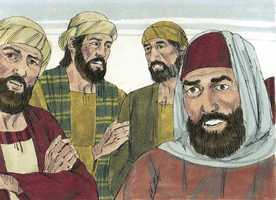
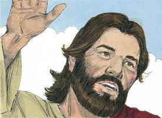

# Mateus Capítulo 7

**1** 	NÃO julgueis, para que não sejais julgados.

 

**2** 	Porque com o juízo com que julgardes sereis julgados, e com a medida com que tiverdes medido vos hão de medir a vós.

**3** 	E por que reparas tu no argueiro que está no olho do teu irmão, e não vês a trave que está no teu olho?

**4** 	Ou como dirás a teu irmão: Deixa-me tirar o argueiro do teu olho, estando uma trave no teu?

**5** 	Hipócrita, tira primeiro a trave do teu olho, e então cuidarás em tirar o argueiro do olho do teu irmão.

**6** 	Não deis aos cães as coisas santas, nem deiteis aos porcos as vossas pérolas, não aconteça que as pisem com os pés e, voltando-se, vos despedacem.

**7** 	Pedi, e dar-se-vos-á; buscai, e encontrareis; batei, e abrir-se-vos-á.

 

**8** 	Porque, aquele que pede, recebe; e, o que busca, encontra; e, ao que bate, abrir-se-lhe-á.

**9** 	E qual dentre vós é o homem que, pedindo-lhe pão o seu filho, lhe dará uma pedra?

**10** 	E, pedindo-lhe peixe, lhe dará uma serpente?

**11** 	Se vós, pois, sendo maus, sabeis dar boas coisas aos vossos filhos, quanto mais vosso Pai, que está nos céus, dará bens aos que lhe pedirem?

**12** 	Portanto, tudo o que vós quereis que os homens vos façam, fazei-lho também vós, porque esta é a lei e os profetas.

**13** 	Entrai pela porta estreita; porque larga é a porta, e espaçoso o caminho que conduz à perdição, e muitos são os que entram por ela;

 

**14** 	E porque estreita é a porta, e apertado o caminho que leva à vida, e poucos há que a encontrem.

**15** 	Acautelai-vos, porém, dos falsos profetas, que vêm até vós vestidos como ovelhas, mas, interiormente, são lobos devoradores.

**16** 	Por seus frutos os conhecereis. Porventura colhem-se uvas dos espinheiros, ou figos dos abrolhos?

**17** 	Assim, toda a árvore boa produz bons frutos, e toda a árvore má produz frutos maus.

**18** 	Não pode a árvore boa dar maus frutos; nem a árvore má dar frutos bons.

**19** 	Toda a árvore que não dá bom fruto corta-se e lança-se no fogo.

**20** 	Portanto, pelos seus frutos os conhecereis.

**21** 	Nem todo o que me diz: Senhor, Senhor! entrará no reino dos céus, mas aquele que faz a vontade de meu Pai, que está nos céus.

**22** 	Muitos me dirão naquele dia: Senhor, Senhor, não profetizamos nós em teu nome? e em teu nome não expulsamos demônios? e em teu nome não fizemos muitas maravilhas?

**23** 	E então lhes direi abertamente: Nunca vos conheci; apartai-vos de mim, vós que praticais a iniqüidade.

**24** 	Todo aquele, pois, que escuta estas minhas palavras, e as pratica, assemelhá-lo-ei ao homem prudente, que edificou a sua casa sobre a rocha;

**25** 	E desceu a chuva, e correram rios, e assopraram ventos, e combateram aquela casa, e não caiu, porque estava edificada sobre a rocha.

**26** 	E aquele que ouve estas minhas palavras, e não as cumpre, compará-lo-ei ao homem insensato, que edificou a sua casa sobre a areia;

**27** 	E desceu a chuva, e correram rios, e assopraram ventos, e combateram aquela casa, e caiu, e foi grande a sua queda.

**28** 	E aconteceu que, concluindo Jesus este discurso, a multidão se admirou da sua doutrina;

**29** 	Porquanto os ensinava como tendo autoridade; e não como os escribas.

