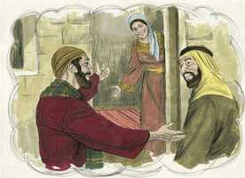
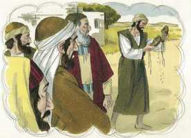
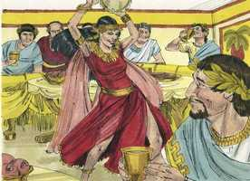

# Marcos Capítulo 6

**1** 	E, PARTINDO dali, chegou à sua pátria, e os seus discípulos o seguiram.

**2** 	E, chegando o sábado, começou a ensinar na sinagoga; e muitos, ouvindo-o, se admiravam, dizendo: De onde lhe vêm estas coisas? e que sabedoria é esta que lhe foi dada? e como se fazem tais maravilhas por suas mãos?

**3** 	Não é este o carpinteiro, filho de Maria, e irmão de Tiago, e de José, e de Judas e de Simão? e não estão aqui conosco suas irmãs? E escandalizavam-se nele.

**4** 	E Jesus lhes dizia: Não há profeta sem honra senão na sua pátria, entre os seus parentes, e na sua casa.

**5** 	E não podia fazer ali nenhuma obra maravilhosa; somente curou alguns poucos enfermos, impondo-lhes as mãos.

**6** 	E estava admirado da incredulidade deles. E percorreu as aldeias vizinhas, ensinando.

**7** 	Chamou a si os doze, e começou a enviá-los a dois e dois, e deu-lhes poder sobre os espíritos imundos;

**8** 	E ordenou-lhes que nada tomassem para o caminho, senão somente um bordão; nem alforje, nem pão, nem dinheiro no cinto;

**9** 	Mas que calçassem alparcas, e que não vestissem duas túnicas.

**10** 	E dizia-lhes: Na casa em que entrardes, ficai nela até partirdes dali.

 

**11** 	E tantos quantos vos não receberem, nem vos ouvirem, saindo dali, sacudi o pó que estiver debaixo dos vossos pés, em testemunho contra eles. Em verdade vos digo que haverá mais tolerância no dia de juízo para Sodoma e Gomorra, do que para os daquela cidade.

 

**12** 	E, saindo eles, pregavam que se arrependessem.

**13** 	E expulsavam muitos demônios, e ungiam muitos enfermos com óleo, e os curavam.

**14** 	E ouviu isto o rei Herodes (porque o nome de Jesus se tornara notório), e disse: João, o que batizava, ressuscitou dentre os mortos, e por isso estas maravilhas operam nele.

**15** 	Outros diziam: É Elias. E diziam outros: É um profeta, ou como um dos profetas.

**16** 	Herodes, porém, ouvindo isto, disse: Este é João, que mandei degolar; ressuscitou dentre os mortos.

 

**17** 	Porquanto o mesmo Herodes mandara prender a João, e encerrá-lo maniatado no cárcere, por causa de Herodias, mulher de Filipe, seu irmão, porquanto tinha casado com ela.

**18** 	Pois João dizia a Herodes: Não te é lícito possuir a mulher de teu irmão.

**19** 	E Herodias o espiava, e queria matá-lo, mas não podia.

**20** 	Porque Herodes temia a João, sabendo que era homem justo e santo; e guardava-o com segurança, e fazia muitas coisas, atendendo-o, e de boa mente o ouvia.

**21** 	E, chegando uma ocasião favorável em que Herodes, no dia dos seus anos, dava uma ceia aos grandes, e tribunos, e príncipes da Galiléia,

 

**22** 	Entrou a filha da mesma Herodias, e dançou, e agradou a Herodes e aos que estavam com ele à mesa. Disse então o rei à menina: Pede-me o que quiseres, e eu to darei.

 

**23** 	E jurou-lhe, dizendo: Tudo o que me pedires te darei, até metade do meu reino.

**24** 	E, saindo ela, perguntou a sua mãe: Que pedirei? E ela disse: A cabeça de João o Batista.

 

**25** 	E, entrando logo, apressadamente, pediu ao rei, dizendo: Quero que imediatamente me dês num prato a cabeça de João o Batista.

 

**26** 	E o rei entristeceu-se muito; todavia, por causa do juramento e dos que estavam com ele à mesa, não lha quis negar.

 

**27** 	E, enviando logo o rei o executor, mandou que lhe trouxessem ali a cabeça de João. E ele foi, e degolou-o na prisão;

 

**28** 	E trouxe a cabeça num prato, e deu-a à menina, e a menina a deu a sua mãe.

 

**29** 	E os seus discípulos, tendo ouvido isto, foram, tomaram o seu corpo, e o puseram num sepulcro.

 

**30** 	E os apóstolos ajuntaram-se a Jesus, e contaram-lhe tudo, tanto o que tinham feito como o que tinham ensinado.

**31** 	E ele disse-lhes: Vinde vós, aqui à parte, a um lugar deserto, e repousai um pouco. Porque havia muitos que iam e vinham, e não tinham tempo para comer.

**32** 	E foram sós num barco para um lugar deserto.

 

**33** 	E a multidão viu-os partir, e muitos o conheceram; e correram para lá, a pé, de todas as cidades, e ali chegaram primeiro do que eles, e aproximavam-se dele.

**34** 	E Jesus, saindo, viu uma grande multidão, e teve compaixão deles, porque eram como ovelhas que não têm pastor; e começou a ensinar-lhes muitas coisas.

 

**35** 	E, como o dia fosse já muito adiantado, os seus discípulos se aproximaram dele, e lhe disseram: O lugar é deserto, e o dia está já muito adiantado.

 

**36** 	Despede-os, para que vão aos lugares e aldeias circunvizinhas, e comprem pão para si; porque não têm que comer.

**37** 	Ele, porém, respondendo, lhes disse: Dai-lhes vós de comer. E eles disseram-lhe: Iremos nós, e compraremos duzentos dinheiros de pão para lhes darmos de comer?

  

**38** 	E ele disse-lhes: Quantos pães tendes? Ide ver. E, sabendo-o eles, disseram: Cinco pães e dois peixes.

**39** 	E ordenou-lhes que fizessem assentar a todos, em ranchos, sobre a erva verde.

 

**40** 	E assentaram-se repartidos de cem em cem, e de cinqüenta em cinqüenta.

**41** 	E, tomando ele os cinco pães e os dois peixes, levantou os olhos ao céu, abençoou e partiu os pães, e deu-os aos seus discípulos para que os pusessem diante deles. E repartiu os dois peixes por todos.

  

**42** 	E todos comeram, e ficaram fartos;

**43** 	E levantaram doze alcofas cheias de pedaços de pão e de peixe.

 

**44** 	E os que comeram os pães eram quase cinco mil homens.

**45** 	E logo obrigou os seus discípulos a subir para o barco, e passar adiante, para o outro lado, a Betsaida, enquanto ele despedia a multidão.

**46** 	E, tendo-os despedido, foi ao monte a orar.

 

**47** 	E, sobrevindo a tarde, estava o barco no meio do mar e ele, sozinho, em terra.

 

**48** 	E vendo que se fatigavam a remar, porque o vento lhes era contrário, perto da quarta vigília da noite aproximou-se deles, andando sobre o mar, e queria passar-lhes adiante.

  

**49** 	Mas, quando eles o viram andar sobre o mar, cuidaram que era um fantasma, e deram grandes gritos.

 

**50** 	Porque todos o viam, e perturbaram-se; mas logo falou com eles, e disse-lhes: Tende bom ânimo; sou eu, não temais.

 

**51** 	E subiu para o barco, para estar com eles, e o vento se aquietou; e entre si ficaram muito assombrados e maravilhados;

 

**52** 	Pois não tinham compreendido o milagre dos pães; antes o seu coração estava endurecido.

**53** 	E, quando já estavam no outro lado, dirigiram-se à terra de Genesaré, e ali atracaram.

**54** 	E, saindo eles do barco, logo o conheceram;

**55** 	E, correndo toda a terra em redor, começaram a trazer em leitos, aonde quer que sabiam que ele estava, os que se achavam enfermos.

**56** 	E, onde quer que entrava, ou em cidade, ou aldeias, ou no campo, apresentavam os enfermos nas praças, e rogavam-lhe que os deixasse tocar ao menos na orla da sua roupa; e todos os que lhe tocavam saravam.

