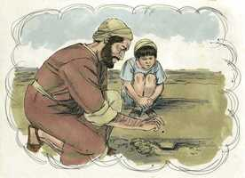

# Lucas Capítulo 13

**1** 	E, NAQUELE mesmo tempo, estavam presentes ali alguns que lhe falavam dos galileus, cujo sangue Pilatos misturara com os seus sacrifícios.

**2** 	E, respondendo Jesus, disse-lhes: Cuidais vós que esses galileus foram mais pecadores do que todos os galileus, por terem padecido tais coisas?

**3** 	Não, vos digo; antes, se não vos arrependerdes, todos de igual modo perecereis.

**4** 	E aqueles dezoito, sobre os quais caiu a torre de Siloé e os matou, cuidais que foram mais culpados do que todos quantos homens habitam em Jerusalém?

**5** 	Não, vos digo; antes, se não vos arrependerdes, todos de igual modo perecereis.

**6** 	E dizia esta parábola: Um certo homem tinha uma figueira plantada na sua vinha, e foi procurar nela fruto, não o achando;

**7** 	E disse ao vinhateiro: Eis que há três anos venho procurar fruto nesta figueira, e não o acho. Corta-a; por que ocupa ainda a terra inutilmente?

**8** 	E, respondendo ele, disse-lhe: Senhor, deixa-a este ano, até que eu a escave e a esterque;

**9** 	E, se der fruto, ficará e, se não, depois a mandarás cortar.

**10** 	E ensinava no sábado, numa das sinagogas.

**11** 	E eis que estava ali uma mulher que tinha um espírito de enfermidade, havia já dezoito anos; e andava curvada, e não podia de modo algum endireitar-se.

**12** 	E, vendo-a Jesus, chamou-a a si, e disse-lhe: Mulher, estás livre da tua enfermidade.

**13** 	E pôs as mãos sobre ela, e logo se endireitou, e glorificava a Deus.

**14** 	E, tomando a palavra o príncipe da sinagoga, indignado porque Jesus curava no sábado, disse à multidão: Seis dias há em que é mister trabalhar; nestes, pois, vinde para serdes curados, e não no dia de sábado.

**15** 	Respondeu-lhe, porém, o Senhor, e disse: Hipócrita, no sábado não desprende da manjedoura cada um de vós o seu boi, ou jumento, e não o leva a beber?

**16** 	E não convinha soltar desta prisão, no dia de sábado, esta filha de Abraão, a qual há dezoito anos Satanás tinha presa?

**17** 	E, dizendo ele isto, todos os seus adversários ficaram envergonhados, e todo o povo se alegrava por todas as coisas gloriosas que eram feitas por ele.

**18** 	E dizia: A que é semelhante o reino de Deus, e a que o compararei?

 

**19** 	É semelhante ao grão de mostarda que um homem, tomando-o, lançou na sua horta; e cresceu, e fez-se grande árvore, e em seus ramos se aninharam as aves do céu.

 

**20** 	E disse outra vez: A que compararei o reino de Deus?

**21** 	É semelhante ao fermento que uma mulher, tomando-o, escondeu em três medidas de farinha, até que tudo levedou.

**22** 	E percorria as cidades e as aldeias, ensinando, e caminhando para Jerusalém.

**23** 	E disse-lhe um: Senhor, são poucos os que se salvam? E ele lhe respondeu:

**24** 	Porfiai por entrar pela porta estreita; porque eu vos digo que muitos procurarão entrar, e não poderão.

**25** 	Quando o pai de família se levantar e cerrar a porta, e começardes, de fora, a bater à porta, dizendo: Senhor, Senhor, abre-nos; e, respondendo ele, vos disser: Não sei de onde vós sois;

**26** 	Então começareis a dizer: Temos comido e bebido na tua presença, e tu tens ensinado nas nossas ruas.

**27** 	E ele vos responderá: Digo-vos que não vos conheço nem sei de onde vós sois; apartai-vos de mim, vós todos os que praticais a iniqüidade.

**28** 	Ali haverá choro e ranger de dentes, quando virdes Abraão, e Isaque, e Jacó, e todos os profetas no reino de Deus, e vós lançados fora.

**29** 	E virão do oriente, e do ocidente, e do norte, e do sul, e assentar-se-ão à mesa no reino de Deus.

**30** 	E eis que derradeiros há que serão os primeiros; e primeiros há que serão os derradeiros.

**31** 	Naquele mesmo dia chegaram uns fariseus, dizendo-lhe: Sai, e retira-te daqui, porque Herodes quer matar-te.

**32** 	E respondeu-lhes: Ide, e dizei àquela raposa: Eis que eu expulso demônios, e efetuo curas, hoje e amanhã, e no terceiro dia sou consumado.

**33** 	Importa, porém, caminhar hoje, amanhã, e no dia seguinte, para que não suceda que morra um profeta fora de Jerusalém.

**34** 	Jerusalém, Jerusalém, que matas os profetas, e apedrejas os que te são enviados! Quantas vezes quis eu ajuntar os teus filhos, como a galinha os seus pintos debaixo das asas, e não quiseste?

**35** 	Eis que a vossa casa se vos deixará deserta. E em verdade vos digo que não me vereis até que venha o tempo em que digais: Bendito aquele que vem em nome do Senhor.

