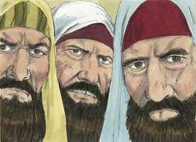
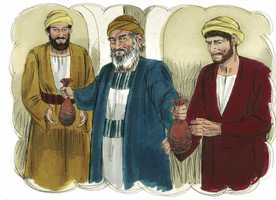
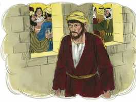
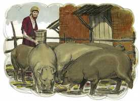
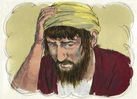
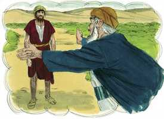
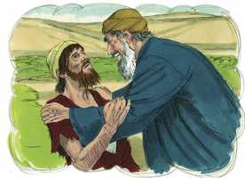
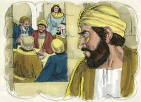
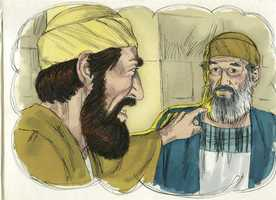
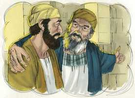

# Lucas Capítulo 15

**1** 	E CHEGAVAM-SE a ele todos os publicanos e pecadores para o ouvir.

**2** 	E os fariseus e os escribas murmuravam, dizendo: Este recebe pecadores, e come com eles.

 

**3** 	E ele lhes propôs esta parábola, dizendo:

**4** 	Que homem dentre vós, tendo cem ovelhas, e perdendo uma delas, não deixa no deserto as noventa e nove, e vai após a perdida até que venha a achá-la?

**5** 	E achando-a, a põe sobre os seus ombros, jubiloso;

**6** 	E, chegando a casa, convoca os amigos e vizinhos, dizendo-lhes: Alegrai-vos comigo, porque já achei a minha ovelha perdida.

**7** 	Digo-vos que assim haverá alegria no céu por um pecador que se arrepende, mais do que por noventa e nove justos que não necessitam de arrependimento.

**8** 	Ou qual a mulher que, tendo dez dracmas, se perder uma dracma, não acende a candeia, e varre a casa, e busca com diligência até a achar?

**9** 	E achando-a, convoca as amigas e vizinhas, dizendo: Alegrai-vos comigo, porque já achei a dracma perdida.

**10** 	Assim vos digo que há alegria diante dos anjos de Deus por um pecador que se arrepende.

**11** 	E disse: Um certo homem tinha dois filhos;

**12** 	E o mais moço deles disse ao pai: Pai, dá-me a parte dos bens que me pertence. E ele repartiu por eles a fazenda.

 

**13** 	E, poucos dias depois, o filho mais novo, ajuntando tudo, partiu para uma terra longínqua, e ali desperdiçou os seus bens, vivendo dissolutamente.

 

**14** 	E, havendo ele gastado tudo, houve naquela terra uma grande fome, e começou a padecer necessidades.

**15** 	E foi, e chegou-se a um dos cidadãos daquela terra, o qual o mandou para os seus campos, a apascentar porcos.

 

**16** 	E desejava encher o seu estômago com as bolotas que os porcos comiam, e ninguém lhe dava nada.

**17** 	E, tornando em si, disse: Quantos jornaleiros de meu pai têm abundância de pão, e eu aqui pereço de fome!

 

**18** 	Levantar-me-ei, e irei ter com meu pai, e dir-lhe-ei: Pai, pequei contra o céu e perante ti;

**19** 	Já não sou digno de ser chamado teu filho; faze-me como um dos teus jornaleiros.

**20** 	E, levantando-se, foi para seu pai; e, quando ainda estava longe, viu-o seu pai, e se moveu de íntima compaixão e, correndo, lançou-se-lhe ao pescoço e o beijou.

 

**21** 	E o filho lhe disse: Pai, pequei contra o céu e perante ti, e já não sou digno de ser chamado teu filho.

 

**22** 	Mas o pai disse aos seus servos: Trazei depressa a melhor roupa; e vesti-lho, e ponde-lhe um anel na mão, e alparcas nos pés;

 

**23** 	E trazei o bezerro cevado, e matai-o; e comamos, e alegremo-nos;

**24** 	Porque este meu filho estava morto, e reviveu, tinha-se perdido, e foi achado. E começaram a alegrar-se.

**25** 	E o seu filho mais velho estava no campo; e quando veio, e chegou perto de casa, ouviu a música e as danças.

**26** 	E, chamando um dos servos, perguntou-lhe que era aquilo.

 

**27** 	E ele lhe disse: Veio teu irmão; e teu pai matou o bezerro cevado, porque o recebeu são e salvo.

**28** 	Mas ele se indignou, e não queria entrar.

 

**29** 	E saindo o pai, instava com ele. Mas, respondendo ele, disse ao pai: Eis que te sirvo há tantos anos, sem nunca transgredir o teu mandamento, e nunca me deste um cabrito para alegrar-me com os meus amigos;

 

**30** 	Vindo, porém, este teu filho, que desperdiçou os teus bens com as meretrizes, mataste-lhe o bezerro cevado.

**31** 	E ele lhe disse: Filho, tu sempre estás comigo, e todas as minhas coisas são tuas;

 

**32** 	Mas era justo alegrarmo-nos e folgarmos, porque este teu irmão estava morto, e reviveu; e tinha-se perdido, e achou-se.

