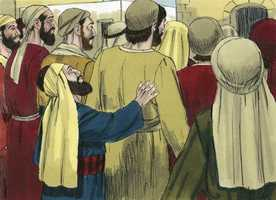
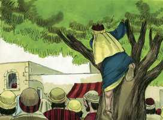
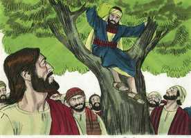
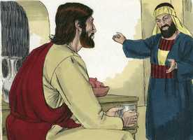
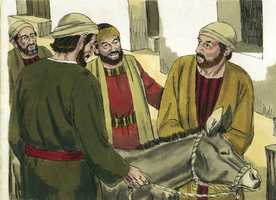
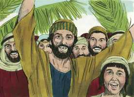
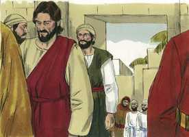

# Lucas Capítulo 19

**1** 	E, TENDO Jesus entrado em Jericó, ia passando.

**2** 	E eis que havia ali um homem chamado Zaqueu; e era este um chefe dos publicanos, e era rico.

**3** 	E procurava ver quem era Jesus, e não podia, por causa da multidão, pois era de pequena estatura.

 

**4** 	E, correndo adiante, subiu a um sicômoro para o ver; porque havia de passar por ali.

 

**5** 	E quando Jesus chegou àquele lugar, olhando para cima, viu-o e disse-lhe: Zaqueu, desce depressa, porque hoje me convém pousar em tua casa.

 

**6** 	E, apressando-se, desceu, e recebeu-o alegremente.

**7** 	E, vendo todos isto, murmuravam, dizendo que entrara para ser hóspede de um homem pecador.

 

**8** 	E, levantando-se Zaqueu, disse ao Senhor: Senhor, eis que eu dou aos pobres metade dos meus bens; e, se nalguma coisa tenho defraudado alguém, o restituo quadruplicado.

 

**9** 	E disse-lhe Jesus: Hoje veio a salvação a esta casa, pois também este é filho de Abraão.

 

**10** 	Porque o Filho do homem veio buscar e salvar o que se havia perdido.

**11** 	E, ouvindo eles estas coisas, ele prosseguiu, e contou uma parábola; porquanto estava perto de Jerusalém, e cuidavam que logo se havia de manifestar o reino de Deus.

**12** 	Disse pois: Certo homem nobre partiu para uma terra remota, a fim de tomar para si um reino e voltar depois.

**13** 	E, chamando dez servos seus, deu-lhes dez minas, e disse-lhes: Negociai até que eu venha.

**14** 	Mas os seus concidadãos odiavam-no, e mandaram após ele embaixadores, dizendo: Não queremos que este reine sobre nós.

**15** 	E aconteceu que, voltando ele, depois de ter tomado o reino, disse que lhe chamassem aqueles servos, a quem tinha dado o dinheiro, para saber o que cada um tinha ganhado, negociando.

**16** 	E veio o primeiro, dizendo: Senhor, a tua mina rendeu dez minas.

**17** 	E ele lhe disse: Bem está, servo bom, porque no mínimo foste fiel, sobre dez cidades terás autoridade.

**18** 	E veio o segundo, dizendo: Senhor, a tua mina rendeu cinco minas.

**19** 	E a este disse também: Sê tu também sobre cinco cidades.

**20** 	E veio outro, dizendo: Senhor, aqui está a tua mina, que guardei num lenço;

**21** 	Porque tive medo de ti, que és homem rigoroso, que tomas o que não puseste, e segas o que não semeaste.

**22** 	Porém, ele lhe disse: Mau servo, pela tua boca te julgarei. Sabias que eu sou homem rigoroso, que tomo o que não pus, e sego o que não semeei;

**23** 	Por que não puseste, pois, o meu dinheiro no banco, para que eu, vindo, o exigisse com os juros?

**24** 	E disse aos que estavam com ele: Tirai-lhe a mina, e dai-a ao que tem dez minas.

**25** 	(E disseram-lhe eles: Senhor, ele tem dez minas.)

**26** 	Pois eu vos digo que a qualquer que tiver ser-lhe-á dado, mas ao que não tiver, até o que tem lhe será tirado.

**27** 	E quanto àqueles meus inimigos que não quiseram que eu reinasse sobre eles, trazei-os aqui, e matai-os diante de mim.

**28** 	E, dito isto, ia caminhando adiante, subindo para Jerusalém.

**29** 	E aconteceu que, chegando perto de Betfagé, e de Betânia, ao monte chamado das Oliveiras, mandou dois dos seus discípulos,

 

**30** 	Dizendo: Ide à aldeia que está defronte, e aí, ao entrar, achareis preso um jumentinho em que nenhum homem ainda montou; soltai-o e trazei-o.

**31** 	E, se alguém vos perguntar: Por que o soltais? assim lhe direis: Porque o Senhor o há de mister.

**32** 	E, indo os que haviam sido mandados, acharam como lhes dissera.

**33** 	E, quando soltaram o jumentinho, seus donos lhes disseram: Por que soltais o jumentinho?

 

**34** 	E eles responderam: O Senhor o há de mister.

**35** 	E trouxeram-no a Jesus; e, lançando sobre o jumentinho as suas vestes, puseram Jesus em cima.

 

**36** 	E, indo ele, estendiam no caminho as suas vestes.

 

**37** 	E, quando já chegava perto da descida do Monte das Oliveiras, toda a multidão dos discípulos, regozijando-se, começou a dar louvores a Deus em alta voz, por todas as maravilhas que tinham visto,

**38** 	Dizendo: Bendito o Rei que vem em nome do Senhor; paz no céu, e glória nas alturas.

 

**39** 	E disseram-lhe de entre a multidão alguns dos fariseus: Mestre, repreende os teus discípulos.

**40** 	E, respondendo ele, disse-lhes: Digo-vos que, se estes se calarem, as próprias pedras clamarão.

**41** 	E, quando ia chegando, vendo a cidade, chorou sobre ela,

**42** 	Dizendo: Ah! se tu conhecesses também, ao menos neste teu dia, o que à tua paz pertence! Mas agora isto está encoberto aos teus olhos.

**43** 	Porque dias virão sobre ti, em que os teus inimigos te cercarão de trincheiras, e te sitiarão, e te estreitarão de todos os lados;

**44** 	E te derrubarão, a ti e aos teus filhos que dentro de ti estiverem, e não deixarão em ti pedra sobre pedra, pois que não conheceste o tempo da tua visitação.

**45** 	E, entrando no templo, começou a expulsar todos os que nele vendiam e compravam,

  

**46** 	Dizendo-lhes: Está escrito: A minha casa é casa de oração; mas vós fizestes dela covil de salteadores.

 

**47** 	E todos os dias ensinava no templo; mas os principais dos sacerdotes, e os escribas, e os principais do povo procuravam matá-lo.

 

**48** 	E não achavam meio de o fazer, porque todo o povo pendia para ele, escutando-o.

 

