# Lucas Capítulo 22

**1** 	ESTAVA, pois, perto a festa dos pães ázimos, chamada a páscoa.

**2** 	E os principais dos sacerdotes, e os escribas, andavam procurando como o matariam; porque temiam o povo.

 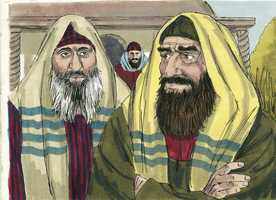 

**3** 	Entrou, porém, Satanás em Judas, que tinha por sobrenome Iscariotes, o qual era do número dos doze.

**4** 	E foi, e falou com os principais dos sacerdotes, e com os capitães, de como lho entregaria;

 

**5** 	Os quais se alegraram, e convieram em lhe dar dinheiro.

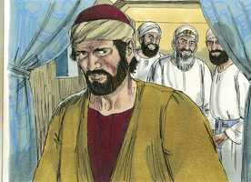 

**6** 	E ele concordou; e buscava oportunidade para lho entregar sem alvoroço.

 

**7** 	Chegou, porém, o dia dos ázimos, em que importava sacrificar a páscoa.

**8** 	E mandou a Pedro e a João, dizendo: Ide, preparai-nos a páscoa, para que a comamos.

 

**9** 	E eles lhe perguntaram: Onde queres que a preparemos?

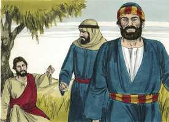 

**10** 	E ele lhes disse: Eis que, quando entrardes na cidade, encontrareis um homem, levando um cântaro de água; segui-o até à casa em que ele entrar.

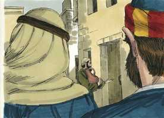 

**11** 	E direis ao pai de família da casa: O Mestre te diz: Onde está o aposento em que hei de comer a páscoa com os meus discípulos?

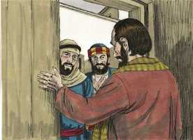 

**12** 	Então ele vos mostrará um grande cenáculo mobilado; aí fazei preparativos.

 

**13** 	E, indo eles, acharam como lhes havia sido dito; e prepararam a páscoa.

 

**14** 	E, chegada a hora, pôs-se à mesa, e com ele os doze apóstolos.

**15** 	E disse-lhes: Desejei muito comer convosco esta páscoa, antes que padeça;

 

**16** 	Porque vos digo que não a comerei mais até que ela se cumpra no reino de Deus.

**17** 	E, tomando o cálice, e havendo dado graças, disse: Tomai-o, e reparti-o entre vós;

**18** 	Porque vos digo que já não beberei do fruto da vide, até que venha o reino de Deus.

**19** 	E, tomando o pão, e havendo dado graças, partiu-o, e deu-lho, dizendo: Isto é o meu corpo, que por vós é dado; fazei isto em memória de mim.

 

**20** 	Semelhantemente, tomou o cálice, depois da ceia, dizendo: Este cálice é o novo testamento no meu sangue, que é derramado por vós.

 

**21** 	Mas eis que a mão do que me trai está comigo à mesa.

**22** 	E, na verdade, o Filho do homem vai segundo o que está determinado; mas ai daquele homem por quem é traído!

**23** 	E começaram a perguntar entre si qual deles seria o que havia de fazer isto.

 

**24** 	E houve também entre eles contenda, sobre qual deles parecia ser o maior.

**25** 	E ele lhes disse: Os reis dos gentios dominam sobre eles, e os que têm autoridade sobre eles são chamados benfeitores.

**26** 	Mas não sereis vós assim; antes o maior entre vós seja como o menor; e quem governa como quem serve.

**27** 	Pois qual é maior: quem está à mesa, ou quem serve? Porventura não é quem está à mesa? Eu, porém, entre vós sou como aquele que serve.

**28** 	E vós sois os que tendes permanecido comigo nas minhas tentações.

**29** 	E eu vos destino o reino, como meu Pai mo destinou,

**30** 	Para que comais e bebais à minha mesa no meu reino, e vos assenteis sobre tronos, julgando as doze tribos de Israel.

**31** 	Disse também o Senhor: Simão, Simão, eis que Satanás vos pediu para vos cirandar como trigo;

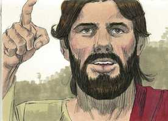 

**32** 	Mas eu roguei por ti, para que a tua fé não desfaleça; e tu, quando te converteres, confirma teus irmãos.

**33** 	E ele lhe disse: Senhor, estou pronto a ir contigo até à prisão e à morte.

 

**34** 	Mas ele disse: Digo-te, Pedro, que não cantará hoje o galo antes que três vezes negues que me conheces.

 

**35** 	E disse-lhes: Quando vos mandei sem bolsa, alforje, ou alparcas, faltou-vos porventura alguma coisa? Eles responderam: Nada.

**36** 	Disse-lhes pois: Mas agora, aquele que tiver bolsa, tome-a, como também o alforje; e, o que não tem espada, venda a sua capa e compre-a;

**37** 	Porquanto vos digo que importa que em mim se cumpra aquilo que está escrito: E com os malfeitores foi contado. Porque o que está escrito de mim terá cumprimento.

**38** 	E eles disseram: Senhor, eis aqui duas espadas. E ele lhes disse: Basta.

**39** 	E, saindo, foi, como costumava, para o Monte das Oliveiras; e também os seus discípulos o seguiram.

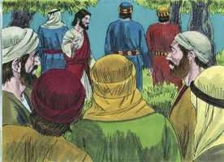 

**40** 	E quando chegou àquele lugar, disse-lhes: Orai, para que não entreis em tentação.

 

**41** 	E apartou-se deles cerca de um tiro de pedra; e, pondo-se de joelhos, orava,

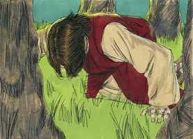 

**42** 	Dizendo: Pai, se queres, passa de mim este cálice; todavia não se faça a minha vontade, mas a tua.

**43** 	E apareceu-lhe um anjo do céu, que o fortalecia.

**44** 	E, posto em agonia, orava mais intensamente. E o seu suor tornou-se como grandes gotas de sangue, que corriam até ao chão.

**45** 	E, levantando-se da oração, veio para os seus discípulos, e achou-os dormindo de tristeza.

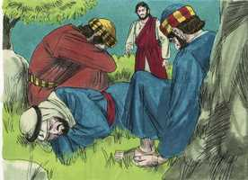 

**46** 	E disse-lhes: Por que estais dormindo? Levantai-vos, e orai, para que não entreis em tentação.

 

**47** 	E, estando ele ainda a falar, surgiu uma multidão; e um dos doze, que se chamava Judas, ia adiante dela, e chegou-se a Jesus para o beijar.

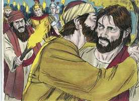 

**48** 	E Jesus lhe disse: Judas, com um beijo trais o Filho do homem?

**49** 	E, vendo os que estavam com ele o que ia suceder, disseram-lhe: Senhor, feriremos à espada?

**50** 	E um deles feriu o servo do sumo sacerdote, e cortou-lhe a orelha direita.

 

**51** 	E, respondendo Jesus, disse: Deixai-os; basta. E, tocando-lhe a orelha, o curou.

**52** 	E disse Jesus aos principais dos sacerdotes, e capitães do templo, e anciãos, que tinham ido contra ele: Saístes, como a um salteador, com espadas e varapaus?

**53** 	Tenho estado todos os dias convosco no templo, e não estendestes as mãos contra mim, mas esta é a vossa hora e o poder das trevas.

**54** 	Então, prendendo-o, o levaram, e o puseram em casa do sumo sacerdote. E Pedro seguia-o de longe.

**55** 	E, havendo-se acendido fogo no meio do pátio, estando todos sentados, assentou-se Pedro entre eles.

 

**56** 	E como certa criada, vendo-o estar assentado ao fogo, pusesse os olhos nele, disse: Este também estava com ele.

 

**57** 	Porém, ele negou-o, dizendo: Mulher, não o conheço.

 

**58** 	E, um pouco depois, vendo-o outro, disse: Tu és também deles. Mas Pedro disse: Homem, não sou.

**59** 	E, passada quase uma hora, um outro afirmava, dizendo: Também este verdadeiramente estava com ele, pois também é galileu.

**60** 	E Pedro disse: Homem, não sei o que dizes. E logo, estando ele ainda a falar, cantou o galo.

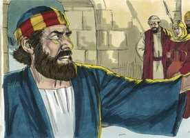 

**61** 	E, virando-se o Senhor, olhou para Pedro, e Pedro lembrou-se da palavra do Senhor, como lhe havia dito: Antes que o galo cante hoje, me negarás três vezes.

**62** 	E, saindo Pedro para fora, chorou amargamente.

 

**63** 	E os homens que detinham Jesus zombavam dele, ferindo-o.

**64** 	E, vendando-lhe os olhos, feriam-no no rosto, e perguntavam-lhe, dizendo: Profetiza, quem é que te feriu?

**65** 	E outras muitas coisas diziam contra ele, blasfemando.

**66** 	E logo que foi dia ajuntaram-se os anciãos do povo, e os principais dos sacerdotes e os escribas, e o conduziram ao seu concílio, e lhe perguntaram:

**67** 	És tu o Cristo? Dize-no-lo. Ele replicou: Se vo-lo disser, não o crereis;

**68** 	E também, se vos perguntar, não me respondereis, nem me soltareis.

**69** 	Desde agora o Filho do homem se assentará à direita do poder de Deus.

**70** 	E disseram todos: Logo, és tu o Filho de Deus? E ele lhes disse: Vós dizeis que eu sou.

 

**71** 	Então disseram: De que mais testemunho necessitamos? pois nós mesmos o ouvimos da sua boca.

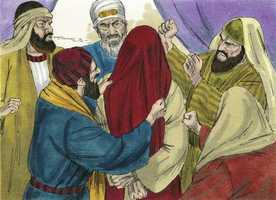 

