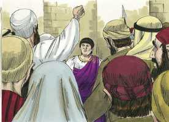
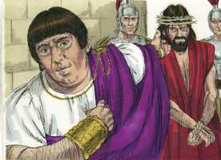
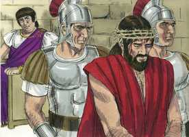

# Lucas Capítulo 23

**1** 	E, LEVANTANDO-SE toda a multidão deles, o levaram a Pilatos.

 

**2** 	E começaram a acusá-lo, dizendo: Havemos achado este pervertendo a nação, proibindo dar o tributo a César, e dizendo que ele mesmo é Cristo, o rei.

**3** 	E Pilatos perguntou-lhe, dizendo: Tu és o Rei dos Judeus? E ele, respondendo, disse-lhe: Tu o dizes.

  

**4** 	E disse Pilatos aos principais dos sacerdotes, e à multidão: Não acho culpa alguma neste homem.

 

**5** 	Mas eles insistiam cada vez mais, dizendo: Alvoroça o povo ensinando por toda a Judéia, começando desde a Galiléia até aqui.

 

**6** 	Então Pilatos, ouvindo falar da Galiléia perguntou se aquele homem era galileu.

**7** 	E, sabendo que era da jurisdição de Herodes, remeteu-o a Herodes, que também naqueles dias estava em Jerusalém.

**8** 	E Herodes, quando viu a Jesus, alegrou-se muito; porque havia muito que desejava vê-lo, por ter ouvido dele muitas coisas; e esperava que lhe veria fazer algum sinal.

**9** 	E interrogava-o com muitas palavras, mas ele nada lhe respondia.

**10** 	E estavam os principais dos sacerdotes, e os escribas, acusando-o com grande veemência.

**11** 	E Herodes, com os seus soldados, desprezou-o e, escarnecendo dele, vestiu-o de uma roupa resplandecente e tornou a enviá-lo a Pilatos.

**12** 	E no mesmo dia, Pilatos e Herodes entre si se fizeram amigos; pois dantes andavam em inimizade um com o outro.

**13** 	E, convocando Pilatos os principais dos sacerdotes, e os magistrados, e o povo,

**14** 	Disse-lhes: Haveis-me apresentado este homem como pervertedor do povo; e eis que, examinando-o na vossa presença, nenhuma culpa, das de que o acusais, acho neste homem.

**15** 	Nem mesmo Herodes, porque a ele vos remeti, e eis que não tem feito coisa alguma digna de morte.

**16** 	Castigá-lo-ei, pois, e soltá-lo-ei.

 

**17** 	E era-lhe necessário soltar-lhes um pela festa.

**18** 	Mas toda a multidão clamou a uma, dizendo: Fora daqui com este, e solta-nos Barrabás.

**19** 	O qual fora lançado na prisão por causa de uma sedição feita na cidade, e de um homicídio.

**20** 	Falou, pois, outra vez Pilatos, querendo soltar a Jesus.

**21** 	Mas eles clamavam em contrário, dizendo: Crucifica-o, crucifica-o.

 

**22** 	Então ele, pela terceira vez, lhes disse: Mas que mal fez este? Não acho nele culpa alguma de morte. Castigá-lo-ei pois, e soltá-lo-ei.

 

**23** 	Mas eles instavam com grandes gritos, pedindo que fosse crucificado. E os seus gritos, e os dos principais dos sacerdotes, prevaleciam.

**24** 	Então Pilatos julgou que devia fazer o que eles pediam.

**25** 	E soltou-lhes o que fora lançado na prisão por uma sedição e homicídio, que era o que pediam; mas entregou Jesus à vontade deles.

 

**26** 	E quando o iam levando, tomaram um certo Simão, cireneu, que vinha do campo, e puseram-lhe a cruz às costas, para que a levasse após Jesus.

 

**27** 	E seguia-o grande multidão de povo e de mulheres, as quais batiam nos peitos, e o lamentavam.

**28** 	Jesus, porém, voltando-se para elas, disse: Filhas de Jerusalém, não choreis por mim; chorai antes por vós mesmas, e por vossos filhos.

**29** 	Porque eis que hão de vir dias em que dirão: Bem-aventuradas as estéreis, e os ventres que não geraram, e os peitos que não amamentaram!

**30** 	Então começarão a dizer aos montes: Caí sobre nós, e aos outeiros: Cobri-nos.

**31** 	Porque, se ao madeiro verde fazem isto, que se fará ao seco?

**32** 	E também conduziram outros dois, que eram malfeitores, para com ele serem mortos.

**33** 	E, quando chegaram ao lugar chamado a Caveira, ali o crucificaram, e aos malfeitores, um à direita e outro à esquerda.

 

**34** 	E dizia Jesus: Pai, perdoa-lhes, porque não sabem o que fazem. E, repartindo as suas vestes, lançaram sortes.

 

**35** 	E o povo estava olhando. E também os príncipes zombavam dele, dizendo: Aos outros salvou, salve-se a si mesmo, se este é o Cristo, o escolhido de Deus.

  

**36** 	E também os soldados o escarneciam, chegando-se a ele, e apresentando-lhe vinagre.

**37** 	E dizendo: Se tu és o Rei dos Judeus, salva-te a ti mesmo.

**38** 	E também por cima dele, estava um título, escrito em letras gregas, romanas, e hebraicas: ESTE É O REI DOS JUDEUS.

**39** 	E um dos malfeitores que estavam pendurados blasfemava dele, dizendo: Se tu és o Cristo, salva-te a ti mesmo, e a nós.

**40** 	Respondendo, porém, o outro, repreendia-o, dizendo: Tu nem ainda temes a Deus, estando na mesma condenação?

**41** 	E nós, na verdade, com justiça, porque recebemos o que os nossos feitos mereciam; mas este nenhum mal fez.

**42** 	E disse a Jesus: Senhor, lembra-te de mim, quando entrares no teu reino.

 

**43** 	E disse-lhe Jesus: Em verdade te digo que hoje estarás comigo no Paraíso.

**44** 	E era já quase a hora sexta, e houve trevas em toda a terra até à hora nona, escurecendo-se o sol;

 

**45** 	E rasgou-se ao meio o véu do templo.

**46** 	E, clamando Jesus com grande voz, disse: Pai, nas tuas mãos entrego o meu espírito. E, havendo dito isto, expirou.

 

**47** 	E o centurião, vendo o que tinha acontecido, deu glória a Deus, dizendo: Na verdade, este homem era justo.

 

**48** 	E toda a multidão que se ajuntara a este espetáculo, vendo o que havia acontecido, voltava batendo nos peitos.

**49** 	E todos os seus conhecidos, e as mulheres que juntamente o haviam seguido desde a Galiléia, estavam de longe vendo estas coisas.

 

**50** 	E eis que um homem por nome José, senador, homem de bem e justo,

 

**51** 	Que não tinha consentido no conselho e nos atos dos outros, de Arimatéia, cidade dos judeus, e que também esperava o reino de Deus;

**52** 	Esse, chegando a Pilatos, pediu o corpo de Jesus.

**53** 	E, havendo-o tirado, envolveu-o num lençol, e pô-lo num sepulcro escavado numa penha, onde ninguém ainda havia sido posto.

 

**54** 	E era o dia da preparação, e amanhecia o sábado.

**55** 	E as mulheres, que tinham vindo com ele da Galiléia, seguiram também e viram o sepulcro, e como foi posto o seu corpo.

**56** 	E, voltando elas, prepararam especiarias e ungüentos; e no sábado repousaram, conforme o mandamento.

