# Lucas Capítulo 24

**1** 	E NO primeiro dia da semana, muito de madrugada, foram elas ao sepulcro, levando as especiarias que tinham preparado, e algumas outras com elas.

 

**2** 	E acharam a pedra revolvida do sepulcro.

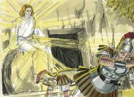 

**3** 	E, entrando, não acharam o corpo do Senhor Jesus.

**4** 	E aconteceu que, estando elas muito perplexas a esse respeito, eis que pararam junto delas dois homens, com vestes resplandecentes.

**5** 	E, estando elas muito atemorizadas, e abaixando o rosto para o chão, eles lhes disseram: Por que buscais o vivente entre os mortos?

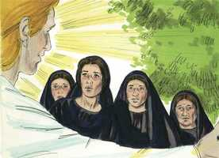 

**6** 	Não está aqui, mas ressuscitou. Lembrai-vos como vos falou, estando ainda na Galiléia,

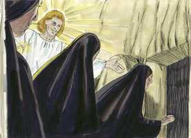 

**7** 	Dizendo: Convém que o Filho do homem seja entregue nas mãos de homens pecadores, e seja crucificado, e ao terceiro dia ressuscite.

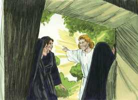 

**8** 	E lembraram-se das suas palavras.

 

**9** 	E, voltando do sepulcro, anunciaram todas estas coisas aos onze e a todos os demais.

**10** 	E eram Maria Madalena, e Joana, e Maria, mãe de Tiago, e as outras que com elas estavam, as que diziam estas coisas aos apóstolos.

**11** 	E as suas palavras lhes pareciam como desvario, e não as creram.

**12** 	Pedro, porém, levantando-se, correu ao sepulcro e, abaixando-se, viu só os lençóis ali postos; e retirou-se, admirando consigo aquele caso.

**13** 	E eis que no mesmo dia iam dois deles para uma aldeia, que distava de Jerusalém sessenta estádios, cujo nome era Emaús.

 

**14** 	E iam falando entre si de tudo aquilo que havia sucedido.

**15** 	E aconteceu que, indo eles falando entre si, e fazendo perguntas um ao outro, o mesmo Jesus se aproximou, e ia com eles.

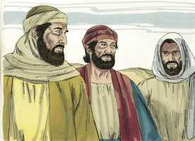 

**16** 	Mas os olhos deles estavam como que fechados, para que o não conhecessem.

**17** 	E ele lhes disse: Que palavras são essas que, caminhando, trocais entre vós, e por que estais tristes?

**18** 	E, respondendo um, cujo nome era Cléopas, disse-lhe: És tu só peregrino em Jerusalém, e não sabes as coisas que nela têm sucedido nestes dias?

 

**19** 	E ele lhes perguntou: Quais? E eles lhe disseram: As que dizem respeito a Jesus Nazareno, que foi homem profeta, poderoso em obras e palavras diante de Deus e de todo o povo;

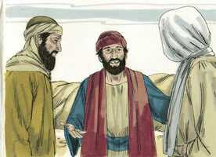 

**20** 	E como os principais dos sacerdotes e os nossos príncipes o entregaram à condenação de morte, e o crucificaram.

**21** 	E nós esperávamos que fosse ele o que remisse Israel; mas agora, sobre tudo isso, é já hoje o terceiro dia desde que essas coisas aconteceram.

**22** 	É verdade que também algumas mulheres dentre nós nos maravilharam, as quais de madrugada foram ao sepulcro;

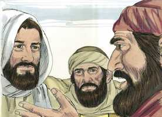 

**23** 	E, não achando o seu corpo, voltaram, dizendo que também tinham visto uma visão de anjos, que dizem que ele vive.

**24** 	E alguns dos que estavam conosco foram ao sepulcro, e acharam ser assim como as mulheres haviam dito; porém, a ele não o viram.

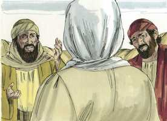 

**25** 	E ele lhes disse: Ó néscios, e tardos de coração para crer tudo o que os profetas disseram!

 

**26** 	Porventura não convinha que o Cristo padecesse estas coisas e entrasse na sua glória?

**27** 	E, começando por Moisés, e por todos os profetas, explicava-lhes o que dele se achava em todas as Escrituras.

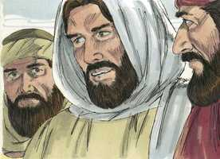 

**28** 	E chegaram à aldeia para onde iam, e ele fez como quem ia para mais longe.

**29** 	E eles o constrangeram, dizendo: Fica conosco, porque já é tarde, e já declinou o dia. E entrou para ficar com eles.

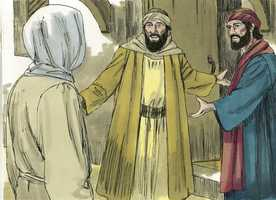 

**30** 	E aconteceu que, estando com eles à mesa, tomando o pão, o abençoou e partiu-o, e lho deu.

 

**31** 	Abriram-se-lhes então os olhos, e o conheceram, e ele desapareceu-lhes.

**32** 	E disseram um para o outro: Porventura não ardia em nós o nosso coração quando, pelo caminho, nos falava, e quando nos abria as Escrituras?

**33** 	E na mesma hora, levantando-se, tornaram para Jerusalém, e acharam congregados os onze, e os que estavam com eles,

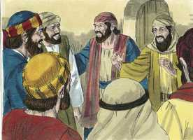 

**34** 	Os quais diziam: Ressuscitou verdadeiramente o Senhor, e já apareceu a Simão.

**35** 	E eles lhes contaram o que lhes acontecera no caminho, e como deles fora conhecido no partir do pão.

**36** 	E falando eles destas coisas, o mesmo Jesus se apresentou no meio deles, e disse-lhes: Paz seja convosco.

**37** 	E eles, espantados e atemorizados, pensavam que viam algum espírito.

**38** 	E ele lhes disse: Por que estais perturbados, e por que sobem tais pensamentos aos vossos corações?

**39** 	Vede as minhas mãos e os meus pés, que sou eu mesmo; apalpai-me e vede, pois um espírito não tem carne nem ossos, como vedes que eu tenho.

**40** 	E, dizendo isto, mostrou-lhes as mãos e os pés.

**41** 	E, não o crendo eles ainda por causa da alegria, e estando maravilhados, disse-lhes: Tendes aqui alguma coisa que comer?

**42** 	Então eles apresentaram-lhe parte de um peixe assado, e um favo de mel;

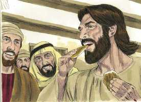 

**43** 	O que ele tomou, e comeu diante deles.

**44** 	E disse-lhes: São estas as palavras que vos disse estando ainda convosco: Que convinha que se cumprisse tudo o que de mim estava escrito na lei de Moisés, e nos profetas e nos Salmos.

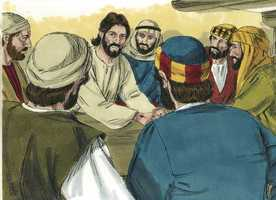 

**45** 	Então abriu-lhes o entendimento para compreenderem as Escrituras.

**46** 	E disse-lhes: Assim está escrito, e assim convinha que o Cristo padecesse, e ao terceiro dia ressuscitasse dentre os mortos,

 

**47** 	E em seu nome se pregasse o arrependimento e a remissão dos pecados, em todas as nações, começando por Jerusalém.

**48** 	E destas coisas sois vós testemunhas.

**49** 	E eis que sobre vós envio a promessa de meu Pai; ficai, porém, na cidade de Jerusalém, até que do alto sejais revestidos de poder.

**50** 	E levou-os fora, até Betânia; e, levantando as suas mãos, os abençoou.

**51** 	E aconteceu que, abençoando-os ele, se apartou deles e foi elevado ao céu.

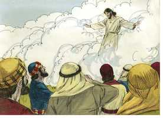 

**52** 	E, adorando-o eles, tornaram com grande júbilo para Jerusalém.

**53** 	E estavam sempre no templo, louvando e bendizendo a Deus. Amém.

