# João Capítulo 11

**1** 	ESTAVA, porém, enfermo um certo Lázaro, de Betânia, aldeia de Maria e de sua irmã Marta.

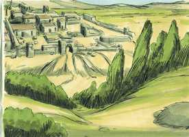 

**2** 	E Maria era aquela que tinha ungido o Senhor com ungüento, e lhe tinha enxugado os pés com os seus cabelos, cujo irmão Lázaro estava enfermo.

**3** 	Mandaram-lhe, pois, suas irmãs dizer: Senhor, eis que está enfermo aquele que tu amas.

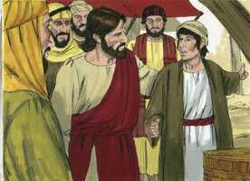 

**4** 	E Jesus, ouvindo isto, disse: Esta enfermidade não é para morte, mas para glória de Deus, para que o Filho de Deus seja glorificado por ela.

**5** 	Ora, Jesus amava a Marta, e a sua irmã, e a Lázaro.

**6** 	Ouvindo, pois, que estava enfermo, ficou ainda dois dias no lugar onde estava.

**7** 	Depois disto, disse aos seus discípulos: Vamos outra vez para a Judéia.

**8** 	Disseram-lhe os discípulos: Rabi, ainda agora os judeus procuravam apedrejar-te, e tornas para lá?

**9** 	Jesus respondeu: Não há doze horas no dia? Se alguém andar de dia, não tropeça, porque vê a luz deste mundo;

**10** 	Mas, se andar de noite, tropeça, porque nele não há luz.

**11** 	Assim falou; e depois disse-lhes: Lázaro, o nosso amigo, dorme, mas vou despertá-lo do sono.

**12** 	Disseram, pois, os seus discípulos: Senhor, se dorme, estará salvo.

**13** 	Mas Jesus dizia isto da sua morte; eles, porém, cuidavam que falava do repouso do sono.

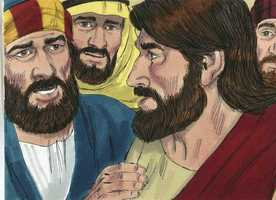 

**14** 	Então Jesus disse-lhes claramente: Lázaro está morto;

**15** 	E folgo, por amor de vós, de que eu lá não estivesse, para que acrediteis; mas vamos ter com ele.

**16** 	Disse, pois, Tomé, chamado Dídimo, aos condiscípulos: Vamos nós também, para morrermos com ele.

**17** 	Chegando, pois, Jesus, achou que já havia quatro dias que estava na sepultura.

**18** 	(Ora Betânia distava de Jerusalém quase quinze estádios.)

**19** 	E muitos dos judeus tinham ido consolar a Marta e a Maria, acerca de seu irmão.

**20** 	Ouvindo, pois, Marta que Jesus vinha, saiu-lhe ao encontro; Maria, porém, ficou assentada em casa.

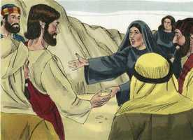 

**21** 	Disse, pois, Marta a Jesus: Senhor, se tu estivesses aqui, meu irmão não teria morrido.

**22** 	Mas também agora sei que tudo quanto pedires a Deus, Deus to concederá.

**23** 	Disse-lhe Jesus: Teu irmão há de ressuscitar.

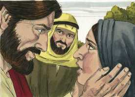 

**24** 	Disse-lhe Marta: Eu sei que há de ressuscitar na ressurreição do último dia.

**25** 	Disse-lhe Jesus: Eu sou a ressurreição e a vida; quem crê em mim, ainda que esteja morto, viverá;

**26** 	E todo aquele que vive, e crê em mim, nunca morrerá. Crês tu isto?

**27** 	Disse-lhe ela: Sim, Senhor, creio que tu és o Cristo, o Filho de Deus, que havia de vir ao mundo.

**28** 	E, dito isto, partiu, e chamou em segredo a Maria, sua irmã, dizendo: O Mestre está cá, e chama-te.

**29** 	Ela, ouvindo isto, levantou-se logo, e foi ter com ele.

**30** 	(Pois, Jesus ainda não tinha chegado à aldeia, mas estava no lugar onde Marta o encontrara.)

**31** 	Vendo, pois, os judeus, que estavam com ela em casa e a consolavam, que Maria apressadamente se levantara e saíra, seguiram-na, dizendo: Vai ao sepulcro para chorar ali.

**32** 	Tendo, pois, Maria chegado aonde Jesus estava, e vendo-o, lançou-se aos seus pés, dizendo-lhe: Senhor, se tu estivesses aqui, meu irmão não teria morrido.

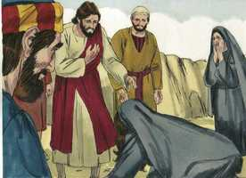 

**33** 	Jesus pois, quando a viu chorar, e também chorando os judeus que com ela vinham, moveu-se muito em espírito, e perturbou-se.

**34** 	E disse: Onde o pusestes? Disseram-lhe: Senhor, vem, e vê.

**35** 	Jesus chorou.

**36** 	Disseram, pois, os judeus: Vede como o amava.

**37** 	E alguns deles disseram: Não podia ele, que abriu os olhos ao cego, fazer também com que este não morresse?

**38** 	Jesus, pois, movendo-se outra vez muito em si mesmo, veio ao sepulcro; e era uma caverna, e tinha uma pedra posta sobre ela.

**39** 	Disse Jesus: Tirai a pedra. Marta, irmã do defunto, disse-lhe: Senhor, já cheira mal, porque é já de quatro dias.

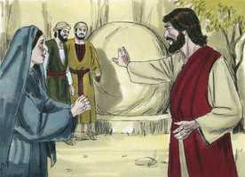 

**40** 	Disse-lhe Jesus: Não te hei dito que, se creres, verás a glória de Deus?

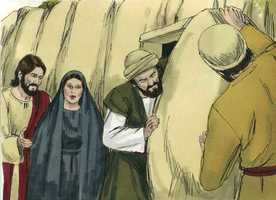 

**41** 	Tiraram, pois, a pedra de onde o defunto jazia. E Jesus, levantando os olhos para cima, disse: Pai, graças te dou, por me haveres ouvido.

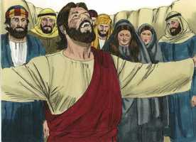 

**42** 	Eu bem sei que sempre me ouves, mas eu disse isto por causa da multidão que está em redor, para que creiam que tu me enviaste.

**43** 	E, tendo dito isto, clamou com grande voz: Lázaro, sai para fora.

 

**44** 	E o defunto saiu, tendo as mãos e os pés ligados com faixas, e o seu rosto envolto num lenço. Disse-lhes Jesus: Desligai-o, e deixai-o ir.

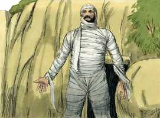 

**45** 	Muitos, pois, dentre os judeus que tinham vindo a Maria, e que tinham visto o que Jesus fizera, creram nele.

**46** 	Mas alguns deles foram ter com os fariseus, e disseram-lhes o que Jesus tinha feito.

**47** 	Depois os principais dos sacerdotes e os fariseus formaram conselho, e diziam: Que faremos? porquanto este homem faz muitos sinais.

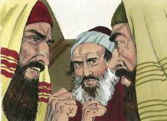 

**48** 	Se o deixamos assim, todos crerão nele, e virão os romanos, e tirar-nos-ão o nosso lugar e a nação.

**49** 	E Caifás, um deles que era sumo sacerdote naquele ano, lhes disse: Vós nada sabeis,

**50** 	Nem considerais que nos convém que um homem morra pelo povo, e que não pereça toda a nação.

**51** 	Ora ele não disse isto de si mesmo, mas, sendo o sumo sacerdote naquele ano, profetizou que Jesus devia morrer pela nação.

**52** 	E não somente pela nação, mas também para reunir em um corpo os filhos de Deus que andavam dispersos.

**53** 	Desde aquele dia, pois, consultavam-se para o matarem.

**54** 	Jesus, pois, já não andava manifestamente entre os judeus, mas retirou-se dali para a terra junto do deserto, para uma cidade chamada Efraim; e ali ficou com os seus discípulos.

**55** 	E estava próxima a páscoa dos judeus, e muitos daquela região subiram a Jerusalém antes da páscoa para se purificarem.

**56** 	Buscavam, pois, a Jesus, e diziam uns aos outros, estando no templo: Que vos parece? Não virá à festa?

**57** 	Ora, os principais dos sacerdotes e os fariseus tinham dado ordem para que, se alguém soubesse onde ele estava, o denunciasse, para o prenderem.

