# João Capítulo 2

**1** 	E, AO terceiro dia, fizeram-se umas bodas em Caná da Galiléia; e estava ali a mãe de Jesus.

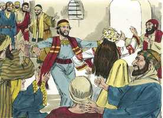 

**2** 	E foi também convidado Jesus e os seus discípulos para as bodas.

**3** 	E, faltando vinho, a mãe de Jesus lhe disse: Não têm vinho.

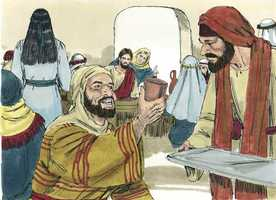 

**4** 	Disse-lhe Jesus: Mulher, que tenho eu contigo? Ainda não é chegada a minha hora.

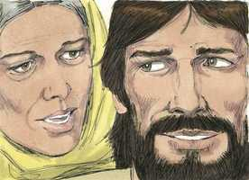 

**5** 	Sua mãe disse aos serventes: Fazei tudo quanto ele vos disser.

**6** 	E estavam ali postas seis talhas de pedra, para as purificações dos judeus, e em cada uma cabiam dois ou três almudes.

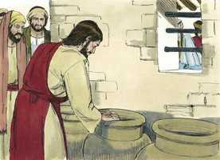 

**7** 	Disse-lhes Jesus: Enchei de água essas talhas. E encheram-nas até em cima.

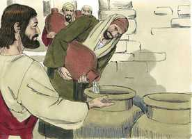 

**8** 	E disse-lhes: Tirai agora, e levai ao mestre-sala. E levaram.

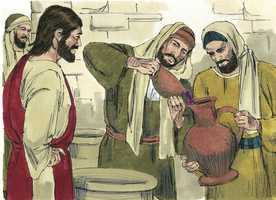 

**9** 	E, logo que o mestre-sala provou a água feita vinho (não sabendo de onde viera, se bem que o sabiam os serventes que tinham tirado a água), chamou o mestre-sala ao esposo,

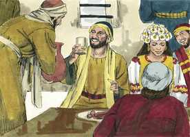 

**10** 	E disse-lhe: Todo o homem põe primeiro o vinho bom e, quando já têm bebido bem, então o inferior; mas tu guardaste até agora o bom vinho.

 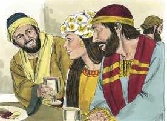 

**11** 	Jesus principiou assim os seus sinais em Caná da Galiléia, e manifestou a sua glória; e os seus discípulos creram nele.

**12** 	Depois disto desceu a Cafarnaum, ele, e sua mãe, e seus irmãos, e seus discípulos; e ficaram ali não muitos dias.

 

**13** 	E estava próxima a páscoa dos judeus, e Jesus subiu a Jerusalém.

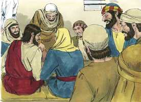 

**14** 	E achou no templo os que vendiam bois, e ovelhas, e pombos, e os cambiadores assentados.

 

**15** 	E tendo feito um azorrague de cordéis, lançou todos fora do templo, também os bois e ovelhas; e espalhou o dinheiro dos cambiadores, e derribou as mesas;

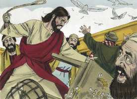 

**16** 	E disse aos que vendiam pombos: Tirai daqui estes, e não façais da casa de meu Pai casa de venda.

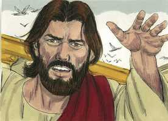 

**17** 	E os seus discípulos lembraram-se do que está escrito: O zelo da tua casa me devorou.

**18** 	Responderam, pois, os judeus, e disseram-lhe: Que sinal nos mostras para fazeres isto?

**19** 	Jesus respondeu, e disse-lhes: Derribai este templo, e em três dias o levantarei.

**20** 	Disseram, pois, os judeus: Em quarenta e seis anos foi edificado este templo, e tu o levantarás em três dias?

**21** 	Mas ele falava do templo do seu corpo.

**22** 	Quando, pois, ressuscitou dentre os mortos, os seus discípulos lembraram-se de que lhes dissera isto; e creram na Escritura, e na palavra que Jesus tinha dito.

**23** 	E, estando ele em Jerusalém pela páscoa, durante a festa, muitos, vendo os sinais que fazia, creram no seu nome.

**24** 	Mas o mesmo Jesus não confiava neles, porque a todos conhecia;

**25** 	E não necessitava de que alguém testificasse do homem, porque ele bem sabia o que havia no homem.

