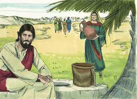
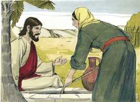
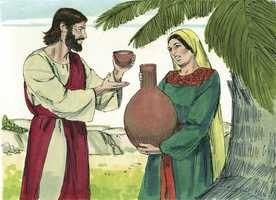
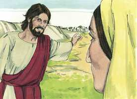
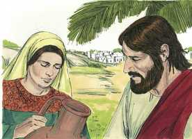
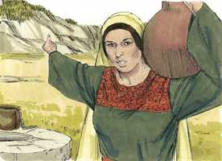
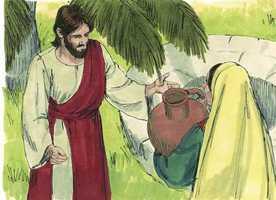
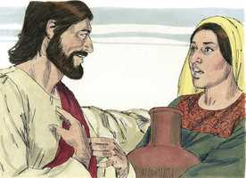
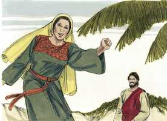
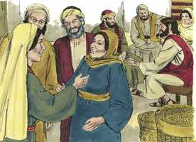

# João Capítulo 4

**1** 	E QUANDO o Senhor entendeu que os fariseus tinham ouvido que Jesus fazia e batizava mais discípulos do que João

**2** 	(Ainda que Jesus mesmo não batizava, mas os seus discípulos),

**3** 	Deixou a Judéia, e foi outra vez para a Galiléia.

**4** 	E era-lhe necessário passar por Samaria.

**5** 	Foi, pois, a uma cidade de Samaria, chamada Sicar, junto da herdade que Jacó tinha dado a seu filho José.

 

**6** 	E estava ali a fonte de Jacó. Jesus, pois, cansado do caminho, assentou-se assim junto da fonte. Era isto quase à hora sexta.

**7** 	Veio uma mulher de Samaria tirar água. Disse-lhe Jesus: Dá-me de beber.

 

**8** 	Porque os seus discípulos tinham ido à cidade comprar comida.

**9** 	Disse-lhe, pois, a mulher samaritana: Como, sendo tu judeu, me pedes de beber a mim, que sou mulher samaritana? (porque os judeus não se comunicam com os samaritanos).

**10** 	Jesus respondeu, e disse-lhe: Se tu conheceras o dom de Deus, e quem é o que te diz: Dá-me de beber, tu lhe pedirias, e ele te daria água viva.

 

**11** 	Disse-lhe a mulher: Senhor, tu não tens com que a tirar, e o poço é fundo; onde, pois, tens a água viva?

**12** 	És tu maior do que o nosso pai Jacó, que nos deu o poço, bebendo ele próprio dele, e os seus filhos, e o seu gado?

**13** 	Jesus respondeu, e disse-lhe: Qualquer que beber desta água tornará a ter sede;

 

**14** 	Mas aquele que beber da água que eu lhe der nunca terá sede, porque a água que eu lhe der se fará nele uma fonte de água que salte para a vida eterna.

**15** 	Disse-lhe a mulher: Senhor, dá-me dessa água, para que não mais tenha sede, e não venha aqui tirá-la.

**16** 	Disse-lhe Jesus: Vai, chama o teu marido, e vem cá.

 

**17** 	A mulher respondeu, e disse: Não tenho marido. Disse-lhe Jesus: Disseste bem: Não tenho marido;

 

**18** 	Porque tiveste cinco maridos, e o que agora tens não é teu marido; isto disseste com verdade.

**19** 	Disse-lhe a mulher: Senhor, vejo que és profeta.

 

**20** 	Nossos pais adoraram neste monte, e vós dizeis que é em Jerusalém o lugar onde se deve adorar.

**21** 	Disse-lhe Jesus: Mulher, crê-me que a hora vem, em que nem neste monte nem em Jerusalém adorareis o Pai.

 

**22** 	Vós adorais o que não sabeis; nós adoramos o que sabemos porque a salvação vem dos judeus.

**23** 	Mas a hora vem, e agora é, em que os verdadeiros adoradores adorarão o Pai em espírito e em verdade; porque o Pai procura a tais que assim o adorem.

**24** 	Deus é Espírito, e importa que os que o adoram o adorem em espírito e em verdade.

**25** 	A mulher disse-lhe: Eu sei que o Messias (que se chama o Cristo) vem; quando ele vier, nos anunciará tudo.

**26** 	Jesus disse-lhe: Eu o sou, eu que falo contigo.

 

**27** 	E nisto vieram os seus discípulos, e maravilharam-se de que estivesse falando com uma mulher; todavia nenhum lhe disse: Que perguntas? ou: Por que falas com ela?

**28** 	Deixou, pois, a mulher o seu cântaro, e foi à cidade, e disse àqueles homens:

 

**29** 	Vinde, vede um homem que me disse tudo quanto tenho feito. Porventura não é este o Cristo?

**30** 	Saíram, pois, da cidade, e foram ter com ele.

**31** 	E entretanto os seus discípulos lhe rogaram, dizendo: Rabi, come.

**32** 	Ele, porém, lhes disse: Uma comida tenho para comer, que vós não conheceis.

**33** 	Então os discípulos diziam uns aos outros: Trouxe-lhe, porventura, alguém algo de comer?

**34** 	Jesus disse-lhes: A minha comida é fazer a vontade daquele que me enviou, e realizar a sua obra.

**35** 	Não dizeis vós que ainda há quatro meses até que venha a ceifa? Eis que eu vos digo: Levantai os vossos olhos, e vede as terras, que já estão brancas para a ceifa.

**36** 	E o que ceifa recebe galardão, e ajunta fruto para a vida eterna; para que, assim o que semeia como o que ceifa, ambos se regozijem.

**37** 	Porque nisto é verdadeiro o ditado, que um é o que semeia, e outro o que ceifa.

**38** 	Eu vos enviei a ceifar onde vós não trabalhastes; outros trabalharam, e vós entrastes no seu trabalho.

**39** 	E muitos dos samaritanos daquela cidade creram nele, pela palavra da mulher, que testificou: Disse-me tudo quanto tenho feito.

 

**40** 	Indo, pois, ter com ele os samaritanos, rogaram-lhe que ficasse com eles; e ficou ali dois dias.

**41** 	E muitos mais creram nele, por causa da sua palavra.

**42** 	E diziam à mulher: Já não é pelo teu dito que nós cremos; porque nós mesmos o temos ouvido, e sabemos que este é verdadeiramente o Cristo, o Salvador do mundo.

**43** 	E dois dias depois partiu dali, e foi para a Galiléia.

**44** 	Porque Jesus mesmo testificou que um profeta não tem honra na sua própria pátria.

**45** 	Chegando, pois, à Galiléia, os galileus o receberam, vistas todas as coisas que fizera em Jerusalém, no dia da festa; porque também eles tinham ido à festa.

**46** 	Segunda vez foi Jesus a Caná da Galiléia, onde da água fizera vinho. E havia ali um nobre, cujo filho estava enfermo em Cafarnaum.

**47** 	Ouvindo este que Jesus vinha da Judéia para a Galiléia, foi ter com ele, e rogou-lhe que descesse, e curasse o seu filho, porque já estava à morte.

**48** 	Então Jesus lhe disse: Se não virdes sinais e milagres, não crereis.

**49** 	Disse-lhe o nobre: Senhor, desce, antes que meu filho morra.

**50** 	Disse-lhe Jesus: Vai, o teu filho vive. E o homem creu na palavra que Jesus lhe disse, e partiu.

**51** 	E descendo ele logo, saíram-lhe ao encontro os seus servos, e lhe anunciaram, dizendo: O teu filho vive.

**52** 	Perguntou-lhes, pois, a que hora se achara melhor. E disseram-lhe: Ontem às sete horas a febre o deixou.

**53** 	Entendeu, pois, o pai que era aquela hora a mesma em que Jesus lhe disse: O teu filho vive; e creu ele, e toda a sua casa.

**54** 	Jesus fez este segundo milagre, quando ia da Judéia para a Galiléia.

