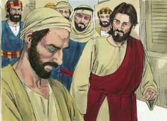
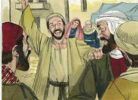
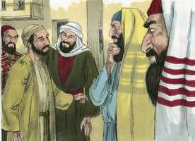
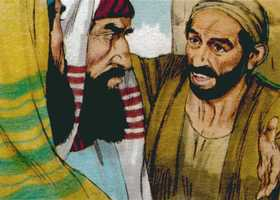
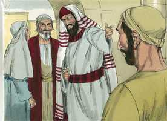
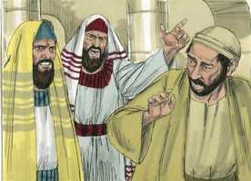
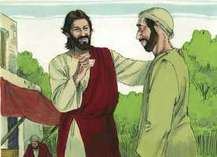
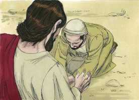

# João Capítulo 9

**1** 	E, PASSANDO Jesus, viu um homem cego de nascença.

 

**2** 	E os seus discípulos lhe perguntaram, dizendo: Rabi, quem pecou, este ou seus pais, para que nascesse cego?

**3** 	Jesus respondeu: Nem ele pecou nem seus pais; mas foi assim para que se manifestem nele as obras de Deus.

**4** 	Convém que eu faça as obras daquele que me enviou, enquanto é dia; a noite vem, quando ninguém pode trabalhar.

**5** 	Enquanto estou no mundo, sou a luz do mundo.

**6** 	Tendo dito isto, cuspiu na terra, e com a saliva fez lodo, e untou com o lodo os olhos do cego.

 

**7** 	E disse-lhe: Vai, lava-te no tanque de Siloé (que significa o Enviado). Foi, pois, e lavou-se, e voltou vendo.

**8** 	Então os vizinhos, e aqueles que dantes tinham visto que era cego, diziam: Não é este aquele que estava assentado e mendigava?

 

**9** 	Uns diziam: É este. E outros: Parece-se com ele. Ele dizia: Sou eu.

**10** 	Diziam-lhe, pois: Como se te abriram os olhos?

**11** 	Ele respondeu, e disse: O homem, chamado Jesus, fez lodo, e untou-me os olhos, e disse-me: Vai ao tanque de Siloé, e lava-te. Então fui, e lavei-me, e vi.

**12** 	Disseram-lhe, pois: Onde está ele? Respondeu: Não sei.

**13** 	Levaram, pois, aos fariseus o que dantes era cego.

**14** 	E era sábado quando Jesus fez o lodo e lhe abriu os olhos.

**15** 	Tornaram, pois, também os fariseus a perguntar-lhe como vira, e ele lhes disse: Pôs-me lodo sobre os olhos, lavei-me, e vejo.

**16** 	Então alguns dos fariseus diziam: Este homem não é de Deus, pois não guarda o sábado. Diziam outros: Como pode um homem pecador fazer tais sinais? E havia dissensão entre eles.

 

**17** 	Tornaram, pois, a dizer ao cego: Tu, que dizes daquele que te abriu os olhos? E ele respondeu: Que é profeta.

 

**18** 	Os judeus, porém, não creram que ele tivesse sido cego, e que agora visse, enquanto não chamaram os pais do que agora via.

**19** 	E perguntaram-lhes, dizendo: É este o vosso filho, que vós dizeis ter nascido cego? Como, pois, vê agora?

 

**20** 	Seus pais lhes responderam, e disseram: Sabemos que este é o nosso filho, e que nasceu cego;

 

**21** 	Mas como agora vê, não sabemos; ou quem lhe tenha aberto os olhos, não sabemos. Tem idade, perguntai-lho a ele mesmo; e ele falará por si mesmo.

**22** 	Seus pais disseram isto, porque temiam os judeus. Porquanto já os judeus tinham resolvido que, se alguém confessasse ser ele o Cristo, fosse expulso da sinagoga.

**23** 	Por isso é que seus pais disseram: Tem idade, perguntai-lho a ele mesmo.

**24** 	Chamaram, pois, pela segunda vez o homem que tinha sido cego, e disseram-lhe: Dá glória a Deus; nós sabemos que esse homem é pecador.

**25** 	Respondeu ele pois, e disse: Se é pecador, não sei; uma coisa sei, é que, havendo eu sido cego, agora vejo.

**26** 	E tornaram a dizer-lhe: Que te fez ele? Como te abriu os olhos?

**27** 	Respondeu-lhes: Já vo-lo disse, e não ouvistes; para que o quereis tornar a ouvir? Quereis vós porventura fazer-vos também seus discípulos?

 

**28** 	Então o injuriaram, e disseram: Discípulo dele sejas tu; nós, porém, somos discípulos de Moisés.

**29** 	Nós bem sabemos que Deus falou a Moisés, mas este não sabemos de onde é.

**30** 	O homem respondeu, e disse-lhes: Nisto, pois, está a maravilha, que vós não saibais de onde ele é, e contudo me abrisse os olhos.

**31** 	Ora, nós sabemos que Deus não ouve a pecadores; mas, se alguém é temente a Deus, e faz a sua vontade, a esse ouve.

**32** 	Desde o princípio do mundo nunca se ouviu que alguém abrisse os olhos a um cego de nascença.

**33** 	Se este não fosse de Deus, nada poderia fazer.

**34** 	Responderam eles, e disseram-lhe: Tu és nascido todo em pecados, e nos ensinas a nós? E expulsaram-no.

 

**35** 	Jesus ouviu que o tinham expulsado e, encontrando-o, disse-lhe: Crês tu no Filho de Deus?

 

**36** 	Ele respondeu, e disse: Quem é ele, Senhor, para que nele creia?

**37** 	E Jesus lhe disse: Tu já o tens visto, e é aquele que fala contigo.

**38** 	Ele disse: Creio, Senhor. E o adorou.

 

**39** 	E disse-lhe Jesus: Eu vim a este mundo para juízo, a fim de que os que não vêem vejam, e os que vêem sejam cegos.

**40** 	E aqueles dos fariseus, que estavam com ele, ouvindo isto, disseram-lhe: Também nós somos cegos?

**41** 	Disse-lhes Jesus: Se fôsseis cegos, não teríeis pecado; mas como agora dizeis: Vemos; por isso o vosso pecado permanece.

