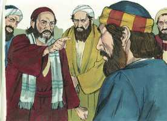

# Atos dos Apóstolos Capítulo 11

**1** 	E OUVIRAM os apóstolos, e os irmãos que estavam na Judéia, que também os gentios tinham recebido a palavra de Deus.

**2** 	E, subindo Pedro a Jerusalém, disputavam com ele os que eram da circuncisão,

 

**3** 	Dizendo: Entraste em casa de homens incircuncisos, e comeste com eles.

**4** 	Mas Pedro começou a fazer-lhes uma exposição por ordem, dizendo:

**5** 	Estando eu orando na cidade de Jope, tive, num arrebatamento dos sentidos, uma visão; via um vaso, como um grande lençol que descia do céu e vinha até junto de mim.

**6** 	E, pondo nele os olhos, considerei, e vi animais da terra, quadrúpedes, e feras, e répteis e aves do céu.

**7** 	E ouvi uma voz que me dizia: Levanta-te, Pedro; mata e come.

**8** 	Mas eu disse: De maneira nenhuma, Senhor; pois, nunca em minha boca entrou coisa alguma comum ou imunda.

**9** 	Mas a voz respondeu-me do céu segunda vez: Não chames tu comum ao que Deus purificou.

**10** 	E sucedeu isto por três vezes; e tudo tornou a recolher-se ao céu.

**11** 	E eis que, na mesma hora, pararam, junto da casa em que eu estava, três homens que me foram enviados de Cesaréia.

**12** 	E disse-me o Espírito que fosse com eles, nada duvidando; e também estes seis irmãos foram comigo, e entramos em casa daquele homem;

**13** 	E contou-nos como vira em pé um anjo em sua casa, e lhe dissera: Envia homens a Jope, e manda chamar a Simão, que tem por sobrenome Pedro,

**14** 	O qual te dirá palavras com que te salves, tu e toda a tua casa.

**15** 	E, quando comecei a falar, caiu sobre eles o Espírito Santo, como também sobre nós ao princípio.

**16** 	E lembrei-me do dito do Senhor, quando disse: João certamente batizou com água; mas vós sereis batizados com o Espírito Santo.

**17** 	Portanto, se Deus lhes deu o mesmo dom que a nós, quando havemos crido no Senhor Jesus Cristo, quem era então eu, para que pudesse resistir a Deus?

**18** 	E, ouvindo estas coisas, apaziguaram-se, e glorificaram a Deus, dizendo: Na verdade até aos gentios deu Deus o arrependimento para a vida.

 

**19** 	E os que foram dispersos pela perseguição que sucedeu por causa de Estêvão caminharam até à Fenícia, Chipre e Antioquia, não anunciando a ninguém a palavra, senão somente aos judeus.

**20** 	E havia entre eles alguns homens cíprios e cirenenses, os quais entrando em Antioquia falaram aos gregos, anunciando o Senhor Jesus.

**21** 	E a mão do Senhor era com eles; e grande número creu e se converteu ao Senhor.

**22** 	E chegou a fama destas coisas aos ouvidos da igreja que estava em Jerusalém; e enviaram Barnabé a Antioquia.

**23** 	O qual, quando chegou, e viu a graça de Deus, se alegrou, e exortou a todos a que permanecessem no Senhor, com propósito de coração;

**24** 	Porque era homem de bem e cheio do Espírito Santo e de fé. E muita gente se uniu ao Senhor.

**25** 	E partiu Barnabé para Tarso, a buscar Saulo; e, achando-o, o conduziu para Antioquia.

**26** 	E sucedeu que todo um ano se reuniram naquela igreja, e ensinaram muita gente; e em Antioquia foram os discípulos, pela primeira vez, chamados cristãos.

**27** 	E naqueles dias desceram profetas de Jerusalém para Antioquia.

**28** 	E, levantando-se um deles, por nome Ágabo, dava a entender pelo Espírito, que haveria uma grande fome em todo o mundo, e isso aconteceu no tempo de Cláudio César.

**29** 	E os discípulos determinaram mandar, cada um conforme o que pudesse, socorro aos irmãos que habitavam na Judéia.

**30** 	O que eles com efeito fizeram, enviando-o aos anciãos por mão de Barnabé e de Saulo.

