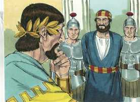
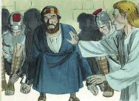
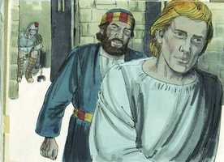
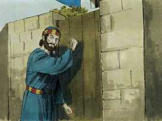
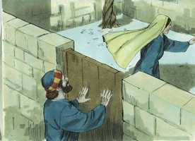
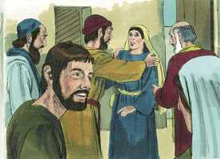
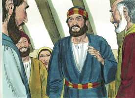
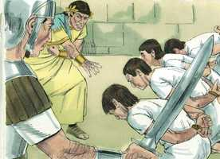
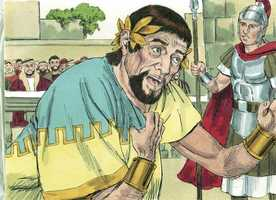
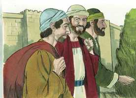

# Atos dos Apóstolos Capítulo 12

**1** 	E POR aquele mesmo tempo o rei Herodes estendeu as mãos sobre alguns da igreja, para os maltratar;

**2** 	E matou à espada Tiago, irmão de João.

 

**3** 	E, vendo que isso agradara aos judeus, continuou, mandando prender também a Pedro. E eram os dias dos ázimos.

 

**4** 	E, havendo-o prendido, o encerrou na prisão, entregando-o a quatro quaternos de soldados, para que o guardassem, querendo apresentá-lo ao povo depois da páscoa.

**5** 	Pedro, pois, era guardado na prisão; mas a igreja fazia contínua oração por ele a Deus.

 

**6** 	E quando Herodes estava para o fazer comparecer, nessa mesma noite estava Pedro dormindo entre dois soldados, ligado com duas cadeias, e os guardas diante da porta guardavam a prisão.

**7** 	E eis que sobreveio o anjo do Senhor, e resplandeceu uma luz na prisão; e, tocando a Pedro na ilharga, o despertou, dizendo: Levanta-te depressa. E caíram-lhe das mãos as cadeias.

 

**8** 	E disse-lhe o anjo: Cinge-te, e ata as tuas alparcas. E ele assim o fez. Disse-lhe mais: Lança às costas a tua capa, e segue-me.

**9** 	E, saindo, o seguia. E não sabia que era real o que estava sendo feito pelo anjo, mas cuidava que via alguma visão.

 

**10** 	E, quando passaram a primeira e segunda guardas, chegaram à porta de ferro, que dá para a cidade, a qual se lhes abriu por si mesma; e, tendo saído, percorreram uma rua, e logo o anjo se apartou dele.

 

**11** 	E Pedro, tornando a si, disse: Agora sei verdadeiramente que o Senhor enviou o seu anjo, e me livrou da mão de Herodes, e de tudo o que o povo dos judeus esperava.

**12** 	E, considerando ele nisto, foi à casa de Maria, mãe de João, que tinha por sobrenome Marcos, onde muitos estavam reunidos e oravam.

**13** 	E, batendo Pedro à porta do pátio, uma menina chamada Rode saiu a escutar;

 

**14** 	E, conhecendo a voz de Pedro, de gozo não abriu a porta, mas, correndo para dentro, anunciou que Pedro estava à porta.

 

**15** 	E disseram-lhe: Estás fora de ti. Mas ela afirmava que assim era. E diziam: É o seu anjo.

 

**16** 	Mas Pedro perseverava em bater e, quando abriram, viram-no, e se espantaram.

**17** 	E acenando-lhes ele com a mão para que se calassem, contou-lhes como o Senhor o tirara da prisão, e disse: Anunciai isto a Tiago e aos irmãos. E, saindo, partiu para outro lugar.

 

**18** 	E, sendo já dia, houve não pouco alvoroço entre os soldados sobre o que seria feito de Pedro.

**19** 	E, quando Herodes o procurou e o não achou, feita inquirição aos guardas, mandou-os justiçar. E, partindo da Judéia para Cesaréia, ficou ali.

 

**20** 	E ele estava irritado com os de Tiro e de Sidom; mas estes, vindo de comum acordo ter com ele, e obtendo a amizade de Blasto, que era o camarista do rei, pediam paz; porquanto o seu país se abastecia do país do rei.

**21** 	E num dia designado, vestindo Herodes as vestes reais, estava assentado no tribunal e lhes fez uma prática.

**22** 	E o povo exclamava: Voz de Deus, e não de homem.

**23** 	E no mesmo instante feriu-o o anjo do Senhor, porque não deu glória a Deus e, comido de bichos, expirou.

 

**24** 	E a palavra de Deus crescia e se multiplicava.

**25** 	E Barnabé e Saulo, havendo terminado aquele serviço, voltaram de Jerusalém, levando também consigo a João, que tinha por sobrenome Marcos.

 

