# Atos dos Apóstolos Capítulo 15

**1** 	ENTÃO alguns que tinham descido da Judéia ensinavam assim os irmãos: Se não vos circuncidardes conforme o uso de Moisés, não podeis salvar-vos.

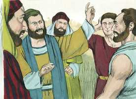 

**2** 	Tendo tido Paulo e Barnabé não pequena discussão e contenda contra eles, resolveu-se que Paulo e Barnabé, e alguns dentre eles, subissem a Jerusalém, aos apóstolos e aos anciãos, sobre aquela questão.

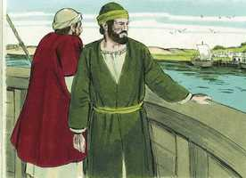 

**3** 	E eles, sendo acompanhados pela igreja, passavam pela Fenícia e por Samaria, contando a conversão dos gentios; e davam grande alegria a todos os irmãos.

**4** 	E, quando chegaram a Jerusalém, foram recebidos pela igreja e pelos apóstolos e anciãos, e lhes anunciaram quão grandes coisas Deus tinha feito com eles.

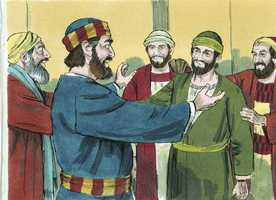 

**5** 	Alguns, porém, da seita dos fariseus, que tinham crido, se levantaram, dizendo que era mister circuncidá-los e mandar-lhes que guardassem a lei de Moisés.

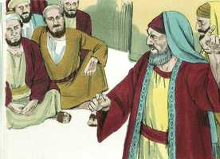 

**6** 	Congregaram-se, pois, os apóstolos e os anciãos para considerar este assunto.

**7** 	E, havendo grande contenda, levantou-se Pedro e disse-lhes: Homens irmãos, bem sabeis que já há muito tempo Deus me elegeu dentre nós, para que os gentios ouvissem da minha boca a palavra do evangelho, e cressem.

 

**8** 	E Deus, que conhece os corações, lhes deu testemunho, dando-lhes o Espírito Santo, assim como também a nós;

**9** 	E não fez diferença alguma entre eles e nós, purificando os seus corações pela fé.

 

**10** 	Agora, pois, por que tentais a Deus, pondo sobre a cerviz dos discípulos um jugo que nem nossos pais nem nós pudemos suportar?

**11** 	Mas cremos que seremos salvos pela graça do Senhor Jesus Cristo, como eles também.

**12** 	Então toda a multidão se calou e escutava a Barnabé e a Paulo, que contavam quão grandes sinais e prodígios Deus havia feito por meio deles entre os gentios.

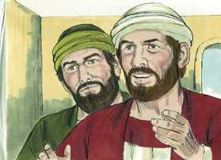 

**13** 	E, havendo-se eles calado, tomou Tiago a palavra, dizendo: Homens irmãos, ouvi-me:

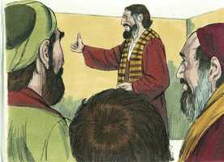 

**14** 	Simão relatou como primeiramente Deus visitou os gentios, para tomar deles um povo para o seu nome.

**15** 	E com isto concordam as palavras dos profetas; como está escrito:

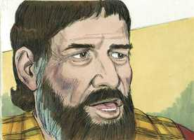 

**16** 	Depois disto voltarei, E reedificarei o tabernáculo de Davi, que está caído, Levantá-lo-ei das suas ruínas, E tornarei a edificá-lo.

**17** 	Para que o restante dos homens busque ao Senhor, E todos os gentios, sobre os quais o meu nome é invocado, Diz o Senhor, que faz todas estas coisas,

**18** 	Conhecidas são a Deus, desde o princípio do mundo, todas as suas obras.

**19** 	Por isso julgo que não se deve perturbar aqueles, dentre os gentios, que se convertem a Deus.

**20** 	Mas escrever-lhes que se abstenham das contaminações dos ídolos, da fornicação, do que é sufocado e do sangue.

**21** 	Porque Moisés, desde os tempos antigos, tem em cada cidade quem o pregue, e cada sábado é lido nas sinagogas.

**22** 	Então pareceu bem aos apóstolos e aos anciãos, com toda a igreja, eleger homens dentre eles e enviá-los com Paulo e Barnabé a Antioquia, a saber: Judas, chamado Barsabás, e Silas, homens distintos entre os irmãos.

**23** 	E por intermédio deles escreveram o seguinte: Os apóstolos, e os anciãos e os irmãos, aos irmãos dentre os gentios que estão em Antioquia, e Síria e Cilícia, saúde.

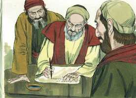 

**24** 	Porquanto ouvimos que alguns que saíram dentre nós vos perturbaram com palavras, e transtornaram as vossas almas, dizendo que deveis circuncidar-vos e guardar a lei, não lhes tendo nós dado mandamento,

**25** 	Pareceu-nos bem, reunidos concordemente, eleger alguns homens e enviá-los com os nossos amados Barnabé e Paulo,

**26** 	Homens que já expuseram as suas vidas pelo nome de nosso Senhor Jesus Cristo.

**27** 	Enviamos, portanto, Judas e Silas, os quais por palavra vos anunciarão também as mesmas coisas.

**28** 	Na verdade pareceu bem ao Espírito Santo e a nós, não vos impor mais encargo algum, senão estas coisas necessárias:

**29** 	Que vos abstenhais das coisas sacrificadas aos ídolos, e do sangue, e da carne sufocada, e da fornicação, das quais coisas bem fazeis se vos guardardes. Bem vos vá.

**30** 	Tendo eles então se despedido, partiram para Antioquia e, ajuntando a multidão, entregaram a carta.

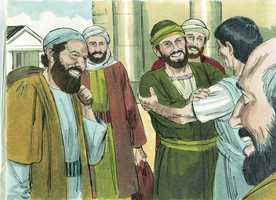 

**31** 	E, quando a leram, alegraram-se pela exortação.

**32** 	Depois Judas e Silas, que também eram profetas, exortaram e confirmaram os irmãos com muitas palavras.

**33** 	E, detendo-se ali algum tempo, os irmãos os deixaram voltar em paz para os apóstolos;

**34** 	Mas pareceu bem a Silas ficar ali.

**35** 	E Paulo e Barnabé ficaram em Antioquia, ensinando e pregando, com muitos outros, a palavra do Senhor.

**36** 	E alguns dias depois, disse Paulo a Barnabé: Tornemos a visitar nossos irmãos por todas as cidades em que já anunciamos a palavra do Senhor, para ver como estão.

**37** 	E Barnabé aconselhava que tomassem consigo a João, chamado Marcos.

**38** 	Mas a Paulo parecia razoável que não tomassem consigo aquele que desde a Panfília se tinha apartado deles e não os acompanhou naquela obra.

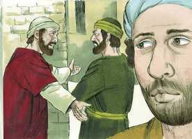 

**39** 	E tal contenda houve entre eles, que se apartaram um do outro. Barnabé, levando consigo a Marcos, navegou para Chipre.

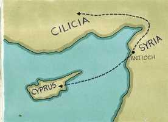 

**40** 	E Paulo, tendo escolhido a Silas, partiu, encomendado pelos irmãos à graça de Deus.

**41** 	E passou pela Síria e Cilícia, confirmando as igrejas.

