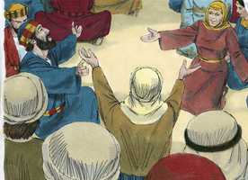
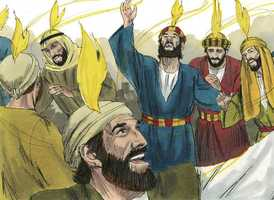
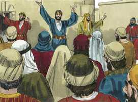
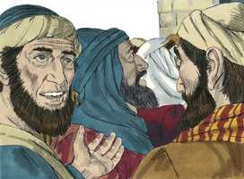
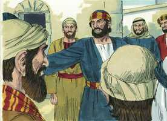
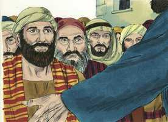
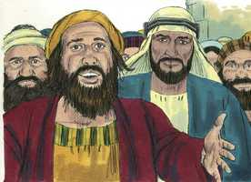
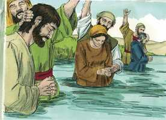
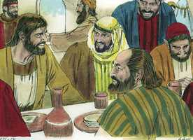

# Atos dos Apóstolos Capítulo 2

**1** 	E, CUMPRINDO-SE o dia de Pentecostes, estavam todos concordemente no mesmo lugar;

 

**2** 	E de repente veio do céu um som, como de um vento veemente e impetuoso, e encheu toda a casa em que estavam assentados.

**3** 	E foram vistas por eles línguas repartidas, como que de fogo, as quais pousaram sobre cada um deles.

 

**4** 	E todos foram cheios do Espírito Santo, e começaram a falar noutras línguas, conforme o Espírito Santo lhes concedia que falassem.

**5** 	E em Jerusalém estavam habitando judeus, homens religiosos, de todas as nações que estão debaixo do céu.

**6** 	E, quando aquele som ocorreu, ajuntou-se uma multidão, e estava confusa, porque cada um os ouvia falar na sua própria língua.

 

**7** 	E todos pasmavam e se maravilhavam, dizendo uns aos outros: Pois quê! não são galileus todos esses homens que estão falando?

 

**8** 	Como, pois, os ouvimos, cada um, na nossa própria língua em que somos nascidos?

**9** 	Partos e medos, elamitas e os que habitam na Mesopotâmia, Judéia, Capadócia, Ponto e Ásia,

**10** 	E Frígia e Panfília, Egito e partes da Líbia, junto a Cirene, e forasteiros romanos, tanto judeus como prosélitos,

**11** 	Cretenses e árabes, todos nós temos ouvido em nossas próprias línguas falar das grandezas de Deus.

**12** 	E todos se maravilhavam e estavam suspensos, dizendo uns para os outros: Que quer isto dizer?

**13** 	E outros, zombando, diziam: Estão cheios de mosto.

**14** 	Pedro, porém, pondo-se em pé com os onze, levantou a sua voz, e disse-lhes: Homens judeus, e todos os que habitais em Jerusalém, seja-vos isto notório, e escutai as minhas palavras.

 

**15** 	Estes homens não estão embriagados, como vós pensais, sendo a terceira hora do dia.

 

**16** 	Mas isto é o que foi dito pelo profeta Joel:

 

**17** 	E nos últimos dias acontecerá, diz Deus, Que do meu Espírito derramarei sobre toda a carne; E os vossos filhos e as vossas filhas profetizarão, Os vossos jovens terão visões, E os vossos velhos sonharão sonhos;

**18** 	E também do meu Espírito derramarei sobre os meus servos e as minhas servas naqueles dias, e profetizarão;

**19** 	E farei aparecer prodígios em cima, no céu; E sinais em baixo na terra, Sangue, fogo e vapor de fumo.

**20** 	O sol se converterá em trevas, E a lua em sangue, Antes de chegar o grande e glorioso dia do Senhor;

**21** 	E acontecerá que todo aquele que invocar o nome do Senhor será salvo.

**22** 	Homens israelitas, escutai estas palavras: A Jesus Nazareno, homem aprovado por Deus entre vós com maravilhas, prodígios e sinais, que Deus por ele fez no meio de vós, como vós mesmos bem sabeis;

 

**23** 	A este que vos foi entregue pelo determinado conselho e presciência de Deus, prendestes, crucificastes e matastes pelas mãos de injustos;

**24** 	Ao qual Deus ressuscitou, soltas as ânsias da morte, pois não era possível que fosse retido por ela;

**25** 	Porque dele disse Davi: Sempre via diante de mim o Senhor, Porque está à minha direita, para que eu não seja comovido;

**26** 	Por isso se alegrou o meu coração, e a minha língua exultou; E ainda a minha carne há de repousar em esperança;

**27** 	Pois não deixarás a minha alma no inferno, Nem permitirás que o teu Santo veja a corrupção;

**28** 	Fizeste-me conhecidos os caminhos da vida; Com a tua face me encherás de júbilo.

**29** 	Homens irmãos, seja-me lícito dizer-vos livremente acerca do patriarca Davi, que ele morreu e foi sepultado, e entre nós está até hoje a sua sepultura.

**30** 	Sendo, pois, ele profeta, e sabendo que Deus lhe havia prometido com juramento que do fruto de seus lombos, segundo a carne, levantaria o Cristo, para o assentar sobre o seu trono,

**31** 	Nesta previsão, disse da ressurreição de Cristo, que a sua alma não foi deixada no inferno, nem a sua carne viu a corrupção.

**32** 	Deus ressuscitou a este Jesus, do que todos nós somos testemunhas.

**33** 	De sorte que, exaltado pela destra de Deus, e tendo recebido do Pai a promessa do Espírito Santo, derramou isto que vós agora vedes e ouvis.

**34** 	Porque Davi não subiu aos céus, mas ele próprio diz: Disse o Senhor ao meu Senhor: Assenta-te à minha direita,

**35** 	Até que ponha os teus inimigos por escabelo de teus pés.

**36** 	Saiba, pois, com certeza toda a casa de Israel que a esse Jesus, a quem vós crucificastes, Deus o fez Senhor e Cristo.

**37** 	E, ouvindo eles isto, compungiram-se em seu coração, e perguntaram a Pedro e aos demais apóstolos: Que faremos, homens irmãos?

 

**38** 	E disse-lhes Pedro: Arrependei-vos, e cada um de vós seja batizado em nome de Jesus Cristo, para perdão dos pecados; e recebereis o dom do Espírito Santo;

 

**39** 	Porque a promessa vos diz respeito a vós, a vossos filhos, e a todos os que estão longe, a tantos quantos Deus nosso Senhor chamar.

**40** 	E com muitas outras palavras isto testificava, e os exortava, dizendo: Salvai-vos desta geração perversa.

**41** 	De sorte que foram batizados os que de bom grado receberam a sua palavra; e naquele dia agregaram-se quase três mil almas,

 

**42** 	E perseveravam na doutrina dos apóstolos, e na comunhão, e no partir do pão, e nas orações.

**43** 	E em toda a alma havia temor, e muitas maravilhas e sinais se faziam pelos apóstolos.

**44** 	E todos os que criam estavam juntos, e tinham tudo em comum.

**45** 	E vendiam suas propriedades e bens, e repartiam com todos, segundo cada um havia de mister.

**46** 	E, perseverando unânimes todos os dias no templo, e partindo o pão em casa, comiam juntos com alegria e singeleza de coração,

 

**47** 	Louvando a Deus, e caindo na graça de todo o povo. E todos os dias acrescentava o Senhor à igreja aqueles que se haviam de salvar.

