# Atos dos Apóstolos Capítulo 27

**1** 	E, COMO se determinou que havíamos de navegar para a Itália, entregaram Paulo, e alguns outros presos, a um centurião por nome Júlio, da coorte augusta.

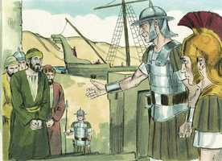 

**2** 	E, embarcando nós em um navio adramitino, partimos navegando pelos lugares da costa da Ásia, estando conosco Aristarco, macedônio, de Tessalônica.

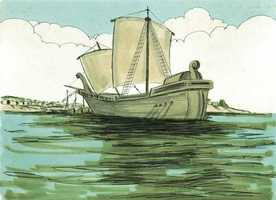 

**3** 	E chegamos no dia seguinte a Sidom, e Júlio, tratando Paulo humanamente, lhe permitiu ir ver os amigos, para que cuidassem dele.

**4** 	E, partindo dali, fomos navegando abaixo de Chipre, porque os ventos eram contrários.

**5** 	E, tendo atravessado o mar, ao longo da Cilícia e Panfília, chegamos a Mirra, na Lícia.

**6** 	E, achando ali o centurião um navio de Alexandria, que navegava para a Itália, nos fez embarcar nele.

**7** 	E, como por muitos dias navegássemos vagarosamente, havendo chegado apenas defronte de Cnido, não nos permitindo o vento ir mais adiante, navegamos abaixo de Creta, junto de Salmone.

**8** 	E, costeando-a dificilmente, chegamos a um lugar chamado Bons Portos, perto do qual estava a cidade de Laséia.

**9** 	E, passado muito tempo, e sendo já perigosa a navegação, pois, também o jejum já tinha passado, Paulo os admoestava,

**10** 	Dizendo-lhes: Senhores, vejo que a navegação há de ser incômoda, e com muito dano, não só para o navio e carga, mas também para as nossas vidas.

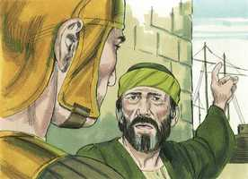 

**11** 	Mas o centurião cria mais no piloto e no mestre, do que no que dizia Paulo.

**12** 	E, como aquele porto não era cômodo para invernar, os mais deles foram de parecer que se partisse dali para ver se podiam chegar a Fenice, que é um porto de Creta que olha para o lado do vento da África e do Coro, e invernar ali.

**13** 	E, soprando o sul brandamente, lhes pareceu terem já o que desejavam e, fazendo-se de vela, foram de muito perto costeando Creta.

**14** 	Mas não muito depois deu nela um pé de vento, chamado Euro-aquilão.

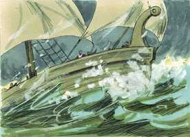 

**15** 	E, sendo o navio arrebatado, e não podendo navegar contra o vento, dando de mão a tudo, nos deixamos ir à toa.

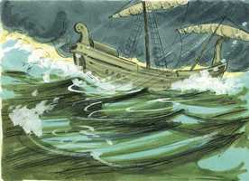 

**16** 	E, correndo abaixo de uma pequena ilha chamada Clauda, apenas pudemos ganhar o batel.

**17** 	E, levado este para cima, usaram de todos os meios, cingindo o navio; e, temendo darem à costa na Sirte, amainadas as velas, assim foram à toa.

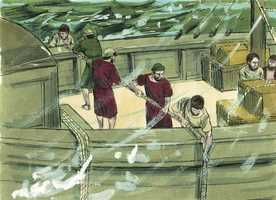 

**18** 	E, andando nós agitados por uma veemente tempestade, no dia seguinte aliviaram o navio.

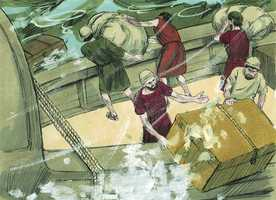 

**19** 	E ao terceiro dia nós mesmos, com as nossas próprias mãos, lançamos ao mar a armação do navio.

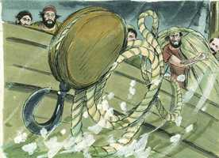 

**20** 	E, não aparecendo, havia já muitos dias, nem sol nem estrelas, e caindo sobre nós uma não pequena tempestade, fugiu-nos toda a esperança de nos salvarmos.

**21** 	E, havendo já muito que não se comia, então Paulo, pondo-se em pé no meio deles, disse: Fora, na verdade, razoável, ó senhores, ter-me ouvido a mim e não partir de Creta, e assim evitariam este incômodo e esta perda.

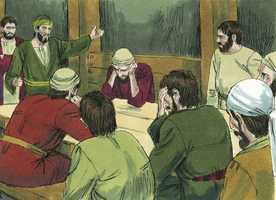 

**22** 	Mas agora vos admoesto a que tenhais bom ânimo, porque não se perderá a vida de nenhum de vós, mas somente o navio.

 

**23** 	Porque esta mesma noite o anjo de Deus, de quem eu sou, e a quem sirvo, esteve comigo,

**24** 	Dizendo: Paulo, não temas; importa que sejas apresentado a César, e eis que Deus te deu todos quantos navegam contigo.

**25** 	Portanto, ó senhores, tende bom ânimo; porque creio em Deus, que há de acontecer assim como a mim me foi dito.

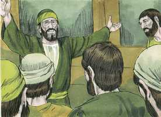 

**26** 	É, contudo, necessário irmos dar numa ilha.

**27** 	E, quando chegou a décima quarta noite, sendo impelidos de um e outro lado no mar Adriático, lá pela meia-noite suspeitaram os marinheiros que estavam próximos de alguma terra.

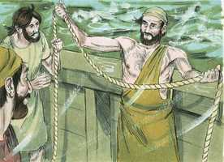 

**28** 	E, lançando o prumo, acharam vinte braças; e, passando um pouco mais adiante, tornando a lançar o prumo, acharam quinze braças.

**29** 	E, temendo ir dar em alguns rochedos, lançaram da popa quatro âncoras, desejando que viesse o dia.

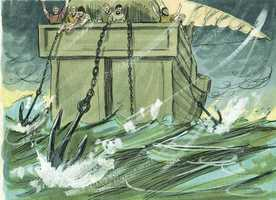 

**30** 	Procurando, porém, os marinheiros fugir do navio, e tendo já deitado o batel ao mar, como que querendo lançar as âncoras pela proa,

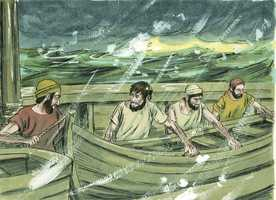 

**31** 	Disse Paulo ao centurião e aos soldados: Se estes não ficarem no navio, não podereis salvar-vos.

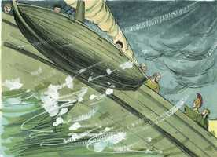 

**32** 	Então os soldados cortaram os cabos do batel, e o deixaram cair.

**33** 	E, entretanto que o dia vinha, Paulo exortava a todos a que comessem alguma coisa, dizendo: É já hoje o décimo quarto dia que esperais, e permaneceis sem comer, não havendo provado nada.

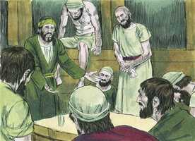 

**34** 	Portanto, exorto-vos a que comais alguma coisa, pois é para a vossa saúde; porque nem um cabelo cairá da cabeça de qualquer de vós.

**35** 	E, havendo dito isto, tomando o pão, deu graças a Deus na presença de todos; e, partindo-o, começou a comer.

 

**36** 	E, tendo já todos bom ânimo, puseram-se também a comer.

**37** 	E éramos ao todo, no navio, duzentas e setenta e seis almas.

**38** 	E, refeitos com a comida, aliviaram o navio, lançando o trigo ao mar.

**39** 	E, sendo já dia, não conheceram a terra; enxergaram, porém, uma enseada que tinha praia, e consultaram-se sobre se deveriam encalhar nela o navio.

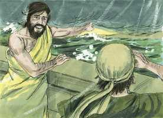 

**40** 	E, levantando as âncoras, deixaram-no ir ao mar, largando também as amarras do leme; e, alçando a vela maior ao vento, dirigiram-se para a praia.

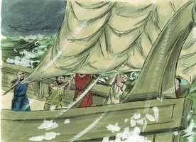 

**41** 	Dando, porém, num lugar de dois mares, encalharam ali o navio; e, fixa a proa, ficou imóvel, mas a popa abria-se com a força das ondas.

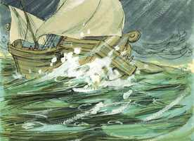 

**42** 	Então a idéia dos soldados foi que matassem os presos para que nenhum fugisse, escapando a nado.

**43** 	Mas o centurião, querendo salvar a Paulo, lhes estorvou este intento; e mandou que os que pudessem nadar se lançassem primeiro ao mar, e se salvassem em terra;

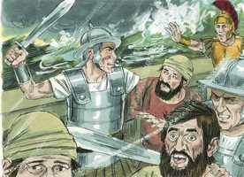 

**44** 	E os demais, uns em tábuas e outros em coisas do navio. E assim aconteceu que todos chegaram à terra a salvo.

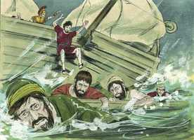 

