# Atos dos Apóstolos Capítulo 5

**1** 	MAS um certo homem chamado Ananias, com Safira, sua mulher, vendeu uma propriedade,

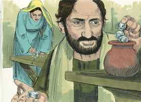 

**2** 	E reteve parte do preço, sabendo-o também sua mulher; e, levando uma parte, a depositou aos pés dos apóstolos.

**3** 	Disse então Pedro: Ananias, por que encheu Satanás o teu coração, para que mentisses ao Espírito Santo, e retivesses parte do preço da herdade?

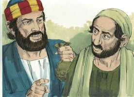 

**4** 	Guardando-a não ficava para ti? E, vendida, não estava em teu poder? Por que formaste este desígnio em teu coração? Não mentiste aos homens, mas a Deus.

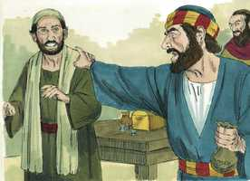 

**5** 	E Ananias, ouvindo estas palavras, caiu e expirou. E um grande temor veio sobre todos os que isto ouviram.

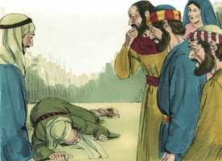 

**6** 	E, levantando-se os moços, cobriram o morto e, transportando-o para fora, o sepultaram.

**7** 	E, passando um espaço quase de três horas, entrou também sua mulher, não sabendo o que havia acontecido.

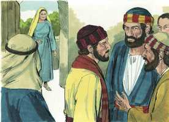 

**8** 	E disse-lhe Pedro: Dize-me, vendestes por tanto aquela herdade? E ela disse: Sim, por tanto.

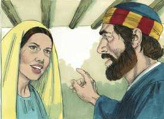 

**9** 	Então Pedro lhe disse: Por que é que entre vós vos concertastes para tentar o Espírito do Senhor? Eis aí à porta os pés dos que sepultaram o teu marido, e também te levarão a ti.

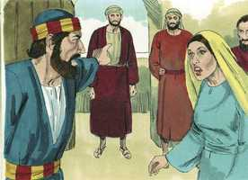 

**10** 	E logo caiu aos seus pés, e expirou. E, entrando os moços, acharam-na morta, e a sepultaram junto de seu marido.

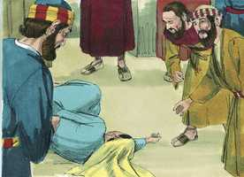 

**11** 	E houve um grande temor em toda a igreja, e em todos os que ouviram estas coisas.

**12** 	E muitos sinais e prodígios eram feitos entre o povo pelas mãos dos apóstolos. E estavam todos unanimemente no alpendre de Salomão.

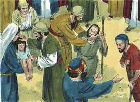 

**13** 	Dos outros, porém, ninguém ousava ajuntar-se a eles; mas o povo tinha-os em grande estima.

**14** 	E a multidão dos que criam no Senhor, tanto homens como mulheres, crescia cada vez mais.

**15** 	De sorte que transportavam os enfermos para as ruas, e os punham em leitos e em camilhas para que ao menos a sombra de Pedro, quando este passasse, cobrisse alguns deles.

**16** 	E até das cidades circunvizinhas concorria muita gente a Jerusalém, conduzindo enfermos e atormentados de espíritos imundos; os quais eram todos curados.

**17** 	E, levantando-se o sumo sacerdote, e todos os que estavam com ele (e eram eles da seita dos saduceus), encheram-se de inveja,

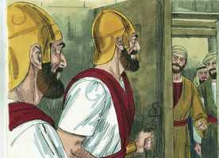 

**18** 	E lançaram mão dos apóstolos, e os puseram na prisão pública.

**19** 	Mas de noite um anjo do Senhor abriu as portas da prisão e, tirando-os para fora, disse:

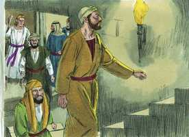 

**20** 	Ide e apresentai-vos no templo, e dizei ao povo todas as palavras desta vida.

**21** 	E, ouvindo eles isto, entraram de manhã cedo no templo, e ensinavam. Chegando, porém, o sumo sacerdote e os que estavam com ele, convocaram o conselho, e a todos os anciãos dos filhos de Israel, e enviaram ao cárcere, para que de lá os trouxessem.

**22** 	Mas, tendo lá ido os servidores, não os acharam na prisão e, voltando, lho anunciaram,

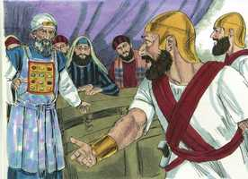 

**23** 	Dizendo: Achamos realmente o cárcere fechado, com toda a segurança, e os guardas, que estavam fora, diante das portas; mas, quando abrimos, ninguém achamos dentro.

**24** 	Então o sumo sacerdote, o capitão do templo e os chefes dos sacerdotes, ouvindo estas palavras, estavam perplexos acerca deles e do que viria a ser aquilo.

**25** 	E, chegando um, anunciou-lhes, dizendo: Eis que os homens que encerrastes na prisão estão no templo e ensinam ao povo.

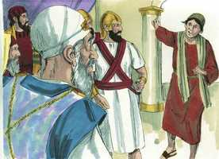 

**26** 	Então foi o capitão com os servidores, e os trouxe, não com violência (porque temiam ser apedrejados pelo povo).

**27** 	E, trazendo-os, os apresentaram ao conselho. E o sumo sacerdote os interrogou,

**28** 	Dizendo: Não vos admoestamos nós expressamente que não ensinásseis nesse nome? E eis que enchestes Jerusalém dessa vossa doutrina, e quereis lançar sobre nós o sangue desse homem.

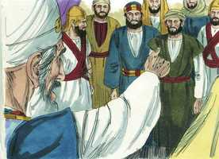 

**29** 	Porém, respondendo Pedro e os apóstolos, disseram: Mais importa obedecer a Deus do que aos homens.

 

**30** 	O Deus de nossos pais ressuscitou a Jesus, ao qual vós matastes, suspendendo-o no madeiro.

**31** 	Deus com a sua destra o elevou a Príncipe e Salvador, para dar a Israel o arrependimento e a remissão dos pecados.

**32** 	E nós somos testemunhas acerca destas palavras, nós e também o Espírito Santo, que Deus deu àqueles que lhe obedecem.

**33** 	E, ouvindo eles isto, se enfureciam, e deliberaram matá-los.

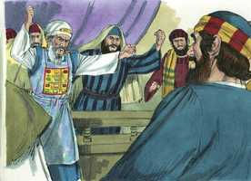 

**34** 	Mas, levantando-se no conselho um certo fariseu, chamado Gamaliel, doutor da lei, venerado por todo o povo, mandou que por um pouco levassem para fora os apóstolos;

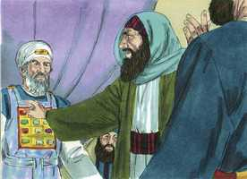 

**35** 	E disse-lhes: Homens israelitas, acautelai-vos a respeito do que haveis de fazer a estes homens,

**36** 	Porque antes destes dias levantou-se Teudas, dizendo ser alguém; a este se ajuntou o número de uns quatrocentos homens; o qual foi morto, e todos os que lhe deram ouvidos foram dispersos e reduzidos a nada.

**37** 	Depois deste levantou-se Judas, o galileu, nos dias do alistamento, e levou muito povo após si; mas também este pereceu, e todos os que lhe deram ouvidos foram dispersos.

**38** 	E agora digo-vos: Dai de mão a estes homens, e deixai-os, porque, se este conselho ou esta obra é de homens, se desfará,

**39** 	Mas, se é de Deus, não podereis desfazê-la; para que não aconteça serdes também achados combatendo contra Deus.

**40** 	E concordaram com ele. E, chamando os apóstolos, e tendo-os açoitado, mandaram que não falassem no nome de Jesus, e os deixaram ir.

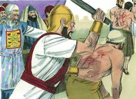 

**41** 	Retiraram-se, pois, da presença do conselho, regozijando-se de terem sido julgados dignos de padecer afronta pelo nome de Jesus.

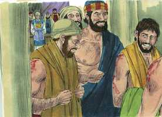 

**42** 	E todos os dias, no templo e nas casas, não cessavam de ensinar, e de anunciar a Jesus Cristo.

