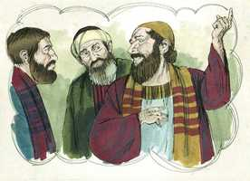

# Tiago Capítulo 1

**1** 	TIAGO, servo de Deus, e do Senhor Jesus Cristo, às doze tribos que andam dispersas, saúde.

 

**2** 	Meus irmãos, tende grande gozo quando cairdes em várias tentações;

 

**3** 	Sabendo que a prova da vossa fé opera a paciência.

**4** 	Tenha, porém, a paciência a sua obra perfeita, para que sejais perfeitos e completos, sem faltar em coisa alguma.

**5** 	E, se algum de vós tem falta de sabedoria, peça-a a Deus, que a todos dá liberalmente, e o não lança em rosto, e ser-lhe-á dada.

**6** 	Peça-a, porém, com fé, em nada duvidando; porque o que duvida é semelhante à onda do mar, que é levada pelo vento, e lançada de uma para outra parte.

**7** 	Não pense tal homem que receberá do Senhor alguma coisa.

**8** 	O homem de coração dobre é inconstante em todos os seus caminhos.

**9** 	Mas glorie-se o irmão abatido na sua exaltação,

**10** 	E o rico em seu abatimento; porque ele passará como a flor da erva.

**11** 	Porque sai o sol com ardor, e a erva seca, e a sua flor cai, e a formosa aparência do seu aspecto perece; assim se murchará também o rico em seus caminhos.

**12** 	Bem-aventurado o homem que suporta a tentação; porque, quando for provado, receberá a coroa da vida, a qual o Senhor tem prometido aos que o amam.

**13** 	Ninguém, sendo tentado, diga: De Deus sou tentado; porque Deus não pode ser tentado pelo mal, e a ninguém tenta.

**14** 	Mas cada um é tentado, quando atraído e engodado pela sua própria concupiscência.

**15** 	Depois, havendo a concupiscência concebido, dá à luz o pecado; e o pecado, sendo consumado, gera a morte.

**16** 	Não erreis, meus amados irmãos.

**17** 	Toda a boa dádiva e todo o dom perfeito vem do alto, descendo do Pai das luzes, em quem não há mudança nem sombra de variação.

**18** 	Segundo a sua vontade, ele nos gerou pela palavra da verdade, para que fôssemos como primícias das suas criaturas.

**19** 	Portanto, meus amados irmãos, todo o homem seja pronto para ouvir, tardio para falar, tardio para se irar.

**20** 	Porque a ira do homem não opera a justiça de Deus.

**21** 	Por isso, rejeitando toda a imundícia e superfluidade de malícia, recebei com mansidão a palavra em vós enxertada, a qual pode salvar as vossas almas.

**22** 	E sede cumpridores da palavra, e não somente ouvintes, enganando-vos a vós mesmos.

**23** 	Porque, se alguém é ouvinte da palavra, e não cumpridor, é semelhante ao homem que contempla ao espelho o seu rosto natural;

**24** 	Porque se contempla a si mesmo, e vai-se, e logo se esquece de como era.

**25** 	Aquele, porém, que atenta bem para a lei perfeita da liberdade, e nisso persevera, não sendo ouvinte esquecidiço, mas fazedor da obra, este tal será bem-aventurado no seu feito.

**26** 	Se alguém entre vós cuida ser religioso, e não refreia a sua língua, antes engana o seu coração, a religião desse é vã.

**27** 	A religião pura e imaculada para com Deus e Pai, é esta: Visitar os órfãos e as viúvas nas suas tribulações, e guardar-se da corrupção do mundo.

