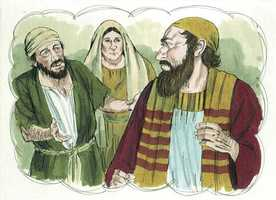
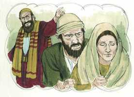
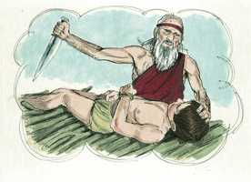

# Tiago Capítulo 2

**1** 	MEUS irmãos, não tenhais a fé de nosso Senhor Jesus Cristo, Senhor da glória, em acepção de pessoas.

**2** 	Porque, se no vosso ajuntamento entrar algum homem com anel de ouro no dedo, com trajes preciosos, e entrar também algum pobre com sórdido traje,

**3** 	E atentardes para o que traz o traje precioso, e lhe disserdes: Assenta-te tu aqui num lugar de honra, e disserdes ao pobre: Tu, fica aí em pé, ou assenta-te abaixo do meu estrado,

**4** 	Porventura não fizestes distinção entre vós mesmos, e não vos fizestes juízes de maus pensamentos?

**5** 	Ouvi, meus amados irmãos: Porventura não escolheu Deus aos pobres deste mundo para serem ricos na fé, e herdeiros do reino que prometeu aos que o amam?

 

**6** 	Mas vós desonrastes o pobre. Porventura não vos oprimem os ricos, e não vos arrastam aos tribunais?

**7** 	Porventura não blasfemam eles o bom nome que sobre vós foi invocado?

**8** 	Todavia, se cumprirdes, conforme a Escritura, a lei real: Amarás a teu próximo como a ti mesmo, bem fazeis.

**9** 	Mas, se fazeis acepção de pessoas, cometeis pecado, e sois redargüidos pela lei como transgressores.

 

**10** 	Porque qualquer que guardar toda a lei, e tropeçar em um só ponto, tornou-se culpado de todos.

**11** 	Porque aquele que disse: Não cometerás adultério, também disse: Não matarás. Se tu pois não cometeres adultério, mas matares, estás feito transgressor da lei.

**12** 	Assim falai, e assim procedei, como devendo ser julgados pela lei da liberdade.

**13** 	Porque o juízo será sem misericórdia sobre aquele que não fez misericórdia; e a misericórdia triunfa do juízo.

**14** 	Meus irmãos, que aproveita se alguém disser que tem fé, e não tiver as obras? Porventura a fé pode salvá-lo?

**15** 	E, se o irmão ou a irmã estiverem nus, e tiverem falta de mantimento quotidiano,

 

**16** 	E algum de vós lhes disser: Ide em paz, aquentai-vos, e fartai-vos; e não lhes derdes as coisas necessárias para o corpo, que proveito virá daí?

 

**17** 	Assim também a fé, se não tiver as obras, é morta em si mesma.

**18** 	Mas dirá alguém: Tu tens a fé, e eu tenho as obras; mostra-me a tua fé sem as tuas obras, e eu te mostrarei a minha fé pelas minhas obras.

**19** 	Tu crês que há um só Deus; fazes bem. Também os demônios o crêem, e estremecem.

**20** 	Mas, ó homem vão, queres tu saber que a fé sem as obras é morta?

**21** 	Porventura o nosso pai Abraão não foi justificado pelas obras, quando ofereceu sobre o altar o seu filho Isaque?

 

**22** 	Bem vês que a fé cooperou com as suas obras, e que pelas obras a fé foi aperfeiçoada.

**23** 	E cumpriu-se a Escritura, que diz: E creu Abraão em Deus, e foi-lhe isso imputado como justiça, e foi chamado o amigo de Deus.

**24** 	Vedes então que o homem é justificado pelas obras, e não somente pela fé.

**25** 	E de igual modo Raabe, a meretriz, não foi também justificada pelas obras, quando recolheu os emissários, e os despediu por outro caminho?

**26** 	Porque, assim como o corpo sem o espírito está morto, assim também a fé sem obras é morta.

