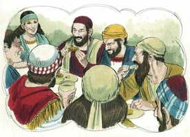

# 1 João Capítulo 3

**1** 	VEDE quão grande amor nos tem concedido o Pai, que fôssemos chamados filhos de Deus. Por isso o mundo não nos conhece; porque não o conhece a ele.

**2** 	Amados, agora somos filhos de Deus, e ainda não é manifestado o que havemos de ser. Mas sabemos que, quando ele se manifestar, seremos semelhantes a ele; porque assim como é o veremos.

**3** 	E qualquer que nele tem esta esperança purifica-se a si mesmo, como também ele é puro.

**4** 	Qualquer que comete pecado, também comete iniqüidade; porque o pecado é iniqüidade.

**5** 	E bem sabeis que ele se manifestou para tirar os nossos pecados; e nele não há pecado.

**6** 	Qualquer que permanece nele não peca; qualquer que peca não o viu nem o conheceu.

**7** 	Filhinhos, ninguém vos engane. Quem pratica justiça é justo, assim como ele é justo.

**8** 	Quem comete o pecado é do diabo; porque o diabo peca desde o princípio. Para isto o Filho de Deus se manifestou: para desfazer as obras do diabo.

**9** 	Qualquer que é nascido de Deus não comete pecado; porque a sua semente permanece nele; e não pode pecar, porque é nascido de Deus.

**10** 	Nisto são manifestos os filhos de Deus, e os filhos do diabo. Qualquer que não pratica a justiça, e não ama a seu irmão, não é de Deus.

**11** 	Porque esta é a mensagem que ouvistes desde o princípio: que nos amemos uns aos outros.

**12** 	Não como Caim, que era do maligno, e matou a seu irmão. E por que causa o matou? Porque as suas obras eram más e as de seu irmão justas.

 

**13** 	Meus irmãos, não vos maravilheis, se o mundo vos odeia.

**14** 	Nós sabemos que passamos da morte para a vida, porque amamos os irmãos. Quem não ama a seu irmão permanece na morte.

**15** 	Qualquer que odeia a seu irmão é homicida. E vós sabeis que nenhum homicida tem a vida eterna permanecendo nele.

**16** 	Conhecemos o amor nisto: que ele deu a sua vida por nós, e nós devemos dar a vida pelos irmãos.

**17** 	Quem, pois, tiver bens do mundo, e, vendo o seu irmão necessitado, lhe cerrar as suas entranhas, como estará nele o amor de Deus?

**18** 	Meus filhinhos, não amemos de palavra, nem de língua, mas por obra e em verdade.

 

**19** 	E nisto conhecemos que somos da verdade, e diante dele asseguraremos nossos corações;

**20** 	Sabendo que, se o nosso coração nos condena, maior é Deus do que o nosso coração, e conhece todas as coisas.

**21** 	Amados, se o nosso coração não nos condena, temos confiança para com Deus;

 

**22** 	E qualquer coisa que lhe pedirmos, dele a receberemos, porque guardamos os seus mandamentos, e fazemos o que é agradável à sua vista.

**23** 	E o seu mandamento é este: que creiamos no nome de seu Filho Jesus Cristo, e nos amemos uns aos outros, segundo o seu mandamento.

**24** 	E aquele que guarda os seus mandamentos nele está, e ele nele. E nisto conhecemos que ele está em nós, pelo Espírito que nos tem dado.

