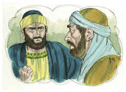

# 1 João Capítulo 2

1	MEUS filhinhos, estas coisas vos escrevo, para que não pequeis; e, se alguém pecar, temos um Advogado para com o Pai, Jesus Cristo, o justo.

2	E ele é a propiciação pelos nossos pecados, e não somente pelos nossos, mas também pelos de todo o mundo.

3	E nisto sabemos que o conhecemos: se guardarmos os seus mandamentos.

4	Aquele que diz: Eu conheço-o, e não guarda os seus mandamentos, é mentiroso, e nele não está a verdade.

5	Mas qualquer que guarda a sua palavra, o amor de Deus está nele verdadeiramente aperfeiçoado; nisto conhecemos que estamos nele.

6	Aquele que diz que está nele, também deve andar como ele andou.

7	Irmãos, não vos escrevo mandamento novo, mas o mandamento antigo, que desde o princípio tivestes. Este mandamento antigo é a palavra que desde o princípio ouvistes.

8	Outra vez vos escrevo um mandamento novo, que é verdadeiro nele e em vós; porque vão passando as trevas, e já a verdadeira luz ilumina.

9	Aquele que diz que está na luz, e odeia a seu irmão, até agora está em trevas.

10	Aquele que ama a seu irmão está na luz, e nele não há escândalo.

11	Mas aquele que odeia a seu irmão está em trevas, e anda em trevas, e não sabe para onde deva ir; porque as trevas lhe cegaram os olhos.

12	Filhinhos, escrevo-vos, porque pelo seu nome vos são perdoados os pecados.

13	Pais, escrevo-vos, porque conhecestes aquele que é desde o princípio. Jovens, escrevo-vos, porque vencestes o maligno. Eu vos escrevo, filhos, porque conhecestes o Pai.

14	Eu vos escrevi, pais, porque já conhecestes aquele que é desde o princípio. Eu vos escrevi, jovens, porque sois fortes, e a palavra de Deus está em vós, e já vencestes o maligno.

15	Não ameis o mundo, nem o que no mundo há. Se alguém ama o mundo, o amor do Pai não está nele.

16	Porque tudo o que há no mundo, a concupiscência da carne, a concupiscência dos olhos e a soberba da vida, não é do Pai, mas do mundo.

17	E o mundo passa, e a sua concupiscência; mas aquele que faz a vontade de Deus permanece para sempre.

18	Filhinhos, é já a última hora; e, como ouvistes que vem o anticristo, também agora muitos se têm feito anticristos, por onde conhecemos que é já a última hora.

19	Saíram de nós, mas não eram de nós; porque, se fossem de nós, ficariam conosco; mas isto é para que se manifestasse que não são todos de nós.

20	E vós tendes a unção do Santo, e sabeis todas as coisas.

21	Não vos escrevi porque não soubésseis a verdade, mas porque a sabeis, e porque nenhuma mentira vem da verdade.

22	Quem é o mentiroso, senão aquele que nega que Jesus é o Cristo? É o anticristo esse mesmo que nega o Pai e o Filho.

23	Qualquer que nega o Filho, também não tem o Pai; mas aquele que confessa o Filho, tem também o Pai.

24	Portanto, o que desde o princípio ouvistes permaneça em vós. Se em vós permanecer o que desde o princípio ouvistes, também permanecereis no Filho e no Pai.

25	E esta é a promessa que ele nos fez: a vida eterna.

26	Estas coisas vos escrevi acerca dos que vos enganam.

27	E a unção que vós recebestes dele, fica em vós, e não tendes necessidade de que alguém vos ensine; mas, como a sua unção vos ensina todas as coisas, e é verdadeira, e não é mentira, como ela vos ensinou, assim nele permanecereis.

28	E agora, filhinhos, permanecei nele; para que, quando ele se manifestar, tenhamos confiança, e não sejamos confundidos por ele na sua vinda.

29	Se sabeis que ele é justo, sabeis que todo aquele que pratica a justiça é nascido dele.

