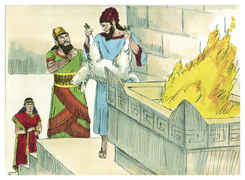

# 1 Reis Capítulo 16

1	ENTÃO veio a palavra do Senhor a Jeú, filho de Hanani, contra Baasa, dizendo:

2	Porquanto te levantei do pó, e te pus por príncipe sobre o meu povo Israel, e tu tens andado no caminho de Jeroboão, e tens feito pecar a meu povo Israel, irritando-me com os seus pecados,

3	Eis que tirarei os descendentes de Baasa, e os descendentes da sua casa, e farei a tua casa como a casa de Jeroboão, filho de Nebate.

4	Quem morrer dos de Baasa, na cidade, os cães o comerão; e o que dele morrer no campo, as aves do céu o comerão.

5	Quanto ao mais dos atos de Baasa, e ao que fez, e ao seu poder, porventura não está escrito no livro das crônicas dos reis de Israel?

6	E Baasa dormiu com seus pais, e foi sepultado em Tirza; e Elá, seu filho, reinou em seu lugar.

7	Assim veio também a palavra do Senhor, pelo ministério do profeta Jeú, filho de Hanani, contra Baasa e contra a sua casa; e isso por todo o mal que fizera aos olhos do Senhor, irritando-o com a obra de suas mãos, para ser como a casa de Jeroboão; e porque o havia ferido.

8	No ano vinte e seis de Asa, rei de Judá, Elá, filho de Baasa, começou a reinar em Tirza sobre Israel; e reinou dois anos.

9	E Zinri, seu servo, capitão de metade dos carros, conspirou contra ele, estando ele em Tirza, bebendo e embriagando-se em casa de Arsa, mordomo em Tirza.

10	Entrou, pois, Zinri, e o feriu, e o matou, no ano vigésimo sétimo de Asa, rei de Judá; e reinou em seu lugar.

11	E sucedeu que, reinando ele, e estando assentado no seu trono, feriu a toda a casa de Baasa; não lhe deixou homem algum, nem a seus parentes, nem a seus amigos.

12	Assim destruiu Zinri toda a casa de Baasa, conforme à palavra do Senhor que, contra Baasa, ele falara pelo ministério do profeta Jeú,

13	Por todos os pecados de Baasa, e os pecados de Elá, seu filho, que cometeram, e com que fizeram pecar a Israel, irritando ao Senhor Deus de Israel com as suas vaidades.

14	Quanto ao mais dos atos de Elá, e a tudo quanto fez, não está escrito no livro das crônicas dos reis de Israel?

15	No ano vigésimo sétimo de Asa, rei de Judá, reinou Zinri sete dias em Tirza; e o povo estava acampado contra Gibetom, que era dos filisteus.

16	E o povo que estava acampado ouviu dizer: Zinri tem conspirado, e até matou o rei. Todo o Israel pois, no mesmo dia, no arraial, constituiu rei sobre Israel a Onri, capitão do exército.

17	E subiu Onri, e todo o Israel com ele, de Gibetom, e cercaram a Tirza.

18	E sucedeu que Zinri, vendo que a cidade era tomada, foi ao paço da casa do rei e queimou-a sobre si; e morreu,

19	Por causa dos pecados que cometera, fazendo o que era mau aos olhos do Senhor, andando no caminho de Jeroboão, e no pecado que ele cometera, fazendo Israel pecar.

20	Quanto ao mais dos atos de Zinri, e à conspiração que fez, porventura não está escrito no livro das crônicas dos reis de Israel?

21	Então o povo de Israel se dividiu em dois partidos: metade do povo seguia a Tibni, filho de Ginate, para o fazer rei, e a outra metade seguia a Onri.

22	Mas o povo que seguia a Onri foi mais forte do que o povo que seguia a Tibni, filho de Ginate; e Tibni morreu, e Onri reinou.

23	No ano trinta e um de Asa, rei de Judá, Onri começou a reinar sobre Israel, e reinou doze anos; e em Tirza reinou seis anos.

24	E de Semer comprou o monte de Samaria por dois talentos de prata, e edificou nele; e chamou a cidade que edificou Samaria, do nome de Semer, dono do monte.

25	E fez Onri o que era mau aos olhos do Senhor; e fez pior do que todos quantos foram antes dele.

26	E andou em todos os caminhos de Jeroboão, filho de Nebate, como também nos pecados com que ele tinha feito pecar a Israel, irritando ao Senhor Deus de Israel com as suas vaidades.

27	Quanto ao mais dos atos de Onri, ao que fez, e ao poder que manifestou, porventura não está escrito no livro das crônicas dos reis de Israel?

28	E Onri dormiu com seus pais, e foi sepultado em Samaria; e Acabe, seu filho, reinou em seu lugar.

29	E Acabe, filho de Onri, começou a reinar sobre Israel no ano trigésimo oitavo de Asa, rei de Judá; e reinou Acabe, filho de Onri, sobre Israel, em Samaria, vinte e dois anos.

30	E fez Acabe, filho de Onri, o que era mau aos olhos do Senhor, mais do que todos os que foram antes dele.

31	E sucedeu que (como se fora pouco andar nos pecados de Jeroboão, filho de Nebate) ainda tomou por mulher a Jezabel, filha de Etbaal, rei dos sidônios; e foi e serviu a Baal, e o adorou.

32	E levantou um altar a Baal, na casa de Baal que edificara em Samaria.

33	Também Acabe fez um ídolo; de modo que Acabe fez muito mais para irritar ao Senhor Deus de Israel, do que todos os reis de Israel que foram antes dele.

34	Em seus dias Hiel, o betelita, edificou a Jericó; em Abirão, seu primogênito, a fundou, e em Segube, seu filho menor, pôs as suas portas; conforme a palavra do Senhor, que falara pelo ministério de Josué, filho de Num.

