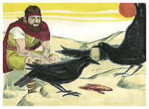
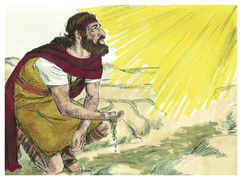
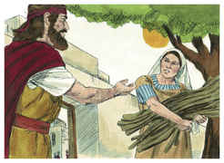
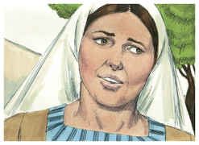
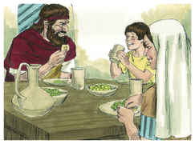
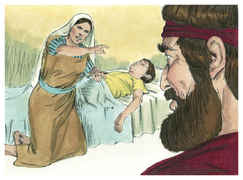
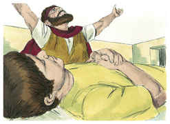
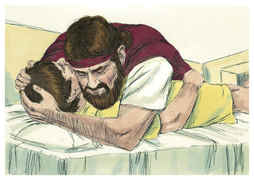
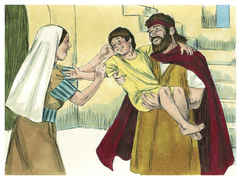

# 1 Reis Capítulo 17

1	ENTÃO Elias, o tisbita, dos moradores de Gileade, disse a Acabe: Vive o Senhor Deus de Israel, perante cuja face estou, que nestes anos nem orvalho nem chuva haverá, senão segundo a minha palavra.

2	Depois veio a ele a palavra do Senhor, dizendo:

3	Retira-te daqui, e vai para o oriente, e esconde-te junto ao ribeiro de Querite, que está diante do Jordão.

4	E há de ser que beberás do ribeiro; e eu tenho ordenado aos corvos que ali te sustentem.

5	Foi, pois, e fez conforme a palavra do Senhor; porque foi, e habitou junto ao ribeiro de Querite, que está diante do Jordão.

6	E os corvos lhe traziam pão e carne pela manhã; como também pão e carne à noite; e bebia do ribeiro.

7	E sucedeu que, passados dias, o ribeiro se secou, porque não tinha havido chuva na terra.

8	Então veio a ele a palavra do Senhor, dizendo:

9	Levanta-te, e vai para Sarepta, que é de Sidom, e habita ali; eis que eu ordenei ali a uma mulher viúva que te sustente.

10	Então ele se levantou, e foi a Sarepta; e, chegando à porta da cidade, eis que estava ali uma mulher viúva apanhando lenha; e ele a chamou, e lhe disse: Traze-me, peço-te, num vaso um pouco de água que beba.

11	E, indo ela a trazê-la, ele a chamou e lhe disse: Traze-me agora também um bocado de pão na tua mão.

12	Porém ela disse: Vive o Senhor teu Deus, que nem um bolo tenho, senão somente um punhado de farinha numa panela, e um pouco de azeite numa botija; e vês aqui apanhei dois cavacos, e vou prepará-lo para mim e para o meu filho, para que o comamos, e morramos.

13	E Elias lhe disse: Não temas; vai, faze conforme à tua palavra; porém faze dele primeiro para mim um bolo pequeno, e traze-mo aqui; depois farás para ti e para teu filho.

14	Porque assim diz o Senhor Deus de Israel: A farinha da panela não se acabará, e o azeite da botija não faltará até ao dia em que o Senhor dê chuva sobre a terra.

15	E ela foi e fez conforme a palavra de Elias; e assim comeu ela, e ele, e a sua casa muitos dias.

16	Da panela a farinha não se acabou, e da botija o azeite não faltou; conforme a palavra do Senhor, que ele falara pelo ministério de Elias.

17	E depois destas coisas sucedeu que adoeceu o filho desta mulher, dona da casa; e a sua doença se agravou muito, até que nele nenhum fôlego ficou.

18	Então ela disse a Elias: Que tenho eu contigo, homem de Deus? vieste tu a mim para trazeres à memória a minha iniqüidade, e matares a meu filho?

19	E ele disse: Dá-me o teu filho. E ele o tomou do seu regaço, e o levou para cima, ao quarto, onde ele mesmo habitava, e o deitou em sua cama,

20	E clamou ao Senhor, e disse: Ó Senhor meu Deus, também até a esta viúva, com quem me hospedo, afligiste, matando-lhe o filho?

21	Então se estendeu sobre o menino três vezes, e clamou ao Senhor, e disse: Ó Senhor meu Deus, rogo-te que a alma deste menino torne a entrar nele.

22	E o Senhor ouviu a voz de Elias; e a alma do menino tornou a entrar nele, e reviveu.

23	E Elias tomou o menino, e o trouxe do quarto à casa, e o deu à sua mãe; e disse Elias: Vês aí, teu filho vive.

24	Então a mulher disse a Elias: Nisto conheço agora que tu és homem de Deus, e que a palavra do Senhor na tua boca é verdade.

