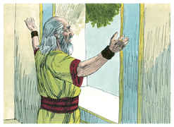
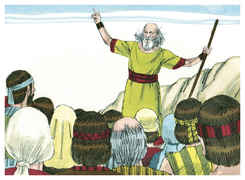
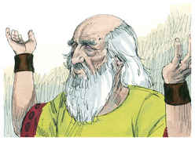
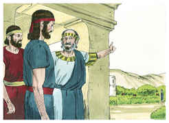
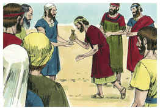

# 1Samuel Capítulo 8

1	E SUCEDEU que, tendo Samuel envelhecido, constituiu a seus filhos por juízes sobre Israel.

2	E o nome do seu filho primogênito era Joel, e o nome do seu segundo, Abia; e foram juízes em Berseba.

3	Porém seus filhos não andaram pelos caminhos dele, antes se inclinaram à avareza, e aceitaram suborno, e perverteram o direito.

4	Então todos os anciãos de Israel se congregaram, e vieram a Samuel, a Ramá,

5	E disseram-lhe: Eis que já estás velho, e teus filhos não andam pelos teus caminhos; constitui-nos, pois, agora um rei sobre nós, para que ele nos julgue, como o têm todas as nações.

6	Porém esta palavra pareceu mal aos olhos de Samuel, quando disseram: Dá-nos um rei, para que nos julgue. E Samuel orou ao Senhor.

7	E disse o Senhor a Samuel: Ouve a voz do povo em tudo quanto te dizem, pois não te têm rejeitado a ti, antes a mim me têm rejeitado, para eu não reinar sobre eles.

8	Conforme a todas as obras que fizeram desde o dia em que os tirei do Egito até ao dia de hoje, a mim me deixaram, e a outros deuses serviram, assim também fazem a ti.

9	Agora, pois, ouve à sua voz, porém protesta-lhes solenemente, e declara-lhes qual será o costume do rei que houver de reinar sobre eles.

10	E falou Samuel todas as palavras do Senhor ao povo, que lhe pedia um rei.

11	E disse: Este será o costume do rei que houver de reinar sobre vós; ele tomará os vossos filhos, e os empregará nos seus carros, e como seus cavaleiros, para que corram adiante dos seus carros.

12	E os porá por chefes de mil, e de cinqüenta; e para que lavrem a sua lavoura, e façam a sua sega, e fabriquem as suas armas de guerra e os petrechos de seus carros.

13	E tomará as vossas filhas para perfumistas, cozinheiras e padeiras.

14	E tomará o melhor das vossas terras, e das vossas vinhas, e dos vossos olivais, e os dará aos seus servos.

15	E as vossas sementes, e as vossas vinhas dizimará, para dar aos seus oficiais, e aos seus servos.

16	Também os vossos servos, e as vossas servas, e os vossos melhores moços, e os vossos jumentos tomará, e os empregará no seu trabalho.

17	Dizimará o vosso rebanho, e vós lhe servireis de servos.

18	Então naquele dia clamareis por causa do vosso rei, que vós houverdes escolhido; mas o Senhor não vos ouvirá naquele dia.

19	Porém o povo não quis ouvir a voz de Samuel; e disseram: Não, mas haverá sobre nós um rei.

20	E nós também seremos como todas as outras nações; e o nosso rei nos julgará, e sairá adiante de nós, e fará as nossas guerras.

21	Ouvindo, pois, Samuel todas as palavras do povo, as repetiu aos ouvidos do Senhor.

22	Então o Senhor disse a Samuel: Dá ouvidos à sua voz, e constitui-lhes rei. Então Samuel disse aos homens de Israel: Volte cada um à sua cidade.

