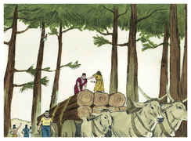

# 2 Crônicas Capítulo 2

1	E DETERMINOU Salomão edificar uma casa ao nome do Senhor, como também uma casa para o seu reino.

2	E designou Salomão setenta mil homens de carga, e oitenta mil que talhavam pedras na montanha, e três mil e seiscentos inspetores sobre eles.

3	E Salomão mandou dizer a Hirão, rei de Tiro: Como fizeste com Davi meu pai, mandando-lhe cedros, para edificar uma casa em que morasse, assim também faze comigo.

4	Eis que estou para edificar uma casa ao nome do Senhor meu Deus, para lhe consagrar, para queimar perante ele incenso aromático, e para a apresentação contínua do pão da proposição, para os holocaustos da manhã e da tarde, nos sábados e nas luas novas, e nas festividades do Senhor nosso Deus; o que é obrigação perpétua de Israel.

5	E a casa que estou para edificar há de ser grande; porque o nosso Deus é maior do que todos os deuses.

6	Porém, quem seria capaz de lhe edificar uma casa, visto que os céus e até os céus dos céus o não podem conter? E quem sou eu, que lhe edificasse casa, salvo para queimar incenso perante ele?

7	Manda-me, pois, agora um homem hábil para trabalhar em ouro, em prata, em bronze, em ferro, em púrpura, em carmesim e em azul; e que saiba lavrar ao buril, juntamente com os peritos que estão comigo em Judá e em Jerusalém, os quais Davi, meu pai, preparou.

8	Manda-me também madeiras de cedro, de cipreste, e algumins do Líbano; porque bem sei eu que os teus servos sabem cortar madeira no Líbano; e eis que os meus servos estarão com os teus servos.

9	E isso para prepararem muita madeira; porque a casa que estou para fazer há de ser grande e maravilhosa.

10	E eis que a teus servos, os cortadores, que cortarem a madeira, darei vinte mil coros de trigo malhado, vinte mil coros de cevada, vinte mil batos de vinho e vinte mil batos de azeite.

11	E Hirão, rei de Tiro, respondeu por escrito que enviou a Salomão, dizendo: Porque o Senhor tem amado o seu povo, te constituiu sobre ele rei.

12	Disse mais Hirão: Bendito seja o Senhor Deus de Israel, que fez os céus e a terra; o que deu ao rei Davi um filho sábio, de grande prudência e entendimento, que edifique casa ao Senhor, e para o seu reino.

13	Agora, pois, envio um homem sábio de grande entendimento, a saber, Hirão Abiú.

14	Filho de uma mulher das filhas de Dã, e cujo pai foi homem de Tiro; este sabe trabalhar em ouro, em prata, em bronze, em ferro, em pedras e em madeira, em púrpura, em azul, e em linho fino, e em carmesim, e é hábil para toda a obra do buril, e para toda a espécie de invenções, qualquer coisa que se lhe propuser, juntamente com os teus peritos, e os peritos de Davi, meu senhor, teu pai.

15	Agora, pois, meu senhor, mande para os seus servos o trigo, a cevada, o azeite e o vinho, de que falou;

16	E nós cortaremos tanta madeira no Líbano, quanta houveres mister, e ta traremos em jangadas pelo mar até Jope, e tu a farás subir a Jerusalém.

17	E Salomão contou todos os homens estrangeiros, que havia na terra de Israel, conforme o censo com que os contara Davi seu pai; e acharam-se cento e cinqüenta e três mil e seiscentos.

18	E designou deles setenta mil carregadores, e oitenta mil cortadores na montanha; como também três mil e seiscentos inspetores, para fazerem trabalhar o povo.

