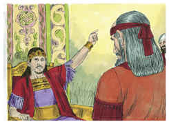
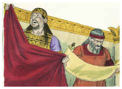
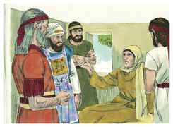
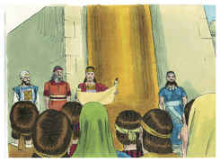

# 2 Crônicas Capítulo 34

1	TINHA Josias oito anos quando começou a reinar, e trinta e um anos reinou em Jerusalém.

2	E fez o que era reto aos olhos do Senhor; e andou nos caminhos de Davi, seu pai, sem se desviar deles nem para a direita nem para a esquerda.

3	Porque no oitavo ano do seu reinado, sendo ainda moço, começou a buscar o Deus de Davi, seu pai; e no duodécimo ano começou a purificar a Judá e a Jerusalém, dos altos, e dos bosques, e das imagens de escultura e de fundição.

4	E derrubaram perante ele os altares de Baalins; e despedaçou as imagens, que estavam acima deles; e os bosques, e as imagens de escultura e de fundição quebrou e reduziu a pó, e o espargiu sobre as sepulturas dos que lhes tinham sacrificado.

5	E os ossos dos sacerdotes queimou sobre os seus altares; e purificou a Judá e a Jerusalém.

6	O mesmo fez nas cidades de Manassés, e de Efraim, e de Simeão, e ainda até Naftali, em seus lugares assolados ao redor.

7	E, tendo derrubado os altares, e os bosques, e as imagens de escultura, até reduzi-los a pó, e tendo despedaçado todas as imagens do sol em toda a terra de Israel, então voltou para Jerusalém.

8	E no ano décimo oitavo do seu reinado, havendo já purificado a terra e a casa, enviou a Safã, filho de Azalias, e a Maaséias, governador da cidade, e a Joá, filho de Joacaz, cronista, para repararem a casa do Senhor seu Deus.

9	E foram a Hilquias, sumo sacerdote, e deram o dinheiro que se tinha trazido à casa de Deus, e que os levitas, que guardavam a entrada tinham recebido da mão de Manassés, e de Efraim, e de todo o restante de Israel, como também de todo o Judá e Benjamim, e dos habitantes de Jerusalém.

10	E eles o entregaram aos que tinham o encargo da obra, e superintendiam a casa do Senhor; e estes o deram aos que faziam a obra, e trabalhavam na casa do Senhor, para consertarem e repararem a casa.

11	E deram-no aos carpinteiros e aos edificadores, para comprarem pedras lavradas, e madeiras para as junturas e para servirem de vigas para as casas que os reis de Judá tinham destruído.

12	E estes homens trabalhavam fielmente na obra; e os superintendentes sobre eles eram: Jaate e Obadias, levitas, dos filhos de Merari, como também Zacarias e Mesulão, dos filhos dos coatitas, para adiantarem a obra; e todos os levitas que eram entendidos em instrumentos de música.

13	Estavam também sobre os carregadores e dirigiam todos os que trabalhavam em alguma obra; e dentre os levitas havia escrivães, oficiais e porteiros.

14	E, tirando eles o dinheiro que se tinha trazido à casa do Senhor, Hilquias, o sacerdote, achou o livro da lei do Senhor, dada pela mão de Moisés.

15	E Hilquias disse a Safã, o escrivão: Achei o livro da lei na casa do Senhor. E Hilquias deu o livro a Safã.

16	E Safã levou o livro ao rei, e deu-lhe conta, dizendo: Teus servos fazem tudo quanto se lhes encomendou.

17	E ajuntaram o dinheiro que se achou na casa do Senhor, e o deram na mão dos superintendentes e na mão dos que faziam a obra.

18	Além disto, Safã, o escrivão, fez saber ao rei, dizendo: O sacerdote Hilquias entregou-me um livro. E Safã leu nele perante o rei.

19	Sucedeu que, ouvindo o rei as palavras da lei, rasgou as suas vestes.

20	E o rei ordenou a Hilquias, e a Aicão, filho de Safã, e a Abdom, filho de Mica, e a Safã, o escrivão, e a Asaías, servo do rei, dizendo:

21	Ide, consultai ao Senhor por mim, e pelos que restam em Israel e em Judá, sobre as palavras deste livro que se achou; porque grande é o furor do Senhor, que se derramou sobre nós; porquanto nossos pais não guardaram a palavra do Senhor, para fazerem conforme a tudo quanto está escrito neste livro.

22	Então Hilquias, e os enviados do rei, foram ter com a profetisa Hulda, mulher de Salum, filho de Tocate, filho de Harás, guarda das vestimentas (e habitava ela em Jerusalém na segunda parte); e falaram-lhe a esse respeito.

23	E ela lhes disse: Assim diz o Senhor Deus de Israel: Dizei ao homem que vos enviou a mim:

24	Assim diz o Senhor: Eis que trarei mal sobre este lugar, e sobre os seus habitantes, a saber, todas as maldições que estão escritas no livro que se leu perante o rei de Judá.

25	Porque me deixaram, e queimaram incenso perante outros deuses, para me provocarem à ira com todas as obras das suas mãos; portanto o meu furor se derramou sobre este lugar, e não se apagará.

26	Porém ao rei de Judá, que vos enviou a consultar ao Senhor, assim lhe direis: Assim diz o Senhor Deus de Israel, quanto às palavras que ouviste:

27	Porquanto o teu coração se enterneceu, e te humilhaste perante Deus, ouvindo as suas palavras contra este lugar, e contra os seus habitantes, e te humilhaste perante mim, e rasgaste as tuas vestes, e choraste perante mim, também eu te ouvi, diz o Senhor.

28	Eis que te reunirei a teus pais, e tu serás recolhido ao teu sepulcro em paz, e os teus olhos não verão todo o mal que hei de trazer sobre este lugar e sobre os seus habitantes. E tornaram com esta resposta ao rei.

29	Então o rei mandou reunir todos os anciãos de Judá e Jerusalém.

30	E o rei subiu à casa do Senhor, com todos os homens de Judá, e os habitantes de Jerusalém, e os sacerdotes, e os levitas, e todo o povo, desde o maior até ao menor; e ele leu aos ouvidos deles todas as palavras do livro da aliança que fora achado na casa do Senhor.

31	E pôs-se o rei em pé em seu lugar, e fez aliança perante o Senhor, para seguirem ao Senhor, e para guardar os seus mandamentos, e os seus testemunhos, e os seus estatutos, com todo o seu coração, e com toda a sua alma, cumprindo as palavras da aliança, que estão escritas naquele livro.

32	E fez com que todos quantos se achavam em Jerusalém e em Benjamim o firmassem; e os habitantes de Jerusalém fizeram conforme a aliança de Deus, o Deus de seus pais.

33	E Josias tirou todas as abominações de todas as terras que eram dos filhos de Israel; e a todos quantos se achavam em Israel obrigou a que servissem ao Senhor seu Deus. Enquanto ele viveu não se desviaram de seguir o Senhor, o Deus de seus pais.

