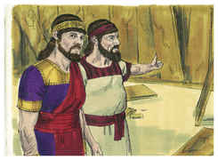
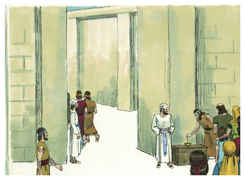
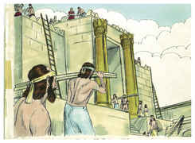

# 2 Reis Capítulo 12

1	NO ano sétimo de Jeú começou a reinar Joás, e quarenta anos reinou em Jerusalém; e era o nome de sua mãe Zíbia, de Berseba.

2	E fez Joás o que era reto aos olhos do Senhor todos os dias em que o sacerdote Joiada o dirigia.

3	Tão-somente os altos não foram tirados; porque ainda o povo sacrificava e queimava incenso nos altos.

4	E disse Joás aos sacerdotes: Todo o dinheiro das coisas santas que se trouxer à casa do Senhor, a saber, o dinheiro daquele que passa o arrolamento, o dinheiro de cada uma das pessoas, segundo a sua avaliação, e todo o dinheiro que trouxer cada um voluntariamente para a casa do Senhor,

5	Os sacerdotes o recebam, cada um dos seus conhecidos; e eles mesmos reparem as fendas da casa, toda a fenda que se achar nela.

6	Sucedeu, porém, que, no ano vinte e três do rei Joás, os sacerdotes ainda não tinham reparado as fendas da casa.

7	Então o rei Joás chamou o sacerdote Joiada e os mais sacerdotes, e lhes disse: Por que não reparais as fendas da casa? Agora, pois, não tomeis mais dinheiro de vossos conhecidos, mas entregai-o para o reparo das fendas da casa.

8	E consentiram os sacerdotes em não tomarem mais dinheiro do povo, e em não repararem as fendas da casa.

9	Porém o sacerdote Joiada tomou um cofre e fez um buraco na tampa; e a pôs ao pé do altar, à mão direita dos que entravam na casa do Senhor; e os sacerdotes que guardavam a entrada da porta punham ali todo o dinheiro que se trazia à casa do Senhor.

10	Sucedeu que, vendo eles que já havia muito dinheiro no cofre, o escrivão do rei subia com o sumo sacerdote, e contavam e ensacavam o dinheiro que se achava na casa do Senhor.

11	E o dinheiro, depois de pesado, davam nas mãos dos que faziam a obra, que tinham a seu cargo a casa do Senhor e eles o distribuíam aos carpinteiros e aos edificadores que reparavam a casa do Senhor.

12	Como também aos pedreiros e aos cabouqueiros; e para se comprar madeira e pedras de cantaria para repararem as fendas da casa do Senhor, e para tudo quanto era necessário para reparar a casa.

13	Todavia, do dinheiro que se trazia à casa do Senhor não se faziam nem taças de prata, nem garfos, nem bacias, nem trombetas, nem vaso algum de ouro ou vaso de prata para a casa do Senhor.

14	Porque o davam aos que faziam a obra, e reparavam com ele a casa do Senhor.

15	Também não pediam contas aos homens em cujas mãos entregavam aquele dinheiro, para o dar aos que faziam a obra, porque procediam com fidelidade.

16	Mas o dinheiro do sacrifício por delitos, e o dinheiro por sacrifício de pecados, não se trazia à casa do Senhor; porque era para os sacerdotes.

17	Então subiu Hazael, rei da Síria, e pelejou contra Gate, e a tomou; depois Hazael resolveu marchar contra Jerusalém.

18	Porém Joás, rei de Judá, tomou todas as coisas santas que Jeosafá, Jorão e Acazias, seus pais, reis de Judá, consagraram, como também todo o ouro que se achou nos tesouros da casa do Senhor e na casa do rei e o mandou a Hazael, rei da Síria; e então se desviou de Jerusalém.

19	Ora, o mais dos atos de Joás, e tudo quanto fez, porventura não está escrito no livro das crônicas dos reis de Judá?

20	E levantaram-se os servos de Joás, e conspiraram contra ele ferindo-o na casa de Milo, no caminho que desce para Sila.

21	Porque Jozacar, filho de Simeate, e Jozabade, filho de Somer, seus servos, o feriram, e morreu, e o sepultaram com seus pais na cidade de Davi. E Amazias, seu filho, reinou em seu lugar.

