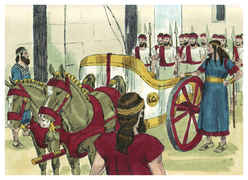
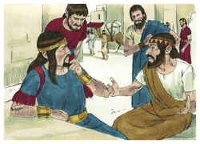
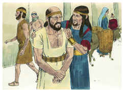
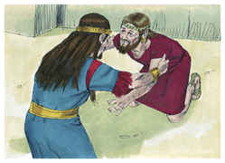
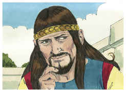
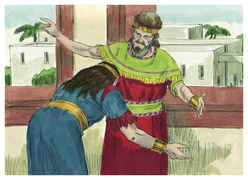
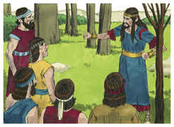
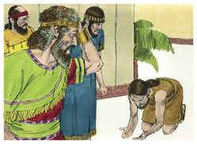
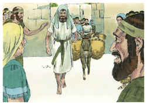

# 2 Samuel Capítulo 15

1	E ACONTECEU depois disto que Absalão fez aparelhar carros e cavalos, e cinqüenta homens que corressem adiante dele.

2	Também Absalão se levantou pela manhã, e parava a um lado do caminho da porta. E sucedia que a todo o homem que tinha alguma demanda para vir ao rei a juízo, o chamava Absalão a si, e lhe dizia: De que cidade és tu? E, dizendo ele: De uma das tribos de Israel é teu servo;

3	Então Absalão lhe dizia: Olha, os teus negócios são bons e retos, porém não tens quem te ouça da parte do rei.

4	Dizia mais Absalão: Ah, quem me dera ser juiz na terra, para que viesse a mim todo o homem que tivesse demanda ou questão, para que lhe fizesse justiça!

5	Sucedia também que, quando alguém se chegava a ele para se inclinar diante dele, ele estendia a sua mão, e pegava dele, e o beijava.

6	E desta maneira fazia Absalão a todo o Israel que vinha ao rei para juízo; assim furtava Absalão o coração dos homens de Israel.

7	Aconteceu, pois, ao cabo de quarenta anos, que Absalão disse ao rei: Deixa-me ir pagar em Hebrom o meu voto que fiz ao Senhor.

8	Porque, morando eu em Gesur, na Síria, fez o teu servo um voto, dizendo: Se o Senhor outra vez me fizer tornar a Jerusalém, servirei ao Senhor.

9	Então lhe disse o rei: Vai em paz. Levantou-se, pois, e foi para Hebrom.

10	E enviou Absalão espias por todas as tribos de Israel, dizendo: Quando ouvirdes o som das trombetas, direis: Absalão reina em Hebrom.

11	E de Jerusalém foram com Absalão duzentos homens convidados, porém iam na sua simplicidade, porque nada sabiam daquele negócio.

12	Também Absalão mandou vir Aitofel, o gilonita, do conselho de Davi, à sua cidade de Giló, estando ele oferecendo os seus sacrifícios; e a conjuração se fortificava, e vinha o povo, e ia crescendo com Absalão.

13	Então veio um mensageiro a Davi, dizendo: O coração de cada um em Israel segue a Absalão.

14	Disse, pois, Davi a todos os seus servos que estavam com ele em Jerusalém: Levantai-vos, e fujamos, porque não poderíamos escapar diante de Absalão. Dai-vos pressa a caminhar, para que porventura não se apresse ele, e nos alcance, e lance sobre nós algum mal, e fira a cidade a fio de espada.

15	Então os servos do rei disseram ao rei: Eis aqui os teus servos, para tudo quanto determinar o rei, nosso senhor.

16	E saiu o rei, com toda a sua casa, a pé; deixou, porém, o rei dez mulheres concubinas, para guardarem a casa.

17	Tendo, pois, saído o rei com todo o povo a pé, pararam num lugar distante.

18	E todos os seus servos iam a seu lado, como também todos os quereteus e todos os peleteus; e todos os giteus, seiscentos homens que vieram de Gate a pé, caminhavam diante do rei.

19	Disse, pois, o rei a Itai, o giteu: Por que irias tu também conosco? Volta-te, e fica-te com o rei, porque és estrangeiro, e também desterrado de teu lugar.

20	Ontem vieste, e te levaria eu hoje conosco a caminhar? Pois eu vou para onde puder ir; volta, pois, e torna a levar teus irmãos contigo, com beneficência e fidelidade.

21	Respondeu, porém, Itai ao rei, e disse: Vive o Senhor, e vive o rei meu senhor, que no lugar em que estiver o rei meu senhor, seja para morte seja para vida, aí certamente estará também o teu servidor.

22	Então Davi disse a Itai: Vem, pois, e passa adiante. Assim passou Itai, o giteu, e todos os seus homens, e todas as crianças que havia com ele.

23	E toda a terra chorava a grandes vozes, passando todo o povo; também o rei passou o ribeiro de Cedrom, e passou todo o povo na direção do caminho do deserto.

24	Eis que também Zadoque ali estava, e com ele todos os levitas que levavam a arca da aliança de Deus; e puseram ali a arca de Deus, e subiu Abiatar, até que todo o povo acabou de passar da cidade.

25	Então disse o rei a Zadoque: Torna a levar a arca de Deus à cidade; que, se achar graça nos olhos do Senhor, ele me tornará a trazer para lá e me deixará ver a ela e a sua habitação.

26	Se, porém, disser assim: Não tenho prazer em ti; eis-me aqui, faça de mim como parecer bem aos seus olhos.

27	Disse mais o rei a Zadoque, o sacerdote: Não és tu porventura vidente? Torna, pois, em paz para a cidade, e convosco também vossos dois filhos, Aimaás, teu filho, e Jônatas, filho de Abiatar.

28	Olhai que me demorarei nas campinas do deserto até que tenha notícias vossas.

29	Zadoque, pois, e Abiatar, tornaram a levar para Jerusalém a arca de Deus; e ficaram ali.

30	E seguiu Davi pela encosta do monte das Oliveiras, subindo e chorando, e com a cabeça coberta; e caminhava com os pés descalços; e todo o povo que ia com ele cobria cada um a sua cabeça, e subiam chorando sem cessar.

31	Então fizeram saber a Davi, dizendo: Também Aitofel está entre os que se conjuraram com Absalão. Pelo que disse Davi: Ó Senhor, peço-te que torne em loucura o conselho de Aitofel.

32	E aconteceu que, chegando Davi ao cume, para adorar ali a Deus, eis que Husai, o arquita, veio encontrar-se com ele com a roupa rasgada e terra sobre a cabeça.

33	E disse-lhe Davi: Se passares comigo, ser-me-ás pesado.

34	Porém se voltares para a cidade, e disseres a Absalão: Eu serei, ó rei, teu servo; bem fui antes servo de teu pai, mas agora serei teu servo; dissipar-me-ás então o conselho de Aitofel.

35	E não estão ali contigo Zadoque e Abiatar, sacerdotes? E será que todas as coisas que ouvires da casa do rei, farás saber a Zadoque, e a Abiatar, sacerdotes.

36	Eis que estão também ali com eles seus dois filhos, Aimaás filho de Zadoque, e Jônatas filho de Abiatar; pela mão deles aviso me mandareis, de todas as coisas que ouvirdes.

37	Husai, pois, amigo de Davi, veio para a cidade; e Absalão entrou em Jerusalém.

