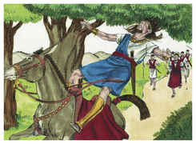
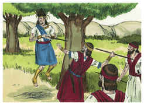
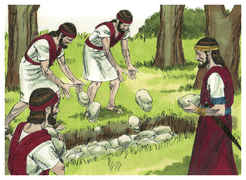
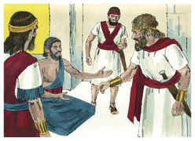
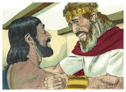
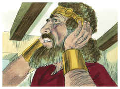

# 2 Samuel Capítulo 18

1	E DAVI contou o povo que tinha consigo, e pôs sobre eles capitães de mil e capitães de cem.

2	E Davi enviou o povo, um terço sob o mando de Joabe, e outro terço sob o mando de Abisai, filho de Zeruia, irmão de Joabe, e outro terço sob o mando de Itai, o giteu; e disse o rei ao povo: Eu também sairei convosco.

3	Porém o povo disse: Não sairás, porque, se formos obrigados a fugir, não se importarão conosco; e, ainda que metade de nós morra, não farão caso de nós, porque ainda, tais como nós somos, ajuntarás dez mil; melhor será, pois, que da cidade nos sirvas de socorro.

4	Então disse-lhe Davi: O que bem parecer aos vossos olhos, farei. E o rei se pôs do lado da porta, e todo o povo saiu em centenas e em milhares.

5	E o rei deu ordem a Joabe, e a Abisai, e a Itai, dizendo: Brandamente tratai, por amor de mim, ao jovem Absalão. E todo o povo ouviu quando o rei deu ordem a todos os capitães acerca de Absalão.

6	Saiu, pois, o povo ao campo, a encontrar-se com Israel, e deu-se a batalha no bosque de Efraim.

7	E ali foi ferido o povo de Israel, diante dos servos de Davi; e naquele mesmo dia houve ali uma grande derrota de vinte mil.

8	Porque ali se derramou a batalha sobre a face de toda aquela terra; e foram mais os do povo que o bosque consumiu do que os que a espada consumiu naquele dia.

9	E Absalão se encontrou com os servos de Davi; e Absalão ia montado num mulo; e, entrando o mulo debaixo dos espessos ramos de um grande carvalho, pegou-se-lhe a cabeça no carvalho, e ficou pendurado entre o céu e a terra; e o mulo, que estava debaixo dele, passou adiante.

10	O que vendo um homem, fez saber a Joabe, e disse: Eis que vi a Absalão pendurado num carvalho.

11	Então disse Joabe ao homem que lho fizera saber: Pois que o viste, por que o não feriste logo ali em terra? E forçoso seria o eu dar-te dez moedas de prata e um cinto.

12	Disse, porém, aquele homem a Joabe: Ainda que eu pudesse pesar nas minhas mãos mil moedas de prata, não estenderia a minha mão contra o filho do rei, pois bem ouvimos que o rei te deu ordem a ti, e a Abisai, e a Itai, dizendo: Guardai-vos, cada um de vós, de tocar no jovem Absalão.

13	Ainda que cometesse mentira a risco da minha vida, nem por isso coisa nenhuma se esconderia ao rei; e tu mesmo te oporias.

14	Então disse Joabe: Não me demorarei assim contigo aqui. E tomou três dardos, e traspassou com eles o coração de Absalão, estando ele ainda vivo no meio do carvalho.

15	E o cercavam dez moços, que levaram as armas de Joabe. E feriram a Absalão, e o mataram.

16	Então tocou Joabe a buzina, e voltou o povo de perseguir a Israel, porque Joabe deteve o povo.

17	E tomaram a Absalão, e o lançaram no bosque, numa grande cova, e levantaram sobre ele um mui grande montão de pedras; e todo o Israel fugiu, cada um para a sua tenda.

18	Ora, Absalão, quando ainda vivia, tinha tomado e levantado para si uma coluna, que está no vale do rei, porque dizia: Filho nenhum tenho para conservar a memória do meu nome. E chamou aquela coluna pelo seu próprio nome; por isso até ao dia de hoje se chama o Pilar de Absalão.

19	Então disse Aimaás, filho de Zadoque: Deixa-me correr, e denunciarei ao rei que já o Senhor o vingou da mão de seus inimigos.

20	Mas Joabe lhe disse: Tu não serás hoje o portador de novas, porém outro dia as levarás; mas hoje não darás a nova, porque é morto o filho do rei.

21	E disse Joabe a Cusi: Vai tu, e dize ao rei o que viste. E Cusi se inclinou a Joabe, e correu.

22	E prosseguiu Aimaás, filho de Zadoque, e disse a Joabe: Seja o que for deixa-me também correr após Cusi. E disse Joabe: Para que agora correrias tu, meu filho, pois não tens mensagem conveniente?

23	Seja o que for, disse Aimaás, correrei. E Joabe lhe disse: Corre. E Aimaás correu pelo caminho da planície, e passou a Cusi.

24	E Davi estava assentado entre as duas portas; e a sentinela subiu ao terraço da porta junto ao muro; e levantou os olhos, e olhou, e eis que um homem corria só.

25	Gritou, pois, a sentinela, e o disse ao rei: Se vem só, há novas em sua boca. E vinha andando e chegando.

26	Então viu a sentinela outro homem que corria, e a sentinela gritou ao porteiro, e disse: Eis que lá vem outro homem correndo só. Então disse o rei: Também traz este novas.

27	Disse mais a sentinela: Vejo o correr do primeiro, que parece ser o correr de Aimaás, filho de Zadoque. Então disse o rei: Este é homem de bem, e virá com boas novas.

28	Gritou, pois, Aimaás, e disse ao rei: Paz. E inclinou-se ao rei com o rosto em terra, e disse: Bendito seja o Senhor, que entregou os homens que levantaram a mão contra o rei meu senhor.

29	Então disse o rei: Vai bem com o jovem, com Absalão? E disse Aimaás: Vi um grande alvoroço, quando Joabe mandou o servo do rei, e a mim teu servo; porém não sei o que era.

30	E disse o rei: Vira-te, e põe-te aqui. E virou-se, e parou.

31	E eis que vinha Cusi; e disse Cusi: Anunciar-se-á ao rei meu senhor que hoje o Senhor te vingou da mão de todos os que se levantaram contra ti.

32	Então disse o rei a Cusi: Vai bem com o jovem, com Absalão? E disse Cusi: Sejam como aquele jovem os inimigos do rei meu senhor, e todos os que se levantam contra ti para mal.

33	Então o rei se perturbou, e subiu à sala que estava por cima da porta, e chorou; e andando, dizia assim: Meu filho Absalão, meu filho, meu filho, Absalão! Quem me dera que eu morrera por ti, Absalão, meu filho, meu filho!

