# Atos dos Apóstolos Capítulo 14

1	E ACONTECEU que em Icônio entraram juntos na sinagoga dos judeus, e falaram de tal modo que creu uma grande multidão, não só de judeus mas de gregos.

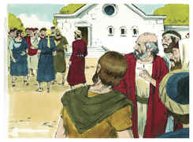

2	Mas os judeus incrédulos incitaram e irritaram, contra os irmãos, os ânimos dos gentios.

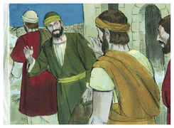

3	Detiveram-se, pois, muito tempo, falando ousadamente acerca do Senhor, o qual dava testemunho à palavra da sua graça, permitindo que por suas mãos se fizessem sinais e prodígios.

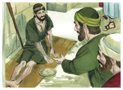

4	E dividiu-se a multidão da cidade; e uns eram pelos judeus, e outros pelos apóstolos.

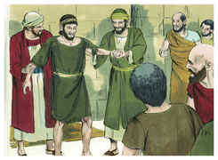

5	E havendo um motim, tanto dos judeus como dos gentios, com os seus principais, para os insultarem e apedrejarem,

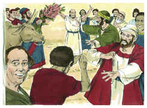

6	Sabendo-o eles, fugiram para Listra e Derbe, cidades de Licaônia, e para a província circunvizinha;

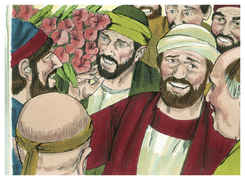

7	E ali pregavam o evangelho.

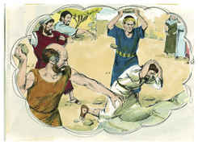

8	E estava assentado em Listra certo homem leso dos pés, coxo desde o ventre de sua mãe, o qual nunca tinha andado.

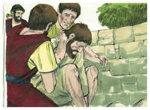

9	Este ouviu falar Paulo, que, fixando nele os olhos, e vendo que tinha fé para ser curado,

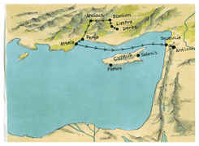

10	Disse em voz alta: Levanta-te direito sobre teus pés. E ele saltou e andou.

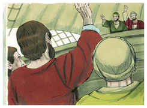

11	E as multidões, vendo o que Paulo fizera, levantaram a sua voz, dizendo em língua licaônica: Fizeram-se os deuses semelhantes aos homens, e desceram até nós.

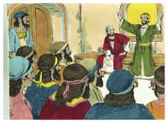

12	E chamavam Júpiter a Barnabé, e Mercúrio a Paulo; porque este era o que falava.

13	E o sacerdote de Júpiter, cujo templo estava em frente da cidade, trazendo para a entrada da porta touros e grinaldas, queria com a multidão sacrificar-lhes.

14	Ouvindo, porém, isto os apóstolos Barnabé e Paulo, rasgaram as suas vestes, e saltaram para o meio da multidão, clamando,

15	E dizendo: Senhores, por que fazeis essas coisas? Nós também somos homens como vós, sujeitos às mesmas paixões, e vos anunciamos que vos convertais dessas vaidades ao Deus vivo, que fez o céu, e a terra, o mar, e tudo quanto há neles;

16	O qual nos tempos passados deixou andar todas as nações em seus próprios caminhos.

17	E contudo, não se deixou a si mesmo sem testemunho, beneficiando-vos lá do céu, dando-vos chuvas e tempos frutíferos, enchendo de mantimento e de alegria os vossos corações.

18	E, dizendo isto, com dificuldade impediram que as multidões lhes sacrificassem.

19	Sobrevieram, porém, uns judeus de Antioquia e de Icônio que, tendo convencido a multidão, apedrejaram a Paulo e o arrastaram para fora da cidade, cuidando que estava morto.

20	Mas, rodeando-o os discípulos, levantou-se, e entrou na cidade, e no dia seguinte saiu com Barnabé para Derbe.

21	E, tendo anunciado o evangelho naquela cidade e feito muitos discípulos, voltaram para Listra, e Icônio e Antioquia,

22	Confirmando os ânimos dos discípulos, exortando-os a permanecer na fé, pois que por muitas tribulações nos importa entrar no reino de Deus.

23	E, havendo-lhes, por comum consentimento, eleito anciãos em cada igreja, orando com jejuns, os encomendaram ao Senhor em quem haviam crido.

24	Passando depois por Pisídia, dirigiram-se a Panfília.

25	E, tendo anunciado a palavra em Perge, desceram a Atália.

26	E dali navegaram para Antioquia, de onde tinham sido encomendados à graça de Deus para a obra que já haviam cumprido.

27	E, quando chegaram e reuniram a igreja, relataram quão grandes coisas Deus fizera por eles, e como abrira aos gentios a porta da fé.

28	E ficaram ali não pouco tempo com os discípulos.

