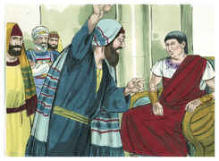
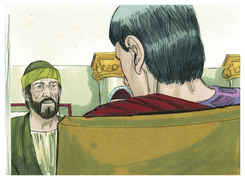
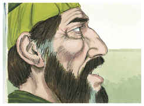
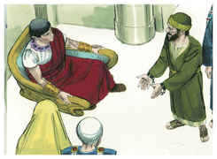
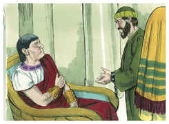
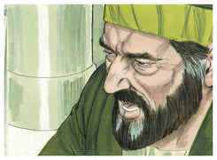
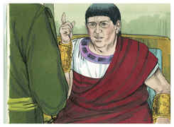
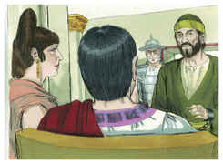
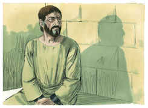

# Atos dos Apóstolos Capítulo 24

1	E, CINCO dias depois, o sumo sacerdote Ananias desceu com os anciãos, e um certo Tértulo, orador, os quais compareceram perante o presidente contra Paulo.

2	E, sendo chamado, Tértulo começou a acusá-lo, dizendo: Visto como por ti temos tanta paz e por tua prudência se fazem a este povo muitos e louváveis serviços,

3	Sempre e em todo o lugar, ó potentíssimo Félix, com todo o agradecimento o queremos reconhecer.

4	Mas, para que não te detenha muito, rogo-te que, conforme a tua eqüidade, nos ouças por pouco tempo.

5	Temos achado que este homem é uma peste, e promotor de sedições entre todos os judeus, por todo o mundo; e o principal defensor da seita dos nazarenos;

6	O qual intentou também profanar o templo; e nós o prendemos, e conforme a nossa lei o quisemos julgar.

7	Mas, sobrevindo o tribuno Lísias, no-lo tirou de entre as mãos com grande violência,

8	Mandando aos seus acusadores que viessem a ti; e dele tu mesmo, examinando-o, poderás entender tudo o de que o acusamos.

9	E também os judeus consentiam, dizendo serem estas coisas assim.

10	Paulo, porém, fazendo-lhe o presidente sinal que falasse, respondeu: Porque sei que já vai para muitos anos que desta nação és juiz, com tanto melhor ânimo respondo por mim.

11	Pois bem podes saber que não há mais de doze dias que subi a Jerusalém a adorar;

12	E não me acharam no templo falando com alguém, nem amotinando o povo nas sinagogas, nem na cidade.

13	Nem tampouco podem provar as coisas de que agora me acusam.

14	Mas confesso-te isto que, conforme aquele Caminho que chamam seita, assim sirvo ao Deus de nossos pais, crendo tudo quanto está escrito na lei e nos profetas.

15	Tendo esperança em Deus, como estes mesmos também esperam, de que há de haver ressurreição de mortos, assim dos justos como dos injustos.

16	E por isso procuro sempre ter uma consciência sem ofensa, tanto para com Deus como para com os homens.

17	Ora, muitos anos depois, vim trazer à minha nação esmolas e ofertas.

18	Nisto me acharam já santificado no templo, não em ajuntamentos, nem com alvoroços, uns certos judeus da Ásia,

19	Os quais convinha que estivessem presentes perante ti, e me acusassem, se alguma coisa contra mim tivessem.

20	Ou digam estes mesmos, se acharam em mim alguma iniqüidade, quando compareci perante o conselho,

21	A não ser estas palavras que, estando entre eles, clamei: Hoje sou julgado por vós acerca da ressurreição dos mortos.

22	Então Félix, havendo ouvido estas coisas, lhes pôs dilação, dizendo: Havendo-me informado melhor deste Caminho, quando o tribuno Lísias tiver descido, então tomarei inteiro conhecimento dos vossos negócios.

23	E mandou ao centurião que o guardasse em prisão, tratando-o com brandura, e que a ninguém dos seus proibisse servi-lo ou vir ter com ele.

24	E alguns dias depois, vindo Félix com sua mulher Drusila, que era judia, mandou chamar a Paulo, e ouviu-o acerca da fé em Cristo.

25	E, tratando ele da justiça, e da temperança, e do juízo vindouro, Félix, espavorido, respondeu: Por agora vai-te, e em tendo oportunidade te chamarei.

26	Esperando ao mesmo tempo que Paulo lhe desse dinheiro, para que o soltasse; pelo que também muitas vezes o mandava chamar, e falava com ele.

27	Mas, passados dois anos, Félix teve por sucessor a Pórcio Festo; e, querendo Félix comprazer aos judeus, deixou a Paulo preso.

