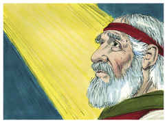
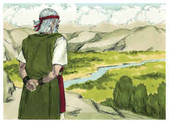
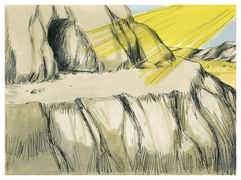

# Deuteronomio Capítulo 32

1	INCLINAI os ouvidos, ó céus, e falarei; e ouça a terra as palavras da minha boca.

2	Goteje a minha doutrina como a chuva, destile a minha palavra como o orvalho, como chuvisco sobre a erva e como gotas de água sobre a relva.

3	Porque apregoarei o nome do Senhor; engrandecei a nosso Deus.

4	Ele é a Rocha, cuja obra é perfeita, porque todos os seus caminhos justos são; Deus é a verdade, e não há nele injustiça; justo e reto é.

5	Corromperam-se contra ele; não são seus filhos, mas a sua mancha; geração perversa e distorcida é.

6	Recompensais assim ao Senhor, povo louco e ignorante? Não é ele teu pai que te adquiriu, te fez e te estabeleceu?

7	Lembra-te dos dias da antiguidade, atenta para os anos de muitas gerações: pergunta a teu pai, e ele te informará; aos teus anciãos, e eles te dirão.

8	Quando o Altíssimo distribuía as heranças às nações, quando dividia os filhos de Adão uns dos outros, estabeleceu os termos dos povos, conforme o número dos filhos de Israel.

9	Porque a porção do Senhor é o seu povo; Jacó é a parte da sua herança.

10	Achou-o numa terra deserta, e num ermo solitário cheio de uivos; cercou-o, instruiu-o, e guardou-o como a menina do seu olho.

11	Como a águia desperta a sua ninhada, move-se sobre os seus filhos, estende as suas asas, toma-os, e os leva sobre as suas asas,

12	Assim só o Senhor o guiou; e não havia com ele deus estranho.

13	Ele o fez cavalgar sobre as alturas da terra, e comer os frutos do campo, e o fez chupar mel da rocha e azeite da dura pederneira.

14	Manteiga de vacas, e leite de ovelhas, com a gordura dos cordeiros e dos carneiros que pastam em Basã, e dos bodes, com o mais escolhido trigo; e bebeste o sangue das uvas, o vinho puro.

15	E, engordando-se Jesurum, deu coices (engordaste-te, engrossaste-te, e de gordura te cobriste) e deixou a Deus, que o fez, e desprezou a Rocha da sua salvação.

16	Com deuses estranhos o provocaram a zelos; com abominações o irritaram.

17	Sacrifícios ofereceram aos demônios, não a Deus; aos deuses que não conheceram, novos deuses que vieram há pouco, aos quais não temeram vossos pais.

18	Esqueceste-te da Rocha que te gerou; e em esquecimento puseste o Deus que te formou;

19	O que vendo o Senhor, os desprezou, por ter sido provocado à ira contra seus filhos e suas filhas;

20	E disse: Esconderei o meu rosto deles, verei qual será o seu fim; porque são geração perversa, filhos em quem não há lealdade.

21	A zelos me provocaram com aquilo que não é Deus; com as suas vaidades me provocaram à ira: portanto eu os provocarei a zelos com o que não é povo; com nação louca os despertarei à ira.

22	Porque um fogo se acendeu na minha ira, e arderá até ao mais profundo do inferno, e consumirá a terra com a sua colheita, e abrasará os fundamentos dos montes.

23	Males amontoarei sobre eles; as minhas setas esgotarei contra eles.

24	Consumidos serão de fome, comidos pela febre ardente e de peste amarga; e contra eles enviarei dentes de feras, com ardente veneno de serpentes do pó.

25	Por fora devastará a espada, e por dentro o pavor; ao jovem, juntamente com a virgem, assim à criança de peito como ao homem encanecido.

26	Eu disse: Por todos os cantos os espalharei; farei cessar a sua memória dentre os homens,

27	Se eu não receasse a ira do inimigo, para que os seus adversários não se iludam, e para que não digam: A nossa mão está exaltada; o Senhor não fez tudo isto.

28	Porque são gente falta de conselhos, e neles não há entendimento.

29	Quem dera eles fossem sábios! Que isto entendessem, e atentassem para o seu fim!

30	Como poderia ser que um só perseguisse mil, e dois fizessem fugir dez mil, se a sua Rocha os não vendera, e o Senhor os não entregara?

31	Porque a sua rocha não é como a nossa Rocha, sendo até os nossos inimigos juízes disto.

32	Porque a sua vinha é a vinha de Sodoma e dos campos de Gomorra; as suas uvas são uvas venenosas, cachos amargos têm.

33	O seu vinho é ardente veneno de serpentes, e peçonha cruel de víboras.

34	Não está isto guardado comigo? Selado nos meus tesouros?

35	Minha é a vingança e a recompensa, ao tempo que resvalar o seu pé; porque o dia da sua ruína está próximo, e as coisas que lhes hão de suceder, se apressam a chegar.

36	Porque o Senhor fará justiça ao seu povo, e se compadecerá de seus servos; quando vir que o poder deles se foi, e não há preso nem desamparado.

37	Então dirá: Onde estão os seus deuses? A rocha em quem confiavam,

38	De cujos sacrifícios comiam a gordura, e de cujas libações bebiam o vinho? Levantem-se, e vos ajudem, para que haja para vós esconderijo.

39	Vede agora que eu, eu o sou, e mais nenhum deus há além de mim; eu mato, e eu faço viver; eu firo, e eu saro, e ninguém há que escape da minha mão.

40	Porque levantarei a minha mão aos céus, e direi: Eu vivo para sempre.

41	Se eu afiar a minha espada reluzente, e se a minha mão travar o juízo, retribuirei a vingança sobre os meus adversários, e recompensarei aos que me odeiam.

42	Embriagarei as minhas setas de sangue, e a minha espada comerá carne; do sangue dos mortos e dos prisioneiros, desde a cabeça, haverá vinganças do inimigo.

43	Jubilai, ó nações, o seu povo, porque ele vingará o sangue dos seus servos, e sobre os seus adversários retribuirá a vingança, e terá misericórdia da sua terra e do seu povo.

44	E veio Moisés, e falou todas as palavras deste cântico aos ouvidos do povo, ele e Josué, filho de Num.

45	E, acabando Moisés de falar todas estas palavras a todo o Israel,

46	Disse-lhes: Aplicai o vosso coração a todas as palavras que hoje testifico entre vós, para que as recomendeis a vossos filhos, para que tenham cuidado de cumprir todas as palavras desta lei.

47	Porque esta palavra não vos é vã, antes é a vossa vida; e por esta mesma palavra prolongareis os dias na terra a qual, passando o Jordão, ides a possuir.

48	Depois falou o Senhor a Moisés, naquele mesmo dia, dizendo:

49	Sobe ao monte de Abarim, ao monte Nebo, que está na terra de Moabe, defronte de Jericó, e vê a terra de Canaã, que darei aos filhos de Israel por possessão.

50	E morre no monte ao qual subirás; e recolhe-te ao teu povo, como Arão teu irmão morreu no monte Hor, e se recolheu ao seu povo.

51	Porquanto transgredistes contra mim no meio dos filhos de Israel, às águas de Meribá de Cades, no deserto de Zim; pois não me santificastes no meio dos filhos de Israel.

52	Pelo que verás a terra diante de ti, porém não entrarás nela, na terra que darei aos filhos de Israel.

