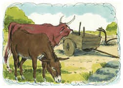

# Deuteronomio Capítulo 5

1	E CHAMOU Moisés a todo o Israel, e disse-lhes: Ouve, ó Israel, os estatutos e juízos que hoje vos falo aos ouvidos; e aprendê-los-eis, e guardá-los-eis, para os cumprir.

2	O Senhor nosso Deus fez conosco aliança em Horebe.

3	Não com nossos pais fez o Senhor esta aliança, mas conosco, todos os que hoje aqui estamos vivos.

4	Face a face o Senhor falou conosco no monte, do meio do fogo

5	(Naquele tempo eu estava em pé entre o Senhor e vós, para vos notificar a palavra do Senhor; porque temestes o fogo e não subistes ao monte), dizendo:

6	Eu sou o Senhor teu Deus, que te tirei da terra do Egito, da casa da servidão;

7	Não terás outros deuses diante de mim;

8	Não farás para ti imagem de escultura, nem semelhança alguma do que há em cima no céu, nem em baixo na terra, nem nas águas debaixo da terra;

9	Não te encurvarás a elas, nem as servirás; porque eu, o Senhor teu Deus, sou Deus zeloso, que visito a iniqüidade dos pais nos filhos, até a terceira e quarta geração daqueles que me odeiam.

10	E faço misericórdia a milhares dos que me amam e guardam os meus mandamentos.

11	Não tomarás o nome do Senhor teu Deus em vão; porque o Senhor não terá por inocente ao que tomar o seu nome em vão.

12	Guarda o dia de sábado, para o santificar, como te ordenou o Senhor teu Deus.

13	Seis dias trabalharás, e farás todo o teu trabalho.

14	Mas o sétimo dia é o sábado do Senhor teu Deus; não farás nenhum trabalho nele, nem tu, nem teu filho, nem tua filha, nem o teu servo, nem a tua serva, nem o teu boi, nem o teu jumento, nem animal algum teu, nem o estrangeiro que está dentro de tuas portas; para que o teu servo e a tua serva descansem como tu;

15	Porque te lembrarás que foste servo na terra do Egito, e que o Senhor teu Deus te tirou dali com mão forte e braço estendido; por isso o Senhor teu Deus te ordenou que guardasses o dia de sábado.

16	Honra a teu pai e a tua mãe, como o Senhor teu Deus te ordenou, para que se prolonguem os teus dias, e para que te vá bem na terra que te dá o Senhor teu Deus.

17	Não matarás.

18	Não adulterarás.

19	Não furtarás.

20	Não dirás falso testemunho contra o teu próximo.

21	Não cobiçarás a mulher do teu próximo; e não desejarás a casa do teu próximo, nem o seu campo, nem o seu servo, nem a sua serva, nem o seu boi, nem o seu jumento, nem coisa alguma do teu próximo.

22	Estas palavras falou o Senhor a toda a vossa congregação no monte, do meio do fogo, da nuvem e da escuridão, com grande voz, e nada acrescentou; e as escreveu em duas tábuas de pedra, e a mim mas deu.

23	E sucedeu que, ouvindo a voz do meio das trevas, e vendo o monte ardendo em fogo, vos achegastes a mim, todos os cabeças das vossas tribos, e vossos anciãos;

24	E dissestes: Eis aqui o Senhor nosso Deus nos fez ver a sua glória e a sua grandeza, e ouvimos a sua voz do meio do fogo; hoje vimos que Deus fala com o homem, e que este permanece vivo.

25	Agora, pois, por que morreríamos? Pois este grande fogo nos consumiria; se ainda mais ouvíssemos a voz do Senhor nosso Deus morreríamos.

26	Porque, quem há de toda a carne, que ouviu a voz do Deus vivente falando do meio do fogo, como nós, e ficou vivo?

27	Chega-te tu, e ouve tudo o que disser o Senhor nosso Deus; e tu nos dirás tudo o que te disser o Senhor nosso Deus, e o ouviremos, e o cumpriremos.

28	Ouvindo, pois, o Senhor as vossas palavras, quando me faláveis, o Senhor me disse: Eu ouvi as palavras deste povo, que eles te disseram; em tudo falaram bem.

29	Quem dera que eles tivessem tal coração que me temessem, e guardassem todos os meus mandamentos todos os dias, para que bem lhes fosse a eles e a seus filhos para sempre.

30	Vai, dize-lhes: Tornai-vos às vossas tendas.

31	Tu, porém, fica-te aqui comigo, para que eu a ti te diga todos os mandamentos, e estatutos, e juízos, que tu lhes hás de ensinar, para que cumpram na terra que eu lhes darei para possuí-la.

32	Olhai, pois, que façais como vos mandou o Senhor vosso Deus; não vos desviareis, nem para a direita nem para a esquerda.

33	Andareis em todo o caminho que vos manda o Senhor vosso Deus, para que vivais e bem vos suceda, e prolongueis os dias na terra que haveis de possuir.

