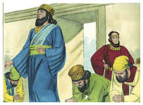
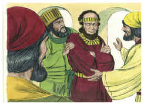
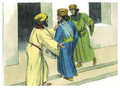
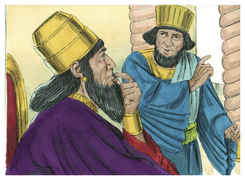
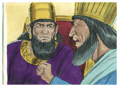
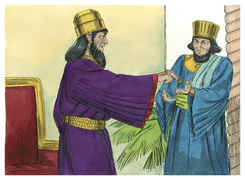
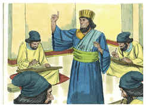
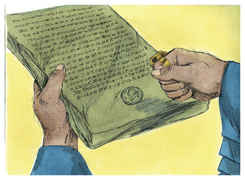

# Ester Capítulo 3

1	DEPOIS destas coisas o rei Assuero engrandeceu a Hamã, filho de Hamedata, agagita, e o exaltou, e pôs o seu assento acima de todos os príncipes que estavam com ele.

2	E todos os servos do rei, que estavam à porta do rei, se inclinavam e se prostravam perante Hamã; porque assim tinha ordenado o rei acerca dele; porém Mardoqueu não se inclinava nem se prostrava.

3	Então os servos do rei, que estavam à porta do rei, disseram a Mardoqueu: Por que transgrides o mandado do rei?

4	Sucedeu, pois, que, dizendo-lhe eles isto, dia após dia, e não lhes dando ele ouvidos, o fizeram saber a Hamã, para verem se as palavras de Mardoqueu se sustentariam, porque ele lhes tinha declarado que era judeu.

5	Vendo, pois, Hamã que Mardoqueu não se inclinava nem se prostrava diante dele, Hamã se encheu de furor.

6	Porém teve como pouco, nos seus propósitos, o pôr as mãos só em Mardoqueu (porque lhe haviam declarado de que povo era Mardoqueu); Hamã, pois, procurou destruir a todos os judeus, o povo de Mardoqueu, que havia em todo o reino de Assuero.

7	No primeiro mês (que é o mês de Nisã), no ano duodécimo do rei Assuero, se lançou Pur, isto é, a sorte, perante Hamã, para cada dia, e para cada mês, até ao duodécimo mês, que é o mês de Adar.

8	E Hamã disse ao rei Assuero: Existe espalhado e dividido entre os povos em todas as províncias do teu reino um povo, cujas leis são diferentes das leis de todos os povos, e que não cumpre as leis do rei; por isso não convém ao rei deixá-lo ficar.

9	Se bem parecer ao rei, decrete-se que os matem; e eu porei nas mãos dos que fizerem a obra dez mil talentos de prata, para que entrem nos tesouros do rei.

10	Então tirou o rei o anel da sua mão, e o deu a Hamã, filho de Hamedata, agagita, adversário dos judeus.

11	E disse o rei a Hamã: Essa prata te é dada como também esse povo, para fazeres dele o que bem parecer aos teus olhos.

12	Então chamaram os escrivães do rei no primeiro mês, no dia treze do mesmo e, conforme a tudo quanto Hamã mandou, se escreveu aos príncipes do rei, e aos governadores que havia sobre cada província, e aos líderes, de cada povo; a cada província segundo a sua escrita, e a cada povo segundo a sua língua; em nome do rei Assuero se escreveu, e com o anel do rei se selou.

13	E enviaram-se as cartas por intermédio dos correios a todas as províncias do rei, para que destruíssem, matassem, e fizessem perecer a todos os judeus, desde o jovem até ao velho, crianças e mulheres, em um mesmo dia, a treze do duodécimo mês (que é o mês de Adar), e que saqueassem os seus bens.

14	Uma cópia do despacho que determinou a divulgação da lei em cada província, foi enviada a todos os povos, para que estivessem preparados para aquele dia.

15	Os correios, pois, impelidos pela palavra do rei, saíram, e a lei se proclamou na fortaleza de Susã. E o rei e Hamã se assentaram a beber, porém a cidade de Susã estava confusa.

