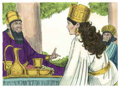
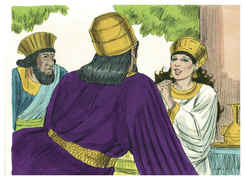
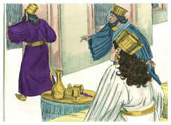
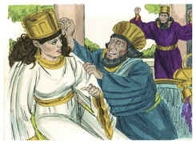
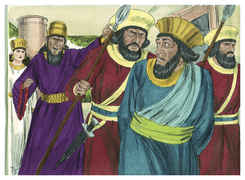

# Ester Capítulo 7

1	VINDO, pois, o rei com Hamã, para beber com a rainha Ester,

2	Disse outra vez o rei a Ester, no segundo dia, no banquete do vinho: Qual é a tua petição, rainha Ester? E se te dará. E qual é o teu desejo? Até metade do reino, se te dará.

3	Então respondeu a rainha Ester, e disse: Se, ó rei, achei graça aos teus olhos, e se bem parecer ao rei, dê-se-me a minha vida como minha petição, e o meu povo como meu desejo.

4	Porque fomos vendidos, eu e o meu povo, para nos destruírem, matarem, e aniquilarem de vez; se ainda por servos e por servas nos vendessem, calar-me-ia; ainda que o opressor não poderia ter compensado a perda do rei.

5	Então falou o rei Assuero, e disse à rainha Ester: Quem é esse e onde está esse, cujo coração o instigou a assim fazer?

6	E disse Ester: O homem, o opressor, e o inimigo, é este mau Hamã. Então Hamã se perturbou perante o rei e a rainha.

7	E o rei no seu furor se levantou do banquete do vinho e passou para o jardim do palácio; e Hamã se pôs em pé, para rogar à rainha Ester pela sua vida; porque viu que já o mal lhe estava determinado pelo rei.

8	Tornando, pois, o rei do jardim do palácio à casa do banquete do vinho, Hamã tinha caído prostrado sobre o leito em que estava Ester. Então disse o rei: Porventura quereria ele também forçar a rainha perante mim nesta casa? Saindo esta palavra da boca do rei, cobriram o rosto de Hamã.

9	Então disse Harbona, um dos camareiros que serviam diante do rei: Eis que também a forca de cinqüenta côvados de altura que Hamã fizera para Mardoqueu, que falara em defesa do rei, está junto à casa de Hamã. Então disse o rei: Enforcai-o nela.

10	Enforcaram, pois, a Hamã na forca, que ele tinha preparado para Mardoqueu. Então o furor do rei se aplacou.

