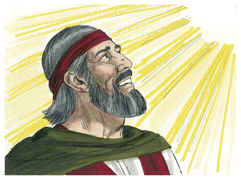
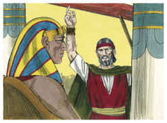
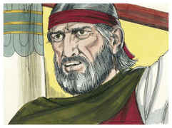
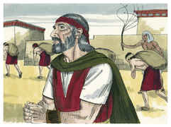

# Êxodo Capítulo 11

1	E O Senhor disse a Moisés: Ainda uma praga trarei sobre Faraó, e sobre o Egito; depois vos deixará ir daqui; e, quando vos deixar ir totalmente, a toda a pressa vos lançará daqui.

2	Fala agora aos ouvidos do povo, que cada homem peça ao seu vizinho, e cada mulher à sua vizinha, jóias de prata e jóias de ouro.

3	E o Senhor deu ao povo graça aos olhos dos egípcios; também o homem Moisés era mui grande na terra do Egito, aos olhos dos servos de Faraó e aos olhos do povo.

4	Disse mais Moisés: Assim o Senhor tem dito: À meia-noite eu sairei pelo meio do Egito;

5	E todo o primogênito na terra do Egito morrerá, desde o primogênito de Faraó, que haveria de assentar-se sobre o seu trono, até ao primogênito da serva que está detrás da mó, e todo o primogênito dos animais.

6	E haverá grande clamor em toda a terra do Egito, como nunca houve semelhante e nunca haverá;

7	Mas entre todos os filhos de Israel nem mesmo um cão moverá a sua língua, desde os homens até aos animais, para que saibais que o Senhor fez diferença entre os egípcios e os israelitas.

8	Então todos estes teus servos descerão a mim, e se inclinarão diante de mim, dizendo: Sai tu, e todo o povo que te segue as pisadas; e depois eu sairei. E saiu da presença de Faraó ardendo em ira.

9	O Senhor dissera a Moisés: Faraó não vos ouvirá, para que as minhas maravilhas se multipliquem na terra do Egito.

10	E Moisés e Arão fizeram todas estas maravilhas diante de Faraó; mas o Senhor endureceu o coração de Faraó, que não deixou ir os filhos de Israel da sua terra.

