# Êxodo Capítulo 14

1	ENTÃO falou o Senhor a Moisés, dizendo:

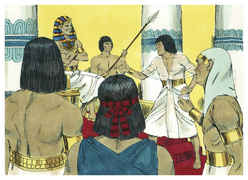

2	Fala aos filhos de Israel que voltem, e que se acampem diante de Pi-Hairote, entre Migdol e o mar, diante de Baal-Zefom; em frente dele assentareis o campo junto ao mar.

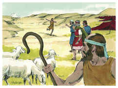

3	Então Faraó dirá dos filhos de Israel: Estão embaraçados na terra o deserto os encerrou.

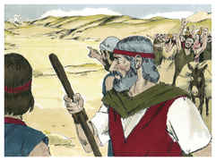

4	E eu endurecerei o coração de Faraó, para que os persiga, e serei glorificado em Faraó e em todo o seu exército, e saberão os egípcios que eu sou o Senhor. E eles fizeram assim.

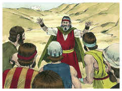

5	Sendo, pois, anunciado ao rei do Egito que o povo fugia, mudou-se o coração de Faraó e dos seus servos contra o povo, e disseram: Por que fizemos isso, havendo deixado ir a Israel, para que não nos sirva?

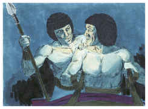

6	E aprontou o seu carro, e tomou consigo o seu povo;

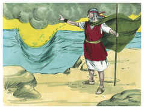

7	E tomou seiscentos carros escolhidos, e todos os carros do Egito, e os capitães sobre eles todos.

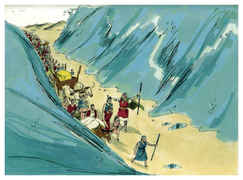

8	Porque o Senhor endureceu o coração de Faraó, rei do Egito, para que perseguisse aos filhos de Israel; porém os filhos de Israel saíram com alta mão.

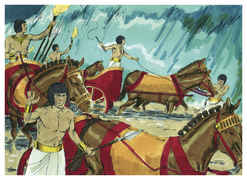

9	E os egípcios perseguiram-nos, todos os cavalos e carros de Faraó, e os seus cavaleiros e o seu exército, e alcançaram-nos acampados junto ao mar, perto de Pi-Hairote, diante de Baal-Zefom.

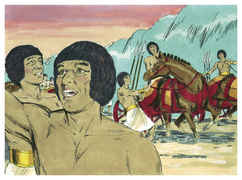

10	E aproximando Faraó, os filhos de Israel levantaram seus olhos, e eis que os egípcios vinham atrás deles, e temeram muito; então os filhos de Israel clamaram ao Senhor.

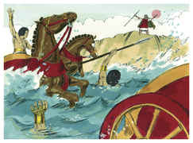

11	E disseram a Moisés: Não havia sepulcros no Egito, para nos tirar de lá, para que morramos neste deserto? Por que nos fizeste isto, fazendo-nos sair do Egito?

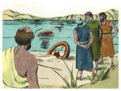

12	Não é esta a palavra que te falamos no Egito, dizendo: Deixa-nos, que sirvamos aos egípcios? Pois que melhor nos fora servir aos egípcios, do que morrermos no deserto.

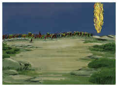

13	Moisés, porém, disse ao povo: Não temais; estai quietos, e vede o livramento do Senhor, que hoje vos fará; porque aos egípcios, que hoje vistes, nunca mais os tornareis a ver.

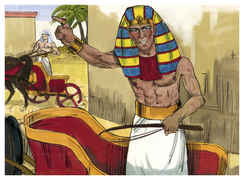

14	O Senhor pelejará por vós, e vós vos calareis.

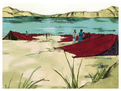

15	Então disse o Senhor a Moisés: Por que clamas a mim? Dize aos filhos de Israel que marchem.

16	E tu, levanta a tua vara, e estende a tua mão sobre o mar, e fende-o, para que os filhos de Israel passem pelo meio do mar em seco.

17	E eis que endurecerei o coração dos egípcios, e estes entrarão atrás deles; e eu serei glorificado em Faraó e em todo o seu exército, nos seus carros e nos seus cavaleiros,

18	E os egípcios saberão que eu sou o Senhor, quando for glorificado em Faraó, nos seus carros e nos seus cavaleiros.

19	E o anjo de Deus, que ia diante do exército de Israel, se retirou, e ia atrás deles; também a coluna de nuvem se retirou de diante deles, e se pôs atrás deles.

20	E ia entre o campo dos egípcios e o campo de Israel; e a nuvem era trevas para aqueles, e para estes clareava a noite; de maneira que em toda a noite não se aproximou um do outro.

21	Então Moisés estendeu a sua mão sobre o mar, e o Senhor fez retirar o mar por um forte vento oriental toda aquela noite; e o mar tornou-se em seco, e as águas foram partidas.

22	E os filhos de Israel entraram pelo meio do mar em seco; e as águas foram-lhes como muro à sua direita e à sua esquerda.

23	E os egípcios os seguiram, e entraram atrás deles todos os cavalos de Faraó, os seus carros e os seus cavaleiros, até ao meio do mar.

24	E aconteceu que, na vigília daquela manhã, o Senhor, na coluna do fogo e da nuvem, viu o campo dos egípcios; e alvoroçou o campo dos egípcios.

25	E tirou-lhes as rodas dos seus carros, e dificultosamente os governavam. Então disseram os egípcios: Fujamos da face de Israel, porque o Senhor por eles peleja contra os egípcios.

26	E disse o Senhor a Moisés: Estende a tua mão sobre o mar, para que as águas tornem sobre os egípcios, sobre os seus carros e sobre os seus cavaleiros.

27	Então Moisés estendeu a sua mão sobre o mar, e o mar retornou a sua força ao amanhecer, e os egípcios, ao fugirem, foram de encontro a ele, e o Senhor derrubou os egípcios no meio do mar,

28	Porque as águas, tornando, cobriram os carros e os cavaleiros de todo o exército de Faraó, que os haviam seguido no mar; nenhum deles ficou.

29	Mas os filhos de Israel foram pelo meio do mar seco; e as águas foram-lhes como muro à sua mão direita e à sua esquerda.

30	Assim o Senhor salvou Israel naquele dia da mão dos egípcios; e Israel viu os egípcios mortos na praia do mar.

31	E viu Israel a grande mão que o Senhor mostrara aos egípcios; e temeu o povo ao Senhor, e creu no Senhor e em Moisés, seu servo.

