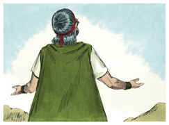
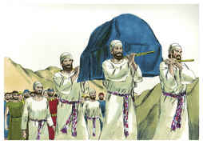
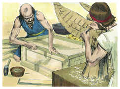
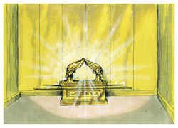
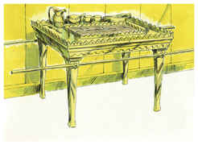
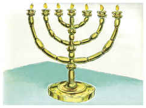

# Êxodo Capítulo 25

1	ENTÃO falou o Senhor a Moisés, dizendo:

2	Fala aos filhos de Israel, que me tragam uma oferta alçada; de todo o homem cujo coração se mover voluntariamente, dele tomareis a minha oferta alçada.

3	E esta é a oferta alçada que recebereis deles: ouro, e prata, e cobre,

4	E azul, e púrpura, e carmesim, e linho fino, e pêlos de cabras,

5	E peles de carneiros tintas de vermelho, e peles de texugos, e madeira de acácia,

6	Azeite para a luz, especiarias para o óleo da unção, e especiarias para o incenso,

7	Pedras de ônix, e pedras de engaste para o éfode e para o peitoral.

8	E me farão um santuário, e habitarei no meio deles.

9	Conforme a tudo o que eu te mostrar para modelo do tabernáculo, e para modelo de todos os seus pertences, assim mesmo o fareis.

10	Também farão uma arca de madeira de acácia; o seu comprimento será de dois côvados e meio, e a sua largura de um côvado e meio, e de um côvado e meio a sua altura.

11	E cobri-la-á de ouro puro; por dentro e por fora a cobrirás; e farás sobre ela uma coroa de ouro ao redor;

12	E fundirás para ela quatro argolas de ouro, e as porás nos quatro cantos dela, duas argolas num lado dela, e duas argolas noutro lado.

13	E farás varas de madeira de acácia, e as cobrirás com ouro.

14	E colocarás as varas nas argolas, aos lados da arca, para se levar com elas a arca.

15	As varas estarão nas argolas da arca, não se tirarão dela.

16	Depois porás na arca o testemunho, que eu te darei.

17	Também farás um propiciatório de ouro puro; o seu comprimento será de dois côvados e meio, e a sua largura de um côvado e meio.

18	Farás também dois querubins de ouro; de ouro batido os farás, nas duas extremidades do propiciatório.

19	Farás um querubim na extremidade de uma parte, e o outro querubim na extremidade da outra parte; de uma só peça com o propiciatório, fareis os querubins nas duas extremidades dele.

20	Os querubins estenderão as suas asas por cima, cobrindo com elas o propiciatório; as faces deles uma defronte da outra; as faces dos querubins estarão voltadas para o propiciatório.

21	E porás o propiciatório em cima da arca, depois que houveres posto na arca o testemunho que eu te darei.

22	E ali virei a ti, e falarei contigo de cima do propiciatório, do meio dos dois querubins (que estão sobre a arca do testemunho), tudo o que eu te ordenar para os filhos de Israel.

23	Também farás uma mesa de madeira de acácia; o seu comprimento será de dois côvados, e a sua largura de um côvado, e a sua altura de um côvado e meio.

24	E cobri-la-ás com ouro puro; também lhe farás uma coroa de ouro ao redor.

25	Também lhe farás uma moldura ao redor, da largura de quatro dedos, e lhe farás uma coroa de ouro ao redor da moldura.

26	Também lhe farás quatro argolas de ouro; e porás as argolas aos quatro cantos, que estão nos seus quatro pés.

27	Defronte da moldura estarão as argolas, como lugares para os varais, para se levar a mesa.

28	Farás, pois, estes varais de madeira de acácia, e cobri-los-ás com ouro; e levar-se-á com eles a mesa.

29	Também farás os seus pratos, e as suas colheres, e as suas cobertas, e as suas tigelas com que se hão de oferecer libações; de ouro puro os farás.

30	E sobre a mesa porás o pão da proposição perante a minha face perpetuamente.

31	Também farás um candelabro de ouro puro; de ouro batido se fará este candelabro; o seu pé, as suas hastes, os seus copos, os seus botões, e as suas flores serão do mesmo.

32	E dos seus lados sairão seis hastes; três hastes do candelabro de um lado dele, e três hastes do outro lado dele.

33	Numa haste haverá três copos a modo de amêndoas, um botão e uma flor; e três copos a modo de amêndoas na outra haste, um botão e uma flor; assim serão as seis hastes que saem do candelabro.

34	Mas no candelabro mesmo haverá quatro copos a modo de amêndoas, com seus botões e com suas flores;

35	E um botão debaixo de duas hastes que saem dele; e ainda um botão debaixo de duas outras hastes que saem dele; e ainda um botão debaixo de duas outras hastes que saem dele; assim se fará com as seis hastes que saem do candelabro.

36	Os seus botões e as suas hastes serão do mesmo; tudo será de uma só peça, obra batida de ouro puro.

37	Também lhe farás sete lâmpadas, as quais se acenderão para iluminar defronte dele.

38	Os seus espevitadores e os seus apagadores serão de ouro puro.

39	De um talento de ouro puro os farás, com todos estes vasos.

40	Atenta, pois, que o faças conforme ao seu modelo, que te foi mostrado no monte.

