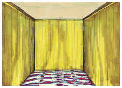
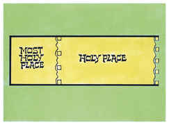

# Êxodo Capítulo 26

1	E O TABERNÁCULO farás de dez cortinas de linho fino torcido, e azul, púrpura, e carmesim; com querubins as farás de obra esmerada.

2	O comprimento de uma cortina será de vinte e oito côvados, e a largura de uma cortina de quatro côvados; todas estas cortinas serão de uma medida.

3	Cinco cortinas se enlaçarão uma à outra; e as outras cinco cortinas se enlaçarão uma com a outra.

4	E farás laçadas de azul na orla de uma cortina, na extremidade, e na juntura; assim também farás na orla da extremidade da outra cortina, na segunda juntura.

5	Cinqüenta laçadas farás numa cortina, e outras cinqüenta laçadas farás na extremidade da cortina que está na segunda juntura; as laçadas estarão presas uma com a outra.

6	Farás também cinqüenta colchetes de ouro, e ajuntarás com estes colchetes as cortinas, uma com a outra, e será um tabernáculo.

7	Farás também cortinas de pêlos de cabras para servirem de tenda sobre o tabernáculo; onze cortinas farás.

8	O comprimento de uma cortina será de trinta côvados, e a largura da mesma cortina de quatro côvados; estas onze cortinas serão da mesma medida.

9	E juntarás cinco destas cortinas à parte, e as outras seis cortinas também à parte; e dobrarás a sexta cortina à frente da tenda.

10	E farás cinqüenta laçadas na borda de uma cortina, na extremidade, na juntura, e outras cinqüenta laçadas na borda da outra cortina, na segunda juntura.

11	Farás também cinqüenta colchetes de cobre, e colocarás os colchetes nas laçadas, e assim ajuntarás a tenda, para que seja uma.

12	E a parte que sobejar das cortinas da tenda, a saber, a metade da cortina que sobejar, penderá de sobra às costas do tabernáculo.

13	E um côvado de um lado, e outro côvado do outro, que sobejará no comprimento das cortinas da tenda, penderá de sobra aos lados do tabernáculo de um e de outro lado, para cobri-lo.

14	Farás também à tenda uma coberta de peles de carneiro, tintas de vermelho, e outra coberta de peles de texugo em cima.

15	Farás também as tábuas para o tabernáculo de madeira de acácia, que serão postas verticalmente.

16	O comprimento de uma tábua será de dez côvados, e a largura de cada tábua será de um côvado e meio.

17	Dois encaixes terá cada tábua, travados um com o outro; assim farás com todas as tábuas do tabernáculo.

18	E farás as tábuas para o tabernáculo assim: vinte tábuas para o lado meridional.

19	Farás também quarenta bases de prata debaixo das vinte tábuas; duas bases debaixo de uma tábua para os seus dois encaixes e duas bases debaixo de outra tábua para os seus dois encaixes.

20	Também haverá vinte tábuas ao outro lado do tabernáculo, para o lado norte,

21	Com as suas quarenta bases de prata; duas bases debaixo de uma tábua, e duas bases debaixo de outra tábua,

22	E ao lado do tabernáculo para o ocidente farás seis tábuas.

23	Farás também duas tábuas para os cantos do tabernáculo, de ambos os lados.

24	E por baixo se ajuntarão, e também em cima dele se ajuntarão numa argola. Assim se fará com as duas tábuas; ambas serão por tábuas para os dois cantos.

25	Assim serão as oito tábuas com as suas bases de prata, dezesseis bases; duas bases debaixo de uma tábua, e duas bases debaixo da outra tábua.

26	Farás também cinco travessas de madeira de acácia, para as tábuas de um lado do tabernáculo,

27	E cinco travessas para as tábuas do outro lado do tabernáculo; como também cinco travessas para as tábuas do outro lado do tabernáculo, de ambos os lados, para o ocidente.

28	E a travessa central estará no meio das tábuas, passando de uma extremidade até à outra.

29	E cobrirás de ouro as tábuas, e farás de ouro as suas argolas, para passar por elas as travessas; também as travessas as cobrirás de ouro.

30	Então levantarás o tabernáculo conforme ao modelo que te foi mostrado no monte.

31	Depois farás um véu de azul, e púrpura, e carmesim, e de linho fino torcido; com querubins de obra prima se fará.

32	E colocá-lo-ás sobre quatro colunas de madeira de acácia, cobertas de ouro; seus colchetes serão de ouro, sobre quatro bases de prata.

33	Pendurarás o véu debaixo dos colchetes, e porás a arca do testemunho ali dentro do véu; e este véu vos fará separação entre o santuário e o lugar santíssimo,

34	E porás a coberta do propiciatório sobre a arca do testemunho no lugar santíssimo,

35	E a mesa porás fora do véu, e o candelabro defronte da mesa, ao lado do tabernáculo, para o sul; mas a mesa porás ao lado do norte.

36	Farás também para a porta da tenda, uma cortina de azul, e púrpura, e carmesim, e de linho fino torcido, de obra de bordador.

37	E farás para esta cortina cinco colunas de madeira de acácia, e as cobrirás de ouro; seus colchetes serão de ouro, e far-lhe-ás de fundição cinco bases de cobre.

