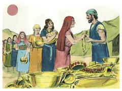
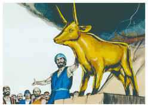
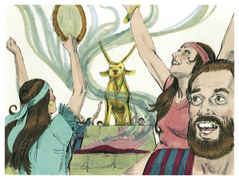
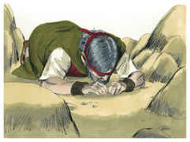
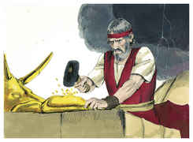
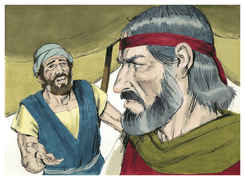
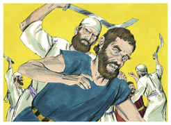

# Êxodo Capítulo 32

1	MAS vendo o povo que Moisés tardava em descer do monte, acercou-se de Arão, e disse-lhe: Levanta-te, faze-nos deuses, que vão adiante de nós; porque quanto a este Moisés, o homem que nos tirou da terra do Egito, não sabemos o que lhe sucedeu.

2	E Arão lhes disse: Arrancai os pendentes de ouro, que estão nas orelhas de vossas mulheres, e de vossos filhos, e de vossas filhas, e trazei-mos.

3	Então todo o povo arrancou os pendentes de ouro, que estavam nas suas orelhas, e os trouxeram a Arão.

4	E ele os tomou das suas mãos, e trabalhou o ouro com um buril, e fez dele um bezerro de fundição. Então disseram: Este é teu deus, ó Israel, que te tirou da terra do Egito.

5	E Arão, vendo isto, edificou um altar diante dele; e apregoou Arão, e disse: Amanhã será festa ao Senhor.

6	E no dia seguinte madrugaram, e ofereceram holocaustos, e trouxeram ofertas pacíficas; e o povo assentou-se a comer e a beber; depois levantou-se a folgar.

7	Então disse o Senhor a Moisés: Vai, desce; porque o teu povo, que fizeste subir do Egito, se tem corrompido,

8	E depressa se tem desviado do caminho que eu lhe tinha ordenado; eles fizeram para si um bezerro de fundição, e perante ele se inclinaram, e ofereceram-lhe sacrifícios, e disseram: Este é o teu deus, ó Israel, que te tirou da terra do Egito.

9	Disse mais o Senhor a Moisés: Tenho visto a este povo, e eis que é povo de dura cerviz.

10	Agora, pois, deixa-me, para que o meu furor se acenda contra ele, e o consuma; e eu farei de ti uma grande nação.

11	Moisés, porém, suplicou ao Senhor seu Deus e disse: Ó Senhor, por que se acende o teu furor contra o teu povo, que tiraste da terra do Egito com grande força e com forte mão?

12	Por que hão de falar os egípcios, dizendo: Para mal os tirou, para matá-los nos montes, e para destruí-los da face da terra? Torna-te do furor da tua ira, e arrepende-te deste mal contra o teu povo.

13	Lembra-te de Abraão, de Isaque, e de Israel, os teus servos, aos quais por ti mesmo tens jurado, e lhes disseste: Multiplicarei a vossa descendência como as estrelas dos céus, e darei à vossa descendência toda esta terra, de que tenho falado, para que a possuam por herança eternamente.

14	Então o Senhor arrependeu-se do mal que dissera que havia de fazer ao seu povo.

15	E virou-se Moisés e desceu do monte com as duas tábuas do testemunho na mão, tábuas escritas de ambos os lados; de um e de outro lado estavam escritas.

16	E aquelas tábuas eram obra de Deus; também a escritura era a mesma escritura de Deus, esculpida nas tábuas.

17	E, ouvindo Josué a voz do povo que jubilava, disse a Moisés: Alarido de guerra há no arraial.

18	Porém ele respondeu: Não é alarido dos vitoriosos, nem alarido dos vencidos, mas o alarido dos que cantam, eu ouço.

19	E aconteceu que, chegando Moisés ao arraial, e vendo o bezerro e as danças, acendeu-se-lhe o furor, e arremessou as tábuas das suas mãos, e quebrou-as ao pé do monte;

20	E tomou o bezerro que tinham feito, e queimou-o no fogo, moendo-o até que se tornou em pó; e o espargiu sobre as águas, e deu-o a beber aos filhos de Israel.

21	E Moisés perguntou a Arão: Que te tem feito este povo, que sobre ele trouxeste tamanho pecado?

22	Então respondeu Arão: Não se acenda a ira do meu senhor; tu sabes que este povo é inclinado ao mal;

23	E eles me disseram: Faze-nos um deus que vá adiante de nós; porque não sabemos o que sucedeu a este Moisés, a este homem que nos tirou da terra do Egito.

24	Então eu lhes disse: Quem tem ouro, arranque-o; e deram-mo, e lancei-o no fogo, e saiu este bezerro.

25	E, vendo Moisés que o povo estava despido, porque Arão o havia deixado despir-se para vergonha entre os seus inimigos,

26	Pôs-se em pé Moisés na porta do arraial e disse: Quem é do Senhor, venha a mim. Então se ajuntaram a ele todos os filhos de Levi.

27	E disse-lhes: Assim diz o Senhor Deus de Israel: Cada um ponha a sua espada sobre a sua coxa; e passai e tornai pelo arraial de porta em porta, e mate cada um a seu irmão, e cada um a seu amigo, e cada um a seu vizinho.

28	E os filhos de Levi fizeram conforme à palavra de Moisés; e caíram do povo aquele dia uns três mil homens.

29	Porquanto Moisés tinha dito: Consagrai hoje as vossas mãos ao Senhor; porquanto cada um será contra o seu filho e contra o seu irmão; e isto, para que ele vos conceda hoje uma bênção.

30	E aconteceu que no dia seguinte Moisés disse ao povo: Vós cometestes grande pecado. Agora, porém, subirei ao Senhor; porventura farei propiciação por vosso pecado.

31	Assim tornou-se Moisés ao Senhor, e disse: Ora, este povo cometeu grande pecado fazendo para si deuses de ouro.

32	Agora, pois, perdoa o seu pecado; se não, risca-me, peço-te, do teu livro, que tens escrito.

33	Então disse o Senhor a Moisés: Aquele que pecar contra mim, a este riscarei do meu livro.

34	Vai, pois, agora, conduze este povo para onde te tenho dito; eis que o meu anjo irá adiante de ti; porém no dia da minha visitação visitarei neles o seu pecado.

35	Assim feriu o Senhor o povo, por ter sido feito o bezerro que Arão tinha formado.

